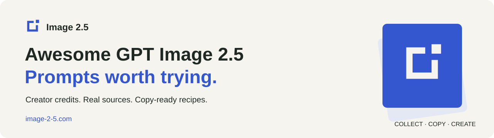

<!-- Generated by scripts/build.mjs. Edit data/prompts/*.json, data/site.json, and data/locales.json. -->
<a href="https://image-2-5.com"></a>

# Awesome GPT Image 2.5 Prompts

[English](README.md) · [简体中文](README.zh-CN.md) · [繁體中文](README.zh-TW.md) · [日本語](README.ja.md) · [한국어](README.ko.md) · [Français](README.fr.md) · [Deutsch](README.de.md) · [Español](README.es.md) · [Português (Brasil)](README.pt-BR.md)

Prompts populaires pour GPT Image 2.5, résultats des créateurs et flux de travail pratiques. Parcourez les images et développez un prompt sans quitter cette page.

**50 cas · 9 langues**

Maintenu par: **[Image 2.5 — image-2-5.com](https://image-2-5.com)**

Les aperçus des créateurs sont des exemples issus de la source et non des résultats reproduits indépendamment par ce répertoire. Les noms des modèles reflètent les preuves citées. Une adaptation dans l'éditeur peut différer du libellé et du résultat d'origine.

Classé selon un score de découverte daté combinant les « J'aime », les enregistrements, les repartages et les vues. Les valeurs manquantes sont inconnues, et non égales à zéro. Il ne s'agit ni d'un classement en temps réel ni d'un test de qualité.

## Mode d'emploi

Choisissez une image, développez le prompt et copiez le texte. Fournissez les références indiquées et suivez les étapes dans l'ordre. Le lien du site web ouvre la page d'accueil ; il ne pré-remplit pas le prompt. Les exportations au format GIF et autres fichiers nécessitent les outils de traitement indiqués.

Les instructions localisées conservent la recette éditoriale source ou étiquetée. Le texte de l'image, les variables et les contraintes numériques conservent leur forme initiale. Veuillez signaler toute correction de traduction via le système de suivi des problèmes (issues) du dépôt.

<a id="collection"></a>
## Galerie d'images complète

### Catégories

- [Édition et restauration](#category-editing)
- [Produits et contenu généré par les utilisateurs (UGC)](#category-products)
- [Portraits et photographie](#category-photography)
- [Affiches et design éditorial](#category-design)
- [Personnages et flux de travail pour sprites](#category-characters)
- [Création guidée par esquisse](#category-sketch)

<a id="category-editing"></a>
### Édition et restauration

- [Une consigne de modification en deux mots pour plus de réalisme.](#case-remove-ai-slop)
- [Restaurer une image basse résolution](#case-low-resolution-restoration)
- [Un robot à travers neuf montages successifs](#case-robot-sequential-edits)
- [Déplacer une lampe dans une pièce](#case-move-the-lamp)

<a id="category-products"></a>
### Produits et contenu généré par les utilisateurs (UGC)

- [Contenu généré par les utilisateurs (UGC) basé sur un style de référence pour un produit](#case-style-reference-product-ugc)
- [Campagne de mode en six couleurs](#case-six-color-fashion-campaign)
- [Image publicitaire dans le style d'un téléachat rétro.](#case-retro-infomercial-frame)
- [Rendu de produit basé sur une géométrie imposée](#case-geometry-locked-product-render)
- [Remplacement d'un produit sur une affiche fixe](#case-fixed-template-product-swap)
- [Composition studio cohérente de plusieurs produits](#case-multi-product-studio-lineup)
- [Personne tenant un produit de référence](#case-person-holding-reference-product)
- [Essayage virtuel d'une chemise de référence](#case-reference-shirt-try-on)
- [Rééclairage studio d'un produit transparent](#case-transparent-product-relighting)

<a id="category-photography"></a>
### Portraits et photographie

- [Selfie de groupe miroir cosplay](#case-cosplay-mirror-group-selfie)
- [Série de portraits de boulanger vintage](#case-vintage-baker-portraits)
- [Portrait de voyage spontané devant une abbaye côtière.](#case-coastal-abbey-travel-portrait)
- [Portrait flou en cabine d'essayage (capteur CCD)](#case-nineties-japanese-ccd-photo)
- [Test de contrainte sur les détails d'une forêt](#case-forest-detail-stress-test)
- [Un portrait onirique en qipao](#case-dreamy-qipao-portrait)
- [Portrait de plage en position assise en W](#case-beach-w-sit-pose)
- [Portrait cybernétique monochrome](#case-cybernetic-monochrome-portrait)
- [Une photo de téléphone franche dans un café](#case-candid-cafe-photo)

<a id="category-design"></a>
### Affiches et design éditorial

- [Miniature artisanale représentant un monument touristique](#case-miniature-travel-landmark)
- [Une page de magazine de voyage personnalisée](#case-travel-magazine-page)
- [Bande dessinée de presse en six cases](#case-six-panel-newspaper-comic)
- [Schéma technique pour manuel d'entretien de machine à expresso](#case-espresso-service-manual)
- [Panneau d'affichage de village avec typographie variée](#case-village-notice-board)
- [Repenser une affiche tout en conservant son univers](#case-poster-perspective-redesign)
- [Affiche de marché d'automne avec contraintes sur le nombre d'objets](#case-autumn-market-count-constraints)
- [Infographie sur la préparation du café chinois](#case-chinese-coffee-brewing-infographic)
- [Modification d'une affiche pour un festival du café (cinq étapes)](#case-coffee-festival-poster-iterations)
- [Interface utilisateur d'une application mobile de courses fraîches](#case-fresh-grocery-mobile-ui)
- [Réutilisation d'un modèle d'affiche longue](#case-long-copy-poster-template)
- [Retouche couleur et finition d'une seule tasse.](#case-single-cup-material-edit)
- [Publicité produit à trois références](#case-three-reference-product-ad)

<a id="category-characters"></a>
### Personnages et flux de travail pour sprites

- [Feuille de sprite de combat et GIF transparent](#case-combat-sprite-sheet)
- [Fiche de référence complète pour la production du personnage.](#case-character-design-reference-sheet)
- [Boucle d'animation de chat de skateboard en argile](#case-clay-skateboard-cat-loop)
- [Fiche de poses de danse axée sur le personnage](#case-dance-pose-keyframes)
- [Une boucle inactive de caractère de référence](#case-character-idle-sprite-loop)
- [Animer à l'aide de variations d'images distinctes](#case-separate-frame-animation)
- [Feuille d'animation pixel art pour animaux de compagnie](#case-pixel-pet-loop)
- [GIF autocollant « bisou soufflé » style LINE](#case-line-bust-sticker-gif)
- [Duel de Cel-animation sur sable volcanique](#case-cel-animation-duel)
- [Animation d'un gobelin archer](#case-goblin-archer-animation)
- [GIF d'autocollant détouré en mouvement](#case-bouncing-cutout-sticker)
- [Neuf stickers de conversation expressifs](#case-nine-emotion-chat-stickers)
- [GIF animé en six images](#case-six-frame-expression-gif)

<a id="category-sketch"></a>
### Création guidée par esquisse

- [Recomposer une scène à partir d'un croquis](#case-sketch-guided-composition)
- [Transformer un croquis en un futur bâtiment](#case-sketch-to-future-building)

---

<a id="case-combat-sprite-sheet"></a>
## Feuille de sprite de combat et GIF transparent

<a href="https://x.com/8co28/status/2097423580229521849"></a>

[English](README.md#case-combat-sprite-sheet) · [简体中文](README.zh-CN.md#case-combat-sprite-sheet) · [繁體中文](README.zh-TW.md#case-combat-sprite-sheet) · [日本語](README.ja.md#case-combat-sprite-sheet) · [한국어](README.ko.md#case-combat-sprite-sheet) · [Français](README.fr.md#case-combat-sprite-sheet) · [Deutsch](README.de.md#case-combat-sprite-sheet) · [Español](README.es.md#case-combat-sprite-sheet) · [Português (Brasil)](README.pt-BR.md#case-combat-sprite-sheet)

Un flux de travail largement partagé pour transformer les illustrations de personnages en images de combat, suivi de la réparation des transparences et de l'assemblage de GIF.

**Adaptation de l'éditeur · Flux de travail en plusieurs étapes · Non testé indépendamment**

[@8co28](https://x.com/8co28/status/2097423580229521849) · [Source du prompt ou du flux de travail](https://x.com/8co28/status/2097423580229521849) · [Déclaration du créateur sur le modèle](https://x.com/8co28/status/2097423580229521849)

Langue source du prompt: **Inconnu** · Langue de la publication: **Inconnu**

5,658 J'aime · 5,524 Enregistrements · 898 Repartages · 726,156 Vues

Engagement observé: 2026-09-10T15:32:09.716Z · Source vérifiée: 2026-09-10T15:32:09.716Z

### Entrées requises

- Une référence de personnage ; un outil de traitement de fichiers pour l'étape GIF.

<details>
<summary>Prompt</summary>

#### Étape 1

```text
Utilisez le caractère ci-joint comme référence. Dessinez une séquence de combat pixel-art dans une feuille de sprite 4 x 4. Gardez l'échelle des caractères et le contact au sol cohérents entre les cellules.
```

#### Étape 2

```text
Dans une nouvelle conversation, supprimez l'arrière-plan de la feuille, séparez ses 16 cellules, alignez le personnage dans chaque image et assemblez un GIF en boucle.
```

</details>

<details>
<summary>Voir le libellé source</summary>

Le libellé source exact n'est pas archivé pour cette adaptation de l'éditeur. Consultez le lien vers le flux de travail original.

[Source du prompt ou du flux de travail](https://x.com/8co28/status/2097423580229521849)

</details>

### Notes

- Il s'agit d'une recette éditoriale basée sur le flux de travail publié, et non d'une transcription de l'invite de génération d'origine.
- Le créateur a signalé un échec de transparence et a utilisé un nouveau chat pour le réparer. Une feuille de sprite n'est pas en soi un GIF animé.

[Open Image 2.5](https://image-2-5.com) · [Retour à l'index de la galerie](#collection)

---

<a id="case-cosplay-mirror-group-selfie"></a>
## Selfie de groupe miroir cosplay

<a href="https://x.com/underwoodxie96/status/2097536477500452937"></a>

[English](README.md#case-cosplay-mirror-group-selfie) · [简体中文](README.zh-CN.md#case-cosplay-mirror-group-selfie) · [繁體中文](README.zh-TW.md#case-cosplay-mirror-group-selfie) · [日本語](README.ja.md#case-cosplay-mirror-group-selfie) · [한국어](README.ko.md#case-cosplay-mirror-group-selfie) · [Français](README.fr.md#case-cosplay-mirror-group-selfie) · [Deutsch](README.de.md#case-cosplay-mirror-group-selfie) · [Español](README.es.md#case-cosplay-mirror-group-selfie) · [Português (Brasil)](README.pt-BR.md#case-cosplay-mirror-group-selfie)

Utilisez une composition de miroir éclairé par un flash pour un portrait de groupe cosplay semi-réaliste.

**Prompt original · Texte vers image · Non testé indépendamment**

[@underwoodxie96](https://x.com/underwoodxie96/status/2097536477500452937) · [Source du prompt ou du flux de travail](https://x.com/underwoodxie96/status/2097536477500452937) · [Déclaration du créateur sur le modèle](https://x.com/underwoodxie96/status/2097536477500452937)

Langue source du prompt: **en** · Langue de la publication: **en**

3,564 J'aime · 2,154 Enregistrements · 194 Repartages · 186,019 Vues

Engagement observé: 2026-09-11T18:03:40Z · Source vérifiée: 2026-09-11T18:03:40Z

### Entrées requises

Aucune image de référence n'est spécifiée par la source.

<details>
<summary>Prompt</summary>


```text
Un selfie pris dans un miroir, téléphone en main avec le flash activé, dans une pièce légèrement en désordre et à l'éclairage décontracté. Je suis entouré de plusieurs personnages de style anime, dont le design rappelle celui des personnages féminins du jeu *Dead or Alive Xtreme Beach Volleyball*. Elles portent des bikinis et se tiennent tout près, rassemblées intimement autour de moi ; certaines me touchent doucement le visage, d'autres se penchent vers moi. Le maquillage est doux et naturel, tandis que les traits du visage s'inspirent clairement de l'esthétique anime. La scène dégage une atmosphère chaleureuse et intime, avec des ombres douces et le reflet visible du flash dans le miroir. Le style visuel est semi-réaliste, avec un éclairage cinématographique, une texture légèrement granuleuse et une esthétique moderne façon TikTok. Les personnages ressemblent à de vraies personnes en cosplay de haute qualité plutôt qu'à des figures entièrement animées.
```

</details>

<details>
<summary>Voir le libellé source</summary>

```text
Holding a phone with the flash on, taking a mirror selfie in a slightly messy, casually lit room. Surrounded by multiple anime-style characters, designed similarly to characters from Female characters in dead or Alive Xtreme Beach Volleyball game. They were wearing bikinis and standing very close, gathered intimately around me — some gently touching my face, others leaning in closely.  The makeup style is soft and natural, while the facial features are clearly inspired by anime aesthetics.  The scene has a warm, cozy atmosphere with soft shadows and a visible flash reflection in the mirror. The visual style is semi-realistic with cinematic lighting, a slightly grainy texture, and a modern TikTok-style aesthetic.  The characters look like real people in high-quality cosplay rather than fully animated figures.
```

[Source du prompt ou du flux de travail](https://x.com/underwoodxie96/status/2097536477500452937)

</details>

### Notes

- La source mentionne « moi » mais ne précise pas qu'une image de référence doit être téléchargée. La préservation de l'identité n'est donc pas assurée par cette recette.
- Le créateur note moins de bruit numérique, mais des couleurs irrégulières. Cet aperçu et ces métriques concernent la publication du 9 septembre, et non l'exemple cité du 6 mai.

[Open Image 2.5](https://image-2-5.com) · [Retour à l'index de la galerie](#collection)

---

<a id="case-character-design-reference-sheet"></a>
## Fiche de référence complète pour la production du personnage.

<a href="https://x.com/meAsifAi/status/2097949170594193427"></a>

[English](README.md#case-character-design-reference-sheet) · [简体中文](README.zh-CN.md#case-character-design-reference-sheet) · [繁體中文](README.zh-TW.md#case-character-design-reference-sheet) · [日本語](README.ja.md#case-character-design-reference-sheet) · [한국어](README.ko.md#case-character-design-reference-sheet) · [Français](README.fr.md#case-character-design-reference-sheet) · [Deutsch](README.de.md#case-character-design-reference-sheet) · [Español](README.es.md#case-character-design-reference-sheet) · [Português (Brasil)](README.pt-BR.md#case-character-design-reference-sheet)

Conserver la cohérence d'un personnage sur tous les angles de vue, expressions, poses, détails du costume, matériaux et palette de couleurs.

**Prompt original · Modification avec référence · Non testé indépendamment**

[@meAsifAi](https://x.com/meAsifAi/status/2097949170594193427) · [Source du prompt ou du flux de travail](https://x.com/meAsifAi/status/2097949170594193427) · [Déclaration du créateur sur le modèle](https://x.com/meAsifAi/status/2097949170594193427)

Langue source du prompt: **en** · Langue de la publication: **en**

1,377 J'aime · 2,534 Enregistrements · 183 Repartages · 65,645 Vues

Engagement observé: 2026-09-11T18:07:16.707Z · Source vérifiée: 2026-09-11T18:07:16.707Z

### Entrées requises

- Image de référence du personnage dont l’identité, la tenue et les proportions doivent être préservées.

<details>
<summary>Prompt</summary>


```text
Créez une fiche de référence/modèle de production de personnage de qualité professionnelle, basée exclusivement sur l'image de référence fournie.

RÉFÉRENCE ET PROTECTION DE L'IDENTITÉ :

Utilisez la référence fournie comme unique source d'identité du personnage. Préservez fidèlement les traits du visage, la structure faciale, la coiffure, l'implantation des cheveux, la forme et la couleur des yeux, les sourcils, le nez, les lèvres, le teint, les proportions corporelles, la silhouette, l'apparence (âge), les caractéristiques distinctives, le costume, les accessoires, les chaussures, les couleurs, les motifs et tous les détails visuels reconnaissables. Ne modifiez pas le personnage : ne l'embellissez pas, ne le simplifiez pas, ne le vieillissez pas, ne le rajeunissez pas et ne le réinterprétez pas. ANALYSE DU DESIGN DU PERSONNAGE :

Avant de créer la fiche, analysez et validez les éléments suivants du personnage :

construction du visage
proportion tête/corps

proportions corporelles

largeur des épaules et structure du torse

longueur des membres et placement des articulations

silhouette

coiffure et volume des cheveux

construction du costume

placement des accessoires

harmonies de couleurs

caractéristiques des matériaux

éléments d'identité distinctifs

Toutes les vues suivantes doivent respecter scrupuleusement le design du personnage.

FORMAT DE LA PAGE :

Créez une planche de référence de personnage professionnelle, au format paysage 16:9, sur un fond neutre/blanc cassé, avec une esthétique soignée de planche de production éditoriale, une hiérarchie claire, un espacement généreux, des lignes techniques discrètes, des légendes typographiques professionnelles et sobres, sans éléments décoratifs superflus.

01 — PORTRAIT DU PERSONNAGE PRINCIPAL

Placez un portrait soigné de la tête et des épaules ou un portrait trois-quarts comme élément d'identité visuelle principal. Représentez clairement l'identité faciale canonique du personnage avec une expression neutre et professionnelle, ainsi qu'une coiffure, une peau, un costume et des accessoires fidèles à la réalité.

02 — VUE COMPLÈTE

Créez une vue complète et organisée du personnage à 360°, en respectant les mêmes proportions et la même échelle :

VUE DE FACE

VUE DE 3/4 DE FACE

PROFIL

VUE DE 3/4 DE DOS

VUE DE DOS

Adoptez une pose debout neutre, avec une posture et un alignement anatomique constants.

Veillez à ce que la hauteur de la tête, la ligne des yeux, la ligne des épaules, la taille, les hanches, les genoux et les pieds restent alignés de manière constante sur toutes les vues.

Le costume, la coiffure, les accessoires, les coutures, les motifs, les chaussures et la silhouette doivent rester identiques sous tous les angles.

03 — ÉTUDE DES EXPRESSIONS

Inclure une grille d'expressions claire contenant environ 6 expressions :

Neutre

Joyeux / sourire discret

Sérieux

En colère / déterminé

Surpris

Triste / émotif

Conserver l'identité faciale, les proportions de la tête, la coiffure et la construction du visage dans chaque expression.

Les expressions doivent démontrer un jeu facial crédible, sans déformation exagérée.

04 — ÉTUDES DE POSES EMBLÉMATIQUES

Inclure 4 à 6 études de poses du corps entier qui communiquent la personnalité et le comportement physique du personnage.

Utiliser des poses variées mais crédibles, telles que :

position debout détendue

posture assurée

marche

position assise

interaction avec un objet

pose emblématique dynamique

Conserver les proportions exactes du personnage, la construction du costume et une silhouette reconnaissable dans chaque pose.

05 — COSTUMES ET DÉTAILS

Ajoutez plusieurs panneaux de détails en gros plan, nets et précis, mettant en évidence les éléments de design les plus importants :

coiffure / détails des cheveux

détails du visage

col / encolure

manches / construction du vêtement

chaussures

bijoux ou accessoires

emblème / motif / texture distinctif

accessoire important, le cas échéant

Représentez clairement la construction et les matériaux sans transformer la planche en un collage de mode décoratif.

06 — ÉTUDES DE MATIÈRES

Communiquez visuellement les principaux matériaux présents dans le design :

tissu, cuir, métal, denim, soie, tricot, plastique, verre, bijoux, cheveux, peau ou autres matériaux pertinents.

Montrez le comportement de surface, la texture, la réflectivité et la construction réalistes de chaque matériau.

07 — PALETTE DE COULEURS

Incluez une palette de couleurs professionnelle et compacte contenant les couleurs dominantes du personnage.

Organisez les couleurs selon leur rôle visuel :

peau

cheveux

costume principal

costume secondaire

couleur d'accent

accessoires/matières

Conservez une palette fidèle à la référence.

08 — GUIDE DES PROPORTIONS ET DES SILHOUETTES

Incluez un guide technique discret des proportions à côté de la rotation.

Indiquez :

hauteur totale

rapport tête/corps

principaux axes horizontaux

proportions clés du corps

croquis net de la silhouette

Cette section doit être sobre et axée sur la production.

09 — COHÉRENCE DU DESIGN

Considérez la page entière comme une source unique et canonique de référence pour le personnage.

Chaque image doit représenter le MÊME personnage, avec :

un visage identique

des proportions corporelles identiques

une coiffure identique

un costume identique

un placement d'accessoires identique

une palette de couleurs identique

un style graphique identique

des détails gauche/droite cohérents

Aucune modification accidentelle de costume, accessoire manquant ou dupliqué, trait du visage altéré, proportions corporelles modifiées, coiffure incohérente ou variation de design inexpliquée ne sera tolérée.

DIRECTION VISUELLE :

Présentation de conception de personnage professionnelle haut de gamme, qualité de référence pour la production en studio, rigueur dans le concept art, rendu net et soigné, construction précise, éclairage neutre maîtrisé, définition réaliste des matériaux, excellente cohérence anatomique, détails nets et lisibles, mise en page soignée, direction artistique de qualité supérieure.

La fiche doit ressembler à un véritable document de production professionnel d'animation/de jeu/de développement visuel, et non à une collection d'images générées par IA.

COMPOSITION :
Hiérarchie de l'information claire, espace négatif équilibré, panneaux alignés, échelle des personnages cohérente, système de grille propre, flux visuel logique, absence de figures superposées, de corps coupés, de perspective confuse et de décor superflu.

CAMÉRA / CONTRÔLE DE LA VUE :
Les vues à 360° doivent utiliser un cadrage orthographique cohérent et une perspective neutre. Les études d'expression doivent utiliser un cadrage de la tête cohérent. Les études de pose peuvent utiliser une perspective naturelle tout en préservant les proportions des personnages.

ÉCLAIRAGE :
Éclairage studio neutre, conçu pour la vérification du design plutôt que pour un effet dramatique cinématographique. Lumière douce, uniforme et réaliste, avec des ombres maîtrisées et une bonne lisibilité des matériaux.

FINITION PHOTOGRAPHIQUE / RENDU :
Présentation visuelle haut de gamme d'une propreté exceptionnelle, détails de surface réalistes, rendu naturel de la peau et des cheveux, matériaux réalistes, détails nets et précis, finition professionnelle digne d'un storyboard de production.

QUALITÉ DE SORTIE :

16K : 15 360 × 8 640 ≈ 132,7 millions de pixels, haute résolution de qualité professionnelle.

CONTRÔLES NÉGATIFS :

Pas de modification du personnage, pas de changement d’identité, pas de proportions incohérentes, pas de changement de visage, pas de changement de coiffure, pas de variations de costume, pas d’accessoires manquants ou dupliqués, pas de membres supplémentaires, pas de mains malformées, pas d’anatomie déformée, pas d’accessoires aléatoires, pas de décors spectaculaires, pas d’arrière-plans cinématographiques, pas d’effets excessifs, pas d’éléments superflus, pas de filigrane, pas de logo, pas de vues recadrées.
```

</details>

<details>
<summary>Voir le libellé source</summary>

```text
Create a premium professional character design reference sheet / production model sheet based strictly on the provided reference image.

REFERENCE & IDENTITY LOCK:
Use the uploaded reference as the single source of truth for the character's identity. Preserve the exact facial identity, facial structure, hairstyle, hairline, eye shape and color, eyebrows, nose, lips, skin tone, body proportions, physique, age appearance, distinctive features, costume design, accessories, footwear, colors, patterns and all recognizable visual details. Do not redesign, beautify, simplify, age, de-age, or reinterpret the character.
CHARACTER DESIGN ANALYSIS:
Before constructing the sheet, internally analyze and lock the character's:

facial construction
head-to-body ratio

body proportions

shoulder width and torso structure

limb length and joint placement

silhouette

hairstyle and hair volume

costume construction

accessory placement

color relationships

material characteristics

distinctive identity anchors

All subsequent views must represent the exact same character design.

PAGE FORMAT:
Create one sophisticated studio-grade character reference board, landscape 16:9, clean neutral/off-white studio background, refined editorial production-board aesthetic, highly organized hierarchy, generous spacing, subtle technical guide lines, restrained professional typography-style labels where appropriate, no decorative clutter.

01 — HERO CHARACTER PORTRAIT

Place one larger polished head-and-shoulders or three-quarter portrait as the visual identity anchor.
Show the character's canonical facial identity clearly with neutral professional expression and accurate hairstyle, skin, costume and accessories.

02 — FULL-BODY TURNAROUND

Create a clearly organized full-body turnaround showing the same character at identical scale and proportions:

FRONT VIEW

3/4 FRONT VIEW

SIDE PROFILE

3/4 BACK VIEW

BACK VIEW

Use a neutral standing pose with consistent posture and anatomical alignment.

Keep head height, eye line, shoulder line, waist, hips, knees and feet consistently aligned across every view.

The costume, hairstyle, accessories, seams, patterns, footwear and silhouette must remain identical from every angle.

03 — EXPRESSION STUDY

Include a clean expression grid containing approximately 6 expressions:

Neutral

Happy / subtle smile

Serious

Angry / determined

Surprised

Sad / emotional

Maintain the exact same facial identity, head proportions, hairstyle and facial construction in every expression.

Expressions should demonstrate believable facial acting rather than exaggerated deformation.

04 — SIGNATURE POSE STUDIES

Include 4–6 full-body pose studies that communicate the character's personality and physical behavior.

Use varied but believable poses such as:

relaxed standing

confident stance

walking

sitting

interacting with an object

dynamic signature pose

Maintain exact character proportions, costume construction and recognizable silhouette in every pose.

05 — COSTUME & DETAIL CALLOUTS

Add several clean close-up detail panels showing the most important design elements:

hairstyle / hair detail

face detail

collar / neckline

sleeves / garment construction

footwear

jewelry or accessories

distinctive emblem / pattern / texture

important prop if present

Show construction and material clearly without turning the sheet into a decorative fashion collage.

06 — MATERIAL STUDIES

Visually communicate the primary materials present in the design:

fabric, leather, metal, denim, silk, knit, plastic, glass, jewelry, hair, skin or other relevant materials.

Show realistic surface behavior, texture, reflectivity and construction appropriate to each material.

07 — COLOR PALETTE

Include a compact professional color palette strip containing the dominant character colors.

Organize colors according to their visual role:

skin

hair

primary costume

secondary costume

accent color

accessories / materials

Keep the palette faithful to the reference.

08 — PROPORTION & SILHOUETTE GUIDE

Include a subtle technical proportion guide beside the turnaround.

Show:

overall height

head-to-body ratio

major horizontal alignment guides

key body proportions

clean silhouette thumbnail

Keep this section understated and production-oriented.

09 — DESIGN CONTINUITY

Treat the entire page as a single canonical character source of truth.

Every panel must depict the SAME person/character with:

identical facial identity

identical body proportions

identical hairstyle

identical costume

identical accessory placement

identical color palette

identical design language

consistent left/right details

No accidental costume changes, missing accessories, duplicated accessories, altered facial features, changing body proportions, inconsistent hairstyles or unexplained design variations.

VISUAL DIRECTION:
High-end professional character design presentation, studio production reference quality, sophisticated concept-art discipline, clean polished rendering, precise construction, controlled neutral lighting, realistic material definition, excellent anatomical consistency, crisp readable details, refined editorial layout, premium art-direction quality.

The sheet should feel like an actual professional animation / game / visual-development production document, not a collection of random AI images.

COMPOSITION:
Clear information hierarchy, balanced negative space, aligned panels, consistent character scale, clean grid system, logical visual flow, no overlapping figures, no cropped bodies, no confusing perspective, no unnecessary scenery.

CAMERA / VIEW CONTROL:
Turnaround views should use consistent orthographic-like framing and neutral perspective. Expression studies should use a consistent head framing. Pose studies may use natural perspective while preserving character proportions.
LIGHTING:
Neutral studio illumination designed for design inspection rather than cinematic drama. Soft, even, physically believable light with controlled shadows and accurate material readability.

PHOTOGRAPHIC / RENDER FINISH:
Ultra-clean high-end visual development presentation, realistic surface detail, natural skin and hair rendering, physically believable materials, sharp but refined detail, professional production-board finish.

OUTPUT QUALITY:
16K: 15360 × 8640 ≈ 132.7 million pixels, high-resolution professional quality.
NEGATIVE CONSTRAINTS:
No character redesign, no identity drift, no inconsistent proportions, no changing face, no changing hairstyle, no costume variations, no missing accessories, no duplicated accessories, no extra limbs, no malformed hands, no distorted anatomy, no random props, no dramatic scenery, no cinematic background, no excessive effects, no clutter, no watermark, no logo, no cropped views.
```

[Source du prompt ou du flux de travail](https://x.com/meAsifAi/status/2097949170594193427)

</details>

### Notes

- Le fichier source complet est conservé, y compris ses dimensions 16K demandées. Ces dimensions sont une instruction et non une résolution de sortie garantie ni une promesse de compatibilité avec les modèles.
- Le créateur fournit un seul résultat pour le découpage en planches de production. Le dépôt n'a pas vérifié de manière indépendante la cohérence des identités sur l'ensemble des panneaux.

[Open Image 2.5](https://image-2-5.com) · [Retour à l'index de la galerie](#collection)

---

<a id="case-vintage-baker-portraits"></a>
## Série de portraits de boulanger vintage

<a href="https://x.com/Lonely__MH/status/2097659111798390968"></a>

[English](README.md#case-vintage-baker-portraits) · [简体中文](README.zh-CN.md#case-vintage-baker-portraits) · [繁體中文](README.zh-TW.md#case-vintage-baker-portraits) · [日本語](README.ja.md#case-vintage-baker-portraits) · [한국어](README.ko.md#case-vintage-baker-portraits) · [Français](README.fr.md#case-vintage-baker-portraits) · [Deutsch](README.de.md#case-vintage-baker-portraits) · [Español](README.es.md#case-vintage-baker-portraits) · [Português (Brasil)](README.pt-BR.md#case-vintage-baker-portraits)

Composer une série cohérente de portraits d'adultes dans une cuisine rétro baignée de soleil.

**Prompt original · Texte vers image · Non testé indépendamment**

[@Lonely__MH](https://x.com/Lonely__MH/status/2097659111798390968) · [Source du prompt ou du flux de travail](https://x.com/Lonely__MH/status/2097659350613626957) · [Déclaration du créateur sur le modèle](https://x.com/Lonely__MH/status/2097659111798390968)

Langue source du prompt: **en** · Langue de la publication: **zh**

1,144 J'aime · 1,259 Enregistrements · 95 Repartages · 422,467 Vues

Engagement observé: 2026-09-11T18:27:35.696Z · Source vérifiée: 2026-09-11T18:27:35.696Z

### Entrées requises

Aucune image de référence n'est spécifiée par la source.

<details>
<summary>Prompt</summary>


```text
Créez une série de portraits photoréalistes d'une boulangère d'époque au format 9:16, avec une approche douce et intime.

Utilisez la même belle femme adulte d'origine asiatique pour l'ensemble de la série. Elle doit montrer un contact visuel direct, une texture de peau réaliste, des cheveux naturels et soyeux, et une présence sensuelle et naturelle. Elle porte une simple robe d'été dos nu, ivoire ou crème, avec un tablier léger et un foulard délicat. Le décor est une cuisine rétro raffinée de style Shaker, avec des placards gris champignon, des plans de travail en noyer foncé, des surfaces en pierre gris chaud, des poignées en laiton discrètes et une belle lumière estivale.

Cette série doit privilégier le langage corporel, le contact visuel et la géométrie des poses plutôt que les scènes d'action. La femme doit rester le point focal de chaque image.

Incluez des portraits élégants dans la cuisine, par exemple :

* assise sur un comptoir, une jambe allongée et un pied posé sur un tabouret

* offrant une part de gâteau aux fraises au spectateur

* assise à l'envers sur un tabouret haut, les bras appuyés sur le dossier

* tendant le bras vers le haut dans la cuisine tout en gardant un contact ludique avec l'objectif

Conservez une ambiance vintage, féminine, enjouée et légèrement séductrice. Chaque image doit donner l'impression d'un instant saisi dans cette même cuisine rétro, comme si le spectateur se tenait près d'elle.

Variez l'angle du visage dans la série. Évitez de reproduire le même profil sur chaque photo. Utilisez une variété de regards : face au spectateur, regards de côté, de profil, regard vers le haut, menton légèrement baissé et yeux levés, pour que la série paraisse vivante et non comme un même visage figé dans différentes poses.

Mettez en valeur la posture, les épaules, la taille, les jambes et le regard. Les poses doivent être naturelles mais travaillées, avec une touche éditoriale subtile.

Les accessoires doivent rester secondaires. Si vous en utilisez, privilégiez les petits objets discrets et utiles, comme une part de gâteau aux fraises, une cuillère en bois, un fouet, un petit plateau, un torchon plié ou un petit bocal en verre. Évitez les objets opaques trop grands, les grands bols ou les ustensiles de cuisine encombrants qui masquent le buste ou détournent l'attention du modèle.

L'éclairage doit être doux, clair et estival. La palette de couleurs doit rester neutre à légèrement chaude. L'effet rétro doit provenir du style de la cuisine, des vêtements, des textures et de l'atmosphère, et non d'un filtre jaune ou orange trop prononcé. La peau doit rester naturelle, les vêtements ivoire doivent rester ivoire et les placards gris doivent rester gris.

Le résultat final doit être intime, élégant, féminin, vintage et digne d'un magazine de mode, avec une anatomie réaliste, une peau réaliste, des expressions crédibles et une cuisine à la fois chaleureuse et raffinée.

Évitez les angles de visage répétitifs, les poses figées, les accessoires trop grands, les dominantes jaunes ou orangées, les mains déformées, les distorsions corporelles exagérées en grand angle, les arrière-plans surchargés, les bretelles complexes et les artefacts d'IA trop visibles.
```

</details>

<details>
<summary>Voir le libellé source</summary>

```text
Create a 9:16 photorealistic vintage baker portrait series with a soft, intimate POV feeling.

Use the same beautiful adult East Asian woman across the set, with direct eye contact, realistic skin texture, soft natural hair, and a sensual but natural presence. She wears a simple backless summer kitchen dress in ivory or soft cream, with a light apron and a delicate headscarf. The setting is a refined retro Shaker-style kitchen with mushroom-gray cabinets, dark walnut counters, warm gray stone surfaces, subtle brass hardware, and clean summer daylight.

This batch should focus more on body language, eye contact, and pose geometry than on big action scenes. The woman must remain the clear visual focus in every frame.

Include elegant kitchen portrait moments such as:

* sitting on a countertop with one long leg extended and one foot placed on a stool

* offering a slice of strawberry cake toward the viewer

* sitting backwards on a high stool with her arms resting on the chair back

* reaching upward in the kitchen while keeping a playful connection with the camera

Keep the mood vintage, feminine, playful, and slightly flirty. Every image should feel like a captured moment inside the same retro kitchen scene, with the viewer standing close to her.

Vary the face angle across the series. Do not repeat the same three-quarter face in every image. Use a mix of front-facing eye contact, side glances, profile-based eye contact, upward gaze, and slightly lowered chin with lifted eyes, so the set feels alive and not like the same face pasted onto different poses.

Use posture, shoulders, waistline, long legs, and eye contact as the main source of visual interest. Poses should feel relaxed but intentional, with a light editorial quality.

Props must stay secondary. If props appear, keep them small and supportive, such as a strawberry cake slice, a wooden spoon, a whisk, a small tray, a folded linen cloth, or a small glass jar. Avoid oversized opaque objects, large bowls, or bulky cookware that block the torso or steal attention from the model.

Lighting should be soft, clean, and summery. Keep the overall color balance neutral to slightly warm. The retro feeling must come from the kitchen style, wardrobe, textures, and atmosphere — not from a heavy yellow or orange filter. Skin should stay natural, ivory clothing should stay ivory, and gray cabinets should remain gray.

The final result should feel intimate, stylish, feminine, vintage, and editorial, with realistic anatomy, realistic skin, believable expressions, and a lived-in but elegant kitchen environment.

Avoid repetitive face angles, stiff posing, oversized props, yellow color cast, orange skin, distorted hands, exaggerated wide-angle body distortion, cluttered backgrounds, complex strap designs, and obvious AI artifacts.
```

[Source du prompt ou du flux de travail](https://x.com/Lonely__MH/status/2097659350613626957)

</details>

### Notes

- L'auteur qui partage cette idée remercie @MrLarus. Les images et l'interaction enregistrées appartiennent à @Lonely__MH.
- La consigne demande un sujet adulte et une série de compositions ; aucune référence n'est spécifiée.

[Open Image 2.5](https://image-2-5.com) · [Retour à l'index de la galerie](#collection)

---

<a id="case-clay-skateboard-cat-loop"></a>
## Boucle d'animation de chat de skateboard en argile

<a href="https://x.com/nett0eth/status/2097683441298944340"></a>

[English](README.md#case-clay-skateboard-cat-loop) · [简体中文](README.zh-CN.md#case-clay-skateboard-cat-loop) · [繁體中文](README.zh-TW.md#case-clay-skateboard-cat-loop) · [日本語](README.ja.md#case-clay-skateboard-cat-loop) · [한국어](README.ko.md#case-clay-skateboard-cat-loop) · [Français](README.fr.md#case-clay-skateboard-cat-loop) · [Deutsch](README.de.md#case-clay-skateboard-cat-loop) · [Español](README.es.md#case-clay-skateboard-cat-loop) · [Português (Brasil)](README.pt-BR.md#case-clay-skateboard-cat-loop)

Générez une séquence d'action de style argile faite à la main, puis assemblez ses images dans un GIF.

**Prompt original · Flux de travail en plusieurs étapes · Non testé indépendamment**

[@nett0eth](https://x.com/nett0eth/status/2097683441298944340) · [Source du prompt ou du flux de travail](https://x.com/nett0eth/status/2097683445409296829) · [Déclaration du créateur sur le modèle](https://x.com/nett0eth/status/2097683441298944340)

Langue source du prompt: **en** · Langue de la publication: **pt**

660 J'aime · 674 Enregistrements · 59 Repartages · 45,399 Vues

Engagement observé: 2026-09-11T18:03:40Z · Source vérifiée: 2026-09-11T18:03:40Z

### Entrées requises

- Un outil de génération d'images et un outil permettant de diviser, d'aligner et d'exporter des images au format GIF.

<details>
<summary>Prompt</summary>


```text
Créez une boucle stop-motion en argile de 24 images représentant un chat orange et blanc chevauchant une planche à roulettes. Texture de pâte à modeler faite à la main, lunettes de soleil à pixels noirs, col clouté, cigarette dans la bouche. Le chat monte, s'accroupit, saute, saute, retourne la planche, l'attrape, atterrit et revient en arrière. Carré 1:1, fond blanc cassé uni, caractère complet toujours visible, pas d'oreilles/queue/patin coupés, pas de fuite de cadre, seulement une subtile ombre au sol horizontale. Mouvement artisanal légèrement saccadé, pas CGI fluide.
```

</details>

<details>
<summary>Voir le libellé source</summary>

```text
Create a 24-frame clay stop-motion loop of an orange-and-white cat riding a skateboard. Handmade plasticine texture, black pixel sunglasses, studded collar, cigarette in mouth. The cat rides, crouches, pops, jumps, flips the board, catches it, lands and loops back. Square 1:1, solid off-white background, full character always visible, no cropped ears/tail/skate, no frame leakage, only a subtle horizontal ground shadow. Slightly choppy handcrafted motion, not smooth CGI.
```

[Source du prompt ou du flux de travail](https://x.com/nett0eth/status/2097683445409296829)

</details>

### Notes

- Le message original est en portugais ; l'invite complète dans la réponse du premier auteur est en anglais.
- L'auteur précise plus tard que la feuille de sprite doit être convertie en GIF. Après génération, divisez les images, vérifiez leur ordre et leur alignement, puis exportez la boucle. Ces instructions de traitement sont des notes éditoriales et non une phrase supplémentaire attribuée à l'invite d'origine.
- L’aperçu est la vignette GIF du créateur. Le référentiel n'a pas testé le nombre d'images, la continuité ou l'exportation de fichiers.

[Open Image 2.5](https://image-2-5.com) · [Retour à l'index de la galerie](#collection)

---

<a id="case-remove-ai-slop"></a>
## Une consigne de modification en deux mots pour plus de réalisme.

<a href="https://x.com/higgsfield_ai/status/2097556101155955113"></a>

[English](README.md#case-remove-ai-slop) · [简体中文](README.zh-CN.md#case-remove-ai-slop) · [繁體中文](README.zh-TW.md#case-remove-ai-slop) · [日本語](README.ja.md#case-remove-ai-slop) · [한국어](README.ko.md#case-remove-ai-slop) · [Français](README.fr.md#case-remove-ai-slop) · [Deutsch](README.de.md#case-remove-ai-slop) · [Español](README.es.md#case-remove-ai-slop) · [Português (Brasil)](README.pt-BR.md#case-remove-ai-slop)

Une consigne de modification minimale accompagnée d'une démonstration « avant-après ».

**Prompt original · Modification avec référence · Non testé indépendamment**

[@higgsfield_ai](https://x.com/higgsfield_ai/status/2097556101155955113) · [Source du prompt ou du flux de travail](https://x.com/higgsfield_ai/status/2097556101155955113) · [Déclaration du créateur sur le modèle](https://x.com/higgsfield_ai/status/2097556101155955113)

Langue source du prompt: **en** · Langue de la publication: **Inconnu**

789 J'aime · 310 Enregistrements · 31 Repartages · 59,690 Vues

Engagement observé: 2026-09-10T15:43:24.179Z · Source vérifiée: 2026-09-10T15:43:24.179Z

### Entrées requises

- Une image existante à modifier.

<details>
<summary>Prompt</summary>


```text
supprimer les imperfections
```

</details>

<details>
<summary>Voir le libellé source</summary>

```text
remove slop
```

[Source du prompt ou du flux de travail](https://x.com/higgsfield_ai/status/2097556101155955113)

</details>

### Notes

- La notion d'« imperfection » est subjective. Utilisez cette consigne pour une exploration rapide, puis précisez les changements concrets si le résultat s'éloigne de vos attentes.
- L'aperçu correspond à la vignette de la vidéo source ; consultez la publication originale pour voir la comparaison.

[Open Image 2.5](https://image-2-5.com) · [Retour à l'index de la galerie](#collection)

---

<a id="case-style-reference-product-ugc"></a>
## Contenu généré par les utilisateurs (UGC) basé sur un style de référence pour un produit

<a href="https://x.com/Mho_23/status/2097483045221917131"></a>

[English](README.md#case-style-reference-product-ugc) · [简体中文](README.zh-CN.md#case-style-reference-product-ugc) · [繁體中文](README.zh-TW.md#case-style-reference-product-ugc) · [日本語](README.ja.md#case-style-reference-product-ugc) · [한국어](README.ko.md#case-style-reference-product-ugc) · [Français](README.fr.md#case-style-reference-product-ugc) · [Deutsch](README.de.md#case-style-reference-product-ugc) · [Español](README.es.md#case-style-reference-product-ugc) · [Português (Brasil)](README.pt-BR.md#case-style-reference-product-ugc)

Extraire un style visuel d'une image de référence, puis l'utiliser pour mettre en scène une personne tenant un produit.

**Adaptation de l'éditeur · Flux de travail en plusieurs étapes · Non testé indépendamment**

[@Mho_23](https://x.com/Mho_23/status/2097483045221917131) · [Source du prompt ou du flux de travail](https://x.com/Mho_23/status/2097483045221917131) · [Déclaration du créateur sur le modèle](https://x.com/Mho_23/status/2097483045221917131)

Langue source du prompt: **Inconnu** · Langue de la publication: **Inconnu**

282 J'aime · 544 Enregistrements · 18 Repartages · 34,356 Vues

Engagement observé: 2026-09-10T15:24:56.932Z · Source vérifiée: 2026-09-10T15:24:56.932Z

### Entrées requises

- Une image de référence de style et une photo de produit ; un modèle textuel pour extraire la recette de style.

<details>
<summary>Prompt</summary>

#### Étape 1

```text
Décrire la photo de référence sous forme de « recette de style » réutilisable au format JSON : éclairage, angle de prise de vue, palette de couleurs, arrière-plan et texture photographique. Exclure l'identité du produit et de la personne des champs relatifs au style.
```

#### Étape 2

```text
À partir de la recette de style et de la photo du produit fournie, créer une photographie naturelle montrant une personne tenant le produit. Préserver la forme du produit ainsi que l'étiquette visible.
```

</details>

<details>
<summary>Voir le libellé source</summary>

Le libellé source exact n'est pas archivé pour cette adaptation de l'éditeur. Consultez le lien vers le flux de travail original.

[Source du prompt ou du flux de travail](https://x.com/Mho_23/status/2097483045221917131)

</details>

### Notes

- Adaptation éditoriale de la recette en deux étapes du créateur. Le processus analyse d'abord la référence avec GPT-6 Astra, puis génère l'image.
- Enregistrer la première image de personnage validée comme référence pour des variantes ultérieures. La publication d'origine porte une mention indiquant un partenariat rémunéré.
- Divulgation: La publication source affiche une mention de partenariat rémunéré.

[Open Image 2.5](https://image-2-5.com) · [Retour à l'index de la galerie](#collection)

---

<a id="case-dance-pose-keyframes"></a>
## Fiche de poses de danse axée sur le personnage

<a href="https://x.com/Mayz1169/status/2098050289819652321"></a>

[English](README.md#case-dance-pose-keyframes) · [简体中文](README.zh-CN.md#case-dance-pose-keyframes) · [繁體中文](README.zh-TW.md#case-dance-pose-keyframes) · [日本語](README.ja.md#case-dance-pose-keyframes) · [한국어](README.ko.md#case-dance-pose-keyframes) · [Français](README.fr.md#case-dance-pose-keyframes) · [Deutsch](README.de.md#case-dance-pose-keyframes) · [Español](README.es.md#case-dance-pose-keyframes) · [Português (Brasil)](README.pt-BR.md#case-dance-pose-keyframes)

Créer seize images clés de danse du corps entier reflétant la personnalité d'un personnage de référence.

**Prompt original · Modification avec référence · Non testé indépendamment**

[@Mayz1169](https://x.com/Mayz1169/status/2098050289819652321) · [Source du prompt ou du flux de travail](https://x.com/Mayz1169/status/2098050833502134393) · [Déclaration du créateur sur le modèle](https://x.com/Mayz1169/status/2098050289819652321)

Langue source du prompt: **en** · Langue de la publication: **en**

276 J'aime · 298 Enregistrements · 34 Repartages · 34,642 Vues

Engagement observé: 2026-09-11T18:27:53.795Z · Source vérifiée: 2026-09-11T18:27:53.795Z

### Entrées requises

- Image de référence d'un personnage entier.

<details>
<summary>Prompt</summary>


```text
Créez une image carrée unique présentant une grille 4×4 de 16 poses de danse complètes et uniques, inspirées du personnage importé.

CHORÉGRAPHIE AXÉE SUR LE PERSONNAGE
Commencez par interpréter visuellement la personnalité et l'esthétique du personnage à travers son expression, sa silhouette, sa tenue, ses accessoires, ses proportions et son style visuel général. Utilisez cette interprétation pour inventer un vocabulaire de danse personnalisé, naturel et distinctif pour CE personnage.

N'appliquez pas une chorégraphie générique ni une liste de poses prédéfinies. Laissez l'attitude du personnage guider le rythme, l'énergie, les gestes, la posture, le jeu de jambes et l'utilisation de l'espace.

Par exemple, un personnage espiègle pourrait utiliser des gestes malicieux, des transferts de poids inattendus et des sauts joyeux ; un personnage réservé pourrait privilégier des pas contrôlés et des mouvements de mains subtils ; un personnage audacieux pourrait utiliser un jeu de jambes ancré au sol et des accents marqués ; un personnage éthéré pourrait se mouvoir avec des courbes douces et des transitions fluides. Ce ne sont que des exemples, pas des catégories ni des mouvements obligatoires. Combinez les traits lorsque le design suggère une personnalité plus nuancée.

Développez un motif de mouvement reconnaissable et propre à ce personnage, et réinterprétez-le sur plusieurs cases sans répéter la même pose. Incorporez naturellement des éléments distinctifs : des manches fluides peuvent accompagner des gestes amples, des bottes lourdes peuvent inspirer des pas ancrés au sol, et une queue ou des ailes peuvent contribuer à l’équilibre et à l’expression, le cas échéant. N’inventez pas d’accessoires ni d’anatomie.

Le résultat doit donner l’impression que ce personnage s’exprime par la danse, plutôt que d’exécuter une série de poses interchangeables. Veillez à ce que les mouvements soient adaptés à l’âge apparent du personnage, à son anatomie, à ses vêtements et à sa mobilité.

SÉQUENCE ET VARIÉTÉ

Montrez 16 poses clés distinctes issues d’une phrase de danse cohérente et spécifique au personnage, lue de gauche à droite et de haut en bas. Créez une progression naturelle, d’un geste d’ouverture à une fin signature, en passant par des variations et un point culminant.

Introduisez des variations significatives dans la silhouette, le placement des bras, le jeu de jambes, l’orientation du corps et le niveau de mouvement uniquement lorsque cela convient au personnage. N’imposez pas de sauts, de flexions, d’expressions exagérées ou de poses théâtrales à un personnage dont la personnalité appelle à la retenue. Même une chorégraphie subtile doit produire des poses clairement identifiables.

Veillez à un équilibre crédible et à des articulations naturelles. Utilisez les expressions faciales, les inclinaisons de la tête, les mains et la posture pour renforcer la cohérence de la personnalité. Les cheveux, les vêtements et les accessoires doivent réagir naturellement aux mouvements.

IDENTITÉ ET STYLE
Respectez fidèlement l’identité du personnage téléchargé : visage, coiffure, proportions corporelles, tenue, couleurs, chaussures et accessoires. Conservez le style de rendu de l’image de référence sur l’ensemble des 16 panneaux. Ne modifiez ni le design, ni les couleurs, ni les costumes. Estimez les détails invisibles avec prudence et assurez-vous de leur cohérence.

GRILLE ET PRÉSENTATION
Quatre rangées et quatre colonnes, avec 16 panneaux carrés de même taille séparés par de fines lignes noires. Fond blanc uni et ombres portées discrètes. Numérotez les panneaux de 1 à 16 dans les coins supérieurs gauches.

Un personnage entier par case, incluant tous les membres et accessoires, avec des marges confortables. Échelle, distance de la caméra, éclairage et niveau du sol uniformes. Utiliser une caméra fixe à hauteur des yeux ; les mouvements du personnage doivent offrir des vues différentes.

Si une grille de danse de référence est fournie, l'utiliser uniquement pour la mise en page et la présentation. Ne pas copier le personnage, sa tenue, ses poses ou son attitude. Le personnage importé doit déterminer la chorégraphie.

RÉSULTAT
Une fiche de référence de danse soignée, avec une forte identité de personnage et 16 poses distinctes. Fournir uniquement l'image, sans analyse écrite.

À ÉVITER
Chorégraphies génériques, poses de référence copiées, doublons ou symétries, incohérences de personnalité, attitude forcée (mignonnerie ou fanfaronnade), identité incohérente, tenues modifiées, membres tronqués, membres supplémentaires, anatomie déformée, traînées de mouvement, cases manquantes ou en surnombre, et texte autre que les numéros de case.
```

</details>

<details>
<summary>Voir le libellé source</summary>

```text
Create a single square image featuring a 4×4 grid of 16 unique full-body dance poses based on the uploaded character.

CHARACTER-DRIVEN CHOREOGRAPHY
First, visually interpret the character’s personality and aesthetic through their expression, silhouette, outfit, accessories, proportions, and overall visual style. Use this interpretation to invent a personalized dance vocabulary that feels natural and distinctive to THIS character.

Do not apply a generic dance routine or a predetermined list of poses. Let the character’s attitude determine the rhythm, energy, gestures, posture, footwork, and use of space.

For example, a mischievous character might use cheeky gestures, unexpected weight shifts, and playful hops; a reserved character might favor controlled steps and subtle hand movements; a bold character might use grounded footwork and sharp accents; an ethereal character might move through soft curves and floating transitions. These are illustrative possibilities, not required categories or moves. Combine traits when the design suggests a more nuanced personality.

Develop a recognizable movement motif unique to this character and reinterpret it across several panels without repeating the same pose. Incorporate distinctive design features naturally: flowing sleeves may follow sweeping gestures, heavy boots may inspire grounded steps, and a tail or wings may contribute to balance and expression if present. Do not invent accessories or anatomy.

Make the result feel like this character is expressing themselves through dance, rather than performing an interchangeable pose pack. Keep the movement appropriate to the character’s apparent age, anatomy, clothing, and mobility.

SEQUENCE AND VARIETY
Show 16 distinct key poses from one cohesive, character-specific dance phrase, read left to right and top to bottom. Build a natural progression from an opening gesture through variations and a climax to a signature finish.

Include meaningful variation in silhouette, arm placement, footwork, body orientation, and movement level only where it suits the character. Do not force jumps, squats, exaggerated expressions, or dramatic poses onto a character whose personality calls for restraint. Even subtle choreography should produce clearly distinguishable poses.

Maintain believable balance and natural joints. Use facial expressions, head tilts, hands, and posture to reinforce the same personality throughout. Hair, clothing, and accessories should react naturally to movement.

IDENTITY AND STYLE
Preserve the uploaded character’s identity exactly: face, hairstyle, body proportions, outfit, colors, footwear, and accessories. Maintain the reference image’s rendering style throughout all 16 panels. Do not redesign, recolor, or change costumes. Infer any unseen details conservatively and keep them consistent.

GRID AND PRESENTATION
Exactly four rows and four columns, with 16 equally sized square panels separated by thin black lines. Plain white backgrounds and subtle grounding shadows. Number the panels 1–16 in the upper-left corners.

One full-body character per panel, including all extremities and accessories, with comfortable margins. Consistent character scale, camera distance, lighting, and ground level. Use a fixed eye-level camera; different views should result from the character turning.

If a separate dance-grid reference is provided, use it only for the grid layout and presentation. Do not copy its character, outfit, dance poses, or attitude. The uploaded character must determine the choreography.

OUTPUT
A polished dance reference sheet with strong character identity and 16 individually readable poses. Output only the image, without written analysis.

AVOID
Generic choreography, copied reference poses, repetitive or mirrored duplicates, personality mismatches, forced cuteness or swagger, inconsistent identity, altered outfits, cropped extremities, extra limbs, distorted anatomy, motion trails, missing or extra panels, and text other than panel numbers.
```

[Source du prompt ou du flux de travail](https://x.com/Mayz1169/status/2098050833502134393)

</details>

### Notes

- Ce cas concerne les images clés GPT Image 2.5. La vidéo finale de l'auteur utilise le modèle Seedance 2.5.
- La feuille de code statique est un aperçu ; la vidéo n'est pas présentée comme un résultat utilisant uniquement le modèle GPT Image 2.5.
- La publication principale du code source affiche la mention « partenariat rémunéré ».
- Divulgation: La publication source affiche une mention de partenariat rémunéré.

[Open Image 2.5](https://image-2-5.com) · [Retour à l'index de la galerie](#collection)

---

<a id="case-coastal-abbey-travel-portrait"></a>
## Portrait de voyage spontané devant une abbaye côtière.

<a href="https://x.com/saniaspeaks_/status/2097532595814940683"></a>

[English](README.md#case-coastal-abbey-travel-portrait) · [简体中文](README.zh-CN.md#case-coastal-abbey-travel-portrait) · [繁體中文](README.zh-TW.md#case-coastal-abbey-travel-portrait) · [日本語](README.ja.md#case-coastal-abbey-travel-portrait) · [한국어](README.ko.md#case-coastal-abbey-travel-portrait) · [Français](README.fr.md#case-coastal-abbey-travel-portrait) · [Deutsch](README.de.md#case-coastal-abbey-travel-portrait) · [Español](README.es.md#case-coastal-abbey-travel-portrait) · [Português (Brasil)](README.pt-BR.md#case-coastal-abbey-travel-portrait)

Placer un voyageur éclairé naturellement devant une abbaye côtière historique, avec des vêtements et une architecture détaillés.

**Prompt original · Texte vers image · Non testé indépendamment**

[@saniaspeaks_](https://x.com/saniaspeaks_/status/2097532595814940683) · [Source du prompt ou du flux de travail](https://x.com/saniaspeaks_/status/2097532595814940683) · [Déclaration du créateur sur le modèle](https://x.com/saniaspeaks_/status/2097532595814940683)

Langue source du prompt: **en** · Langue de la publication: **en**

295 J'aime · 216 Enregistrements · 30 Repartages · 24,807 Vues

Engagement observé: 2026-09-11T18:08:16.434Z · Source vérifiée: 2026-09-11T18:08:16.434Z

### Entrées requises

Aucune image de référence n'est spécifiée par la source.

<details>
<summary>Prompt</summary>


```text
Portrait de voyage photoréaliste d'une jeune femme d'Asie de l'Est, debout sur une plage de sable fin, près de gros rochers couverts de mousse. Derrière elle, une magnifique abbaye en pierre et une architecture médiévale, évoquant un château, se dressent majestueusement sur un îlot rocheux. Elle a de longs cheveux bruns foncés et raides qui tombent naturellement sur une épaule, des traits doux et juvéniles, et un sourire chaleureux et bienveillant, regardant directement l'objectif.

Elle porte un long manteau noir oversize, les mains nonchalamment glissées dans les poches, par-dessus une tenue claire. Une grande écharpe douce couleur crème est enroulée autour de son cou, tombant sur le devant et ornée d'un petit emblème noir de marque. On aperçoit partiellement un délicat sac à bandoulière à chaîne.

La composition la place au premier plan, tandis que l'imposante abbaye historique domine l'arrière-plan, entourée de vieux murs de pierre, de falaises rocheuses, de vasières et d'une atmosphère côtière paisible. Quelques véhicules et passants au loin ajoutent une touche de réalisme à la scène. La douce lumière naturelle du soir et un ciel bleu pâle et limpide créent une ambiance de voyage européenne sereine.

Photographie ultra-réaliste, photo de voyage authentique prise sur le vif, texture de peau naturelle, détails réalistes des tissus, éclairage doux et cinématographique, esthétique subtile de la photographie sur smartphone, étalonnage des couleurs légèrement onirique, proportions naturelles, architecture détaillée, atmosphère côtière paisible, composition verticale, format 3:4.
```

</details>

<details>
<summary>Voir le libellé source</summary>

```text
A photorealistic candid travel portrait of a young East Asian woman standing on a quiet sandy shoreline beside large moss-covered rocks, with a magnificent historic stone abbey and medieval castle-like architecture rising dramatically on a rocky island behind her. She has long straight dark brown hair falling naturally over one shoulder, soft youthful facial features, and a gentle warm smile while looking directly at the camera.

She is wearing a long oversized black coat with her hands casually tucked inside the pockets, layered over a light-colored outfit. A large soft cream-white scarf is wrapped warmly around her neck, hanging down the front with a small black designer-style emblem near the end. A delicate chain shoulder bag is partially visible.

The composition captures her in the foreground while the vast historic abbey dominates the background, surrounded by ancient stone walls, rocky cliffs, sandy tidal flats, and a calm coastal atmosphere. A few small distant vehicles and people add realistic scale to the scene. Soft natural evening light and a clear pale blue sky create a peaceful European travel mood.

Ultra-realistic photography, authentic candid travel photo, natural skin texture, realistic fabric details, soft cinematic lighting, subtle smartphone camera aesthetic, slightly dreamy color grading, natural proportions, detailed architecture, peaceful coastal atmosphere, vertical composition, 3:4 aspect ratio.
```

[Source du prompt ou du flux de travail](https://x.com/saniaspeaks_/status/2097532595814940683)

</details>

### Notes

- La source fournit la consigne complète et deux exemples. Cet aperçu est la première image ; aucune personne de référence n'est spécifiée.

[Open Image 2.5](https://image-2-5.com) · [Retour à l'index de la galerie](#collection)

---

<a id="case-low-resolution-restoration"></a>
## Restaurer une image basse résolution

<a href="https://x.com/k_matsumaru/status/2097506834659893340"></a>

[English](README.md#case-low-resolution-restoration) · [简体中文](README.zh-CN.md#case-low-resolution-restoration) · [繁體中文](README.zh-TW.md#case-low-resolution-restoration) · [日本語](README.ja.md#case-low-resolution-restoration) · [한국어](README.ko.md#case-low-resolution-restoration) · [Français](README.fr.md#case-low-resolution-restoration) · [Deutsch](README.de.md#case-low-resolution-restoration) · [Español](README.es.md#case-low-resolution-restoration) · [Português (Brasil)](README.pt-BR.md#case-low-resolution-restoration)

Rendre plus nette une image bruitée tout en conservant son style d'illustration et sa composition d'origine.

**Adaptation de l'éditeur · Modification avec référence · Non testé indépendamment**

[@k_matsumaru](https://x.com/k_matsumaru/status/2097506834659893340) · [Source du prompt ou du flux de travail](https://x.com/k_matsumaru/status/2097506834659893340) · [Déclaration du créateur sur le modèle](https://x.com/k_matsumaru/status/2097506834659893340)

Langue source du prompt: **Inconnu** · Langue de la publication: **Inconnu**

267 J'aime · 195 Enregistrements · 36 Repartages · 19,727 Vues

Engagement observé: 2026-09-10T15:23:27.450Z · Source vérifiée: 2026-09-10T15:23:27.450Z

### Entrées requises

- Une image source basse résolution.

<details>
<summary>Prompt</summary>


```text
Restaurez cette image basse résolution. Préservez son style de dessin, ses couleurs et sa composition. Nettoyez les zones bruitées et améliorez la netteté sans ajouter de nouveaux objets ni inventer de détails de surface.
```

</details>

<details>
<summary>Voir le libellé source</summary>

Le libellé source exact n'est pas archivé pour cette adaptation de l'éditeur. Consultez le lien vers le flux de travail original.

[Source du prompt ou du flux de travail](https://x.com/k_matsumaru/status/2097506834659893340)

</details>

### Notes

- Adaptation concise en anglais du prompt japonais original de l'auteur. La restauration peut entraîner l'ajout de détails inventés ; comparez le résultat avec l'original.

[Open Image 2.5](https://image-2-5.com) · [Retour à l'index de la galerie](#collection)

---

<a id="case-miniature-travel-landmark"></a>
## Miniature artisanale représentant un monument touristique

<a href="https://x.com/Naiknelofar788/status/2097646788258021837"></a>

[English](README.md#case-miniature-travel-landmark) · [简体中文](README.zh-CN.md#case-miniature-travel-landmark) · [繁體中文](README.zh-TW.md#case-miniature-travel-landmark) · [日本語](README.ja.md#case-miniature-travel-landmark) · [한국어](README.ko.md#case-miniature-travel-landmark) · [Français](README.fr.md#case-miniature-travel-landmark) · [Deutsch](README.de.md#case-miniature-travel-landmark) · [Español](README.es.md#case-miniature-travel-landmark) · [Português (Brasil)](README.pt-BR.md#case-miniature-travel-landmark)

Créez un diorama de collection représentant un monument, accompagné d'une plaque souvenir et d'un arrière-plan en papier aux tons chauds.

**Prompt original · Texte vers image · Non testé indépendamment**

[@Naiknelofar788](https://x.com/Naiknelofar788/status/2097646788258021837) · [Source du prompt ou du flux de travail](https://x.com/Naiknelofar788/status/2097646788258021837) · [Déclaration du créateur sur le modèle](https://x.com/Naiknelofar788/status/2097646788258021837)

Langue source du prompt: **en** · Langue de la publication: **en**

239 J'aime · 233 Enregistrements · 42 Repartages · 9,757 Vues

Engagement observé: 2026-09-11T18:03:40Z · Source vérifiée: 2026-09-11T18:03:40Z

### Entrées requises

- Remplacez [ICONIC STRUCTURE], [STRUCTURE NAME], [CITY, COUNTRY] et [SHORT UNIQUE FACT] par le monument souhaité et les informations vérifiées correspondantes.

<details>
<summary>Prompt</summary>


```text
Créez une charmante scène de voyage miniature artisanale mettant en vedette [ICONIC STRUCTURE] comme élément central. Représentez le monument sous la forme d'une minuscule maquette 3D magnifiquement sculptée, aux détails arrondis et doux, aux textures façonnées à la main et aux imperfections délicates, évoquant l'univers féerique d'un livre d'images. Entourez-le de quelques éléments subtils évoquant son emplacement — tels que de minuscules arbres, fleurs, rues, bateaux, montagnes, nuages ​​ou objets locaux — sans surcharger la scène.

Disposez le tout sur un fond de papier texturé d'un blanc chaud et épuré, laissant une large place à un espace négatif élégant. Ajoutez une petite plaque de voyage en bois ou en papier, sobre et raffinée, portant les inscriptions suivantes :

[STRUCTURE NAME]
[CITY, COUNTRY]
Famous for: [SHORT UNIQUE FACT]

Privilégiez un éclairage naturel et doux, des ombres légères, des couleurs pastel mais réalistes, une profondeur façon diorama miniature, des textures évoquant l'argile ou le papier travaillé à la main, ainsi qu'une esthétique haut de gamme rappelant un carnet de voyage plein de charme. Composition centrée, monument très détaillé, style à la fois adorable et sophistiqué, design de carte de voyage épuré digne d'un objet de collection ; pas de personnages photoréalistes ni d'éléments encombrants.
```

</details>

<details>
<summary>Voir le libellé source</summary>

```text
Create a charming handcrafted miniature travel scene featuring [ICONIC STRUCTURE] as the main focal point.
Show the landmark as a beautifully sculpted tiny 3D model, with soft rounded details, handmade textures, delicate imperfections, and a whimsical storybook feeling. Surround it with a few subtle elements that represent its location—such as tiny trees, flowers, streets, boats, mountains, clouds, or local objects—without making the scene crowded.

Place everything on a clean warm-white textured paper background, with plenty of elegant negative space. Add a small tasteful wooden or paper travel plaque containing:

[STRUCTURE NAME]
[CITY, COUNTRY]
Famous for: [SHORT UNIQUE FACT]

Use soft natural lighting, gentle shadows, pastel yet realistic colors, miniature diorama depth, handcrafted clay/paper textures, and a premium cute travel-journal aesthetic. Centered composition, highly detailed landmark, adorable but sophisticated, clean and collectible travel-card design, no photorealistic people, no clutter.
```

[Source du prompt ou du flux de travail](https://x.com/Naiknelofar788/status/2097646788258021837)

</details>

### Notes

- Le prompt complet figure dans la publication principale. L'aperçu correspond au premier des quatre exemples fournis par le créateur. L'étiquette « Famous for: » visible sur la plaque a été volontairement conservée lors de la traduction des instructions.

[Open Image 2.5](https://image-2-5.com) · [Retour à l'index de la galerie](#collection)

---

<a id="case-nineties-japanese-ccd-photo"></a>
## Portrait flou en cabine d'essayage (capteur CCD)

<a href="https://x.com/BubbleBrain/status/2098315158997307550"></a>

[English](README.md#case-nineties-japanese-ccd-photo) · [简体中文](README.zh-CN.md#case-nineties-japanese-ccd-photo) · [繁體中文](README.zh-TW.md#case-nineties-japanese-ccd-photo) · [日本語](README.ja.md#case-nineties-japanese-ccd-photo) · [한국어](README.ko.md#case-nineties-japanese-ccd-photo) · [Français](README.fr.md#case-nineties-japanese-ccd-photo) · [Deutsch](README.de.md#case-nineties-japanese-ccd-photo) · [Español](README.es.md#case-nineties-japanese-ccd-photo) · [Português (Brasil)](README.pt-BR.md#case-nineties-japanese-ccd-photo)

Effets de lumière diffuse, noirs profonds et détails de peau naturels pour un portrait inspiré des magazines des années 1990.

**Prompt original · Texte vers image · Non testé indépendamment**

[@BubbleBrain](https://x.com/BubbleBrain/status/2098315158997307550) · [Source du prompt ou du flux de travail](https://x.com/BubbleBrain/status/2098315158997307550) · [Déclaration du créateur sur le modèle](https://x.com/BubbleBrain/status/2098315158997307550)

Langue source du prompt: **en** · Langue de la publication: **en**

218 J'aime · 230 Enregistrements · 17 Repartages · 13,354 Vues

Engagement observé: 2026-09-11T18:27:49.186Z · Source vérifiée: 2026-09-11T18:27:49.186Z

### Entrées requises

Aucune image de référence n'est spécifiée par la source.

<details>
<summary>Prompt</summary>


```text
Portrait ultra-réaliste au format 9:16 vertical, style cabine d'essayage des magazines japonais des années 1990, texture douce (capteur CCD), effets de lumière diffuse marqués et léger voile. Une idole coréenne, visiblement adulte, environ 23-27 ans, au teint clair et naturel, à la silhouette fine et harmonieuse, aux cheveux noirs raides mi-longs, légèrement décoiffés et vaporeux, avec une longue frange tombant naturellement et cachant partiellement un œil. Traits délicats, expression à la fois fière et nonchalante, le regard légèrement baissé vers l'objectif. Maquillage naturel rose pâle, lèvres rose tendre. Elle conserve un grain de peau authentique, des pores fins et une asymétrie faciale naturelle.

Elle porte un t-shirt noir court et fin à manches courtes en coton doux et ajusté, s'arrêtant au-dessus du ventre et dévoilant la taille, le nombril et le ventre. En bas : un bas de bikini noir minimaliste taille basse, la taille basse se situant naturellement au niveau des hanches, un design simple.

Elle se tient dans une petite cabine d'essayage de style magazine japonais des années 90, aux murs beige-gris clair, avec un miroir étroit en pied, de simples crochets et un éclairage tamisé. Pose naturelle : une jambe d'appui, l'autre légèrement fléchie vers l'avant, la hanche naturellement décalée sur le côté. Pose pensive 🤔 : une main levée, l’index légèrement posé sur le menton, le pouce près de la mâchoire, geste naturel et retenu ; l’autre main pend naturellement le long du corps. Tête légèrement inclinée, regard perdu dans l’objectif, l’air absent et pensif.

Prise de vue en contre-plongée, caméra proche du sujet, léger grand angle sans distorsion excessive, accentuant la longueur des jambes et la silhouette élancée. La composition inclut la tête, le buste, la taille, le ventre, les hanches et la majeure partie des jambes. Le sujet occupe la majeure partie du cadre.

Éclairage doux et vaporeux. Lumière diffuse provenant de l’avant et du haut. Légère surexposition sur les joues, l’arête du nez, les clavicules, les épaules, la taille, le ventre et les jambes, se diffusant progressivement en une douce lumière diffuse, créant un halo et un voile léger. Les hautes lumières sont d’un blanc crémeux ; les ombres sont douces et pâles, sans contours nets. Faible contraste général, faible saturation, tons chair gris crémeux et chauds pâles, noirs légèrement rehaussés, léger bruit CCD et grain de film, contours légèrement flous, filtre flou artistique et brume atmosphérique. Évoque une page de magazine photo asiatique des années 90, prise sur le vif.

Photographie photoréaliste, prise avec un véritable appareil, peau, cheveux et texture des tissus réalistes. Doux effet CCD, halo lumineux, aspect vaporeux et onirique, sans retouche excessive.

À éviter : peau artificielle, embellissement excessif, netteté excessive, HDR, lumière dure, ombres marquées, style anime, CGI, fisheye, grand angle exagéré, difformités des membres, doigts supplémentaires ou incorrects, arrière-plan encombré, filtres d’influenceurs bon marché.
```

</details>

<details>
<summary>Voir le libellé source</summary>

```text
9:16 vertical, ultra-realistic portrait photography, 90s Japanese magazine fitting-room photoshoot style, soft-light CCD texture, obvious highlight bloom and slight haze.
A clearly adult Korean female idol, about 23–27 years old, fair natural skin, slender well-proportioned figure, shoulder-length black straight hair slightly messy and fluffy, long bangs falling naturally and partially covering one eye. Delicate features, haughty and languid expression, slightly looking down at the camera. Soft pink natural makeup, gentle pink lips. Keep real skin texture, fine pores, and natural facial asymmetry.
She wears a black thin cropped short-sleeve T-shirt in soft fitted cotton, hem stopping at the upper abdomen and exposing the waist, midriff, and natural navel. Bottom: black minimalist low-rise bikini-style bottoms, waistline sitting naturally near the hip bones, simple design.
She stands in a small 90s Japanese magazine-style fitting room with light beige-gray walls, a narrow full-length mirror, simple hooks, and soft overhead lighting. Natural standing pose: one leg supporting, the other slightly bent forward, hip shifted naturally to one side. Thinking pose 🤔: one hand raised, index finger lightly resting on the chin, thumb near the jawline, gesture natural and restrained; the other hand hanging naturally at her side. Head slightly tilted, eyes looking down at the camera with a careless, thoughtful look.
Low-angle upward shot, camera close to the subject, slight wide-angle without exaggerated distortion, emphasizing vertical leg extension and slender proportions. Composition includes the head, upper body, full waist and midriff, hips, and most of the legs. Subject occupies the main part of the frame.
Soft hazy lighting. Soft scattered light from the front and above. Slight overexposure on the cheeks, nose bridge, collarbones, shoulders, waist, midriff, and legs, blooming softly outward into clear highlight overflow, halation, bloom, and soft fog. Highlights are creamy white glow; shadows are soft and pale with no hard edges.
Overall low contrast, low saturation, creamy gray and pale warm skin tones, slightly lifted blacks, fine CCD noise and film grain, slightly soft edges, soft-focus filter, and atmospheric haze. Like a casually captured page from a 90s Asian photo magazine.
Photorealistic, real-camera photography, real skin, hair strands, and fabric texture. Soft CCD, highlight bloom, hazy and dreamy but not over-retouched.
Avoid: plastic skin, excessive beautification, over-sharpening, HDR, hard light, strong shadows, anime look, CGI, fisheye, exaggerated wide-angle, limb deformities, extra or wrong fingers, cluttered background, cheap influencer filters.
```

[Source du prompt ou du flux de travail](https://x.com/BubbleBrain/status/2098315158997307550)

</details>

### Notes

- L’auteur présente cette image comme sa variante 2.5 et fournit la consigne complète. Seul le résultat de la publication actuelle est affiché ici ; l’image précédente du créateur cité est exclue.
- La source précise clairement qu'il s'agit d'un adulte âgé de 23 à 27 ans.

[Open Image 2.5](https://image-2-5.com) · [Retour à l'index de la galerie](#collection)

---

<a id="case-forest-detail-stress-test"></a>
## Test de contrainte sur les détails d'une forêt

<a href="https://x.com/mark_k/status/2097411028510179759"></a>

[English](README.md#case-forest-detail-stress-test) · [简体中文](README.zh-CN.md#case-forest-detail-stress-test) · [繁體中文](README.zh-TW.md#case-forest-detail-stress-test) · [日本語](README.ja.md#case-forest-detail-stress-test) · [한국어](README.ko.md#case-forest-detail-stress-test) · [Français](README.fr.md#case-forest-detail-stress-test) · [Deutsch](README.de.md#case-forest-detail-stress-test) · [Español](README.es.md#case-forest-detail-stress-test) · [Português (Brasil)](README.pt-BR.md#case-forest-detail-stress-test)

Un feuillage dense constitue un test visuel utile pour évaluer la répétition des textures et les artefacts de bruit numérique.

**Prompt original · Texte vers image · Non testé indépendamment**

[@mark_k](https://x.com/mark_k/status/2097411028510179759) · [Source du prompt ou du flux de travail](https://x.com/mark_k/status/2097411028510179759) · [Déclaration du créateur sur le modèle](https://x.com/mark_k/status/2097411028510179759)

Langue source du prompt: **en** · Langue de la publication: **Inconnu**

414 J'aime · 57 Enregistrements · 17 Repartages · 38,893 Vues

Engagement observé: 2026-09-10T15:31:42.128Z · Source vérifiée: 2026-09-10T15:31:42.128Z

### Entrées requises

Aucune image de référence n'est spécifiée par la source.

<details>
<summary>Prompt</summary>


```text
Photo d'une clairière en forêt avec un feuillage vert abondant, très détaillée
```

</details>

<details>
<summary>Voir le libellé source</summary>

```text
Photo of a clearing in the woods with lots of green foliage, highly detailed
```

[Source du prompt ou du flux de travail](https://x.com/mark_k/status/2097411028510179759)

</details>

### Notes

- Le créateur a qualifié le résultat de mitigé. Cet élément est inclus comme test de contrainte utile, et non comme une démonstration parfaite.

[Open Image 2.5](https://image-2-5.com) · [Retour à l'index de la galerie](#collection)

---

<a id="case-character-idle-sprite-loop"></a>
## Une boucle inactive de caractère de référence

<a href="https://x.com/hahazwei/status/2097591465329488095"></a>

[English](README.md#case-character-idle-sprite-loop) · [简体中文](README.zh-CN.md#case-character-idle-sprite-loop) · [繁體中文](README.zh-TW.md#case-character-idle-sprite-loop) · [日本語](README.ja.md#case-character-idle-sprite-loop) · [한국어](README.ko.md#case-character-idle-sprite-loop) · [Français](README.fr.md#case-character-idle-sprite-loop) · [Deutsch](README.de.md#case-character-idle-sprite-loop) · [Español](README.es.md#case-character-idle-sprite-loop) · [Português (Brasil)](README.pt-BR.md#case-character-idle-sprite-loop)

Transformez un personnage téléchargé en un petit sprite de pixels avec un cycle d'inactivité cohérent.

**Adaptation de l'éditeur · Flux de travail en plusieurs étapes · Non testé indépendamment**

[@hahazwei](https://x.com/hahazwei/status/2097591465329488095) · [Source du prompt ou du flux de travail](https://x.com/hahazwei/status/2097591869932986560) · [Déclaration du créateur sur le modèle](https://x.com/hahazwei/status/2097591465329488095)

Langue source du prompt: **Inconnu** · Langue de la publication: **Inconnu**

162 J'aime · 184 Enregistrements · 11 Repartages · 34,685 Vues

Engagement observé: 2026-09-10T15:32:09.329Z · Source vérifiée: 2026-09-10T15:32:09.329Z

### Entrées requises

- Une référence de personnage et des outils permettant de diviser des images et d'écrire des fichiers GIF/PNG.

<details>
<summary>Prompt</summary>

#### Étape 1

```text
À l’aide de la référence du personnage, dessinez 16 images inactives pixel-art dans une feuille 4 x 4 sur une toile transparente de 1 024 x 1 024. Conservez chaque personnage dans sa cellule de 256 x 256 avec une ligne de base fixe et un remplissage généreux. Utilisez une respiration subtile et un clignement des yeux ; préserver la conception des personnages.
```

#### Étape 2

```text
Divisez la feuille en images PNG individuelles, alignez-les et exportez un GIF en boucle transparent ainsi que les images. Utilisez le redimensionnement du voisin le plus proche et inspectez les écrêtages, les sauts de position et la fausse transparence en damier.
```

</details>

<details>
<summary>Voir le libellé source</summary>

Le libellé source exact n'est pas archivé pour cette adaptation de l'éditeur. Consultez le lien vers le flux de travail original.

[Source du prompt ou du flux de travail](https://x.com/hahazwei/status/2097591869932986560)

</details>

### Notes

- Adaptation condensée de la longue invite de la réponse de l'auteur. Il demande systématiquement une boucle inactive ; la source contient également une instruction de danse.
- L’aperçu est une image tirée du message du créateur. L'exportation de fichiers nécessite une étape de traitement distincte.

[Open Image 2.5](https://image-2-5.com) · [Retour à l'index de la galerie](#collection)

---

<a id="case-robot-sequential-edits"></a>
## Un robot à travers neuf montages successifs

<a href="https://x.com/ctgptlb/status/2097479691368337900"></a>

[English](README.md#case-robot-sequential-edits) · [简体中文](README.zh-CN.md#case-robot-sequential-edits) · [繁體中文](README.zh-TW.md#case-robot-sequential-edits) · [日本語](README.ja.md#case-robot-sequential-edits) · [한국어](README.ko.md#case-robot-sequential-edits) · [Français](README.fr.md#case-robot-sequential-edits) · [Deutsch](README.de.md#case-robot-sequential-edits) · [Español](README.es.md#case-robot-sequential-edits) · [Português (Brasil)](README.pt-BR.md#case-robot-sequential-edits)

Répétez un cycle d'action court en utilisant le résultat de chaque étape comme entrée pour la suivante.

**Adaptation de l'éditeur · Flux de travail en plusieurs étapes · Non testé indépendamment**

[@ctgptlb](https://x.com/ctgptlb/status/2097479691368337900) · [Source du prompt ou du flux de travail](https://x.com/ctgptlb/status/2097479691368337900) · [Déclaration du créateur sur le modèle](https://x.com/ctgptlb/status/2097479691368337900)

Langue source du prompt: **Inconnu** · Langue de la publication: **Inconnu**

181 J'aime · 75 Enregistrements · 30 Repartages · 52,898 Vues

Engagement observé: 2026-09-10T15:32:44.224Z · Source vérifiée: 2026-09-10T15:32:44.224Z

### Entrées requises

- Une image initiale du robot et de l'étoile. Utilisez chaque résultat comme entrée suivante ; répétez le cycle en trois étapes à trois reprises.

<details>
<summary>Prompt</summary>

#### Étape 1

```text
Faites ramasser l'étoile par le robot.
```

#### Étape 2

```text
Faites lever l'étoile par le robot.
```

#### Étape 3

```text
Faites ramener l'étoile à sa position initiale par le robot.
```

</details>

<details>
<summary>Voir le libellé source</summary>

Le libellé source exact n'est pas archivé pour cette adaptation de l'éditeur. Consultez le lien vers le flux de travail original.

[Source du prompt ou du flux de travail](https://x.com/ctgptlb/status/2097479691368337900)

</details>

### Notes

- Rendu éditorial en anglais de la séquence d'action japonaise. Vérifiez l'identité, la texture et l'arrière-plan après chaque étape.
- La vidéo originale est une comparaison côte à côte de modèles, et non un test de référentiel indépendant.

[Open Image 2.5](https://image-2-5.com) · [Retour à l'index de la galerie](#collection)

---

<a id="case-travel-magazine-page"></a>
## Une page de magazine de voyage personnalisée

<a href="https://x.com/minchoi/status/2097525572591136869"></a>

[English](README.md#case-travel-magazine-page) · [简体中文](README.zh-CN.md#case-travel-magazine-page) · [繁體中文](README.zh-TW.md#case-travel-magazine-page) · [日本語](README.ja.md#case-travel-magazine-page) · [한국어](README.ko.md#case-travel-magazine-page) · [Français](README.fr.md#case-travel-magazine-page) · [Deutsch](README.de.md#case-travel-magazine-page) · [Español](README.es.md#case-travel-magazine-page) · [Português (Brasil)](README.pt-BR.md#case-travel-magazine-page)

Combinez une référence de voyageur, une destination, des photos et une typographie éditoriale dense sur une seule page.

**Adaptation de l'éditeur · Modification avec référence · Non testé indépendamment**

[@minchoi](https://x.com/minchoi/status/2097525572591136869) · [Source du prompt ou du flux de travail](https://x.com/minchoi/status/2097525574730223687) · [Déclaration du créateur sur le modèle](https://x.com/minchoi/status/2097525572591136869)

Langue source du prompt: **Inconnu** · Langue de la publication: **Inconnu**

125 J'aime · 151 Enregistrements · 15 Repartages · 53,937 Vues

Engagement observé: 2026-09-10T15:24:57.746Z · Source vérifiée: 2026-09-10T15:24:57.746Z

### Entrées requises

- Une référence de personne et une destination. Remplacez l'élément d'espace réservé entre crochets.

<details>
<summary>Prompt</summary>


```text
Créez une page de magazine de voyage verticale (format 9:16) consacrée à [DESTINATION]. Intégrez naturellement la personne figurant dans la pièce jointe à la photo de la destination. Incluez un titre accrocheur, de brefs conseils de voyage, des recommandations et des légendes pour les photos. Exploitez toute la surface de la page en respectant une hiérarchie éditoriale lisible. Vérifiez chaque mot visible.
```

</details>

<details>
<summary>Voir le libellé source</summary>

Le libellé source exact n'est pas archivé pour cette adaptation de l'éditeur. Consultez le lien vers le flux de travail original.

[Source du prompt ou du flux de travail](https://x.com/minchoi/status/2097525574730223687)

</details>

### Notes

- Cette version condensée ajoute une étape explicite de révision du texte. Le prompt complet du créateur figure dans la réponse de l'auteur liée.
- Les détails de voyage générés doivent faire l'objet d'une vérification factuelle avant publication.

[Open Image 2.5](https://image-2-5.com) · [Retour à l'index de la galerie](#collection)

---

<a id="case-dreamy-qipao-portrait"></a>
## Un portrait onirique en qipao

<a href="https://x.com/BubbleBrain/status/2097513469172129825"></a>

[English](README.md#case-dreamy-qipao-portrait) · [简体中文](README.zh-CN.md#case-dreamy-qipao-portrait) · [繁體中文](README.zh-TW.md#case-dreamy-qipao-portrait) · [日本語](README.ja.md#case-dreamy-qipao-portrait) · [한국어](README.ko.md#case-dreamy-qipao-portrait) · [Français](README.fr.md#case-dreamy-qipao-portrait) · [Deutsch](README.de.md#case-dreamy-qipao-portrait) · [Español](README.es.md#case-dreamy-qipao-portrait) · [Português (Brasil)](README.pt-BR.md#case-dreamy-qipao-portrait)

Un prompt concis pour un portrait combinant une prise de vue en plongée, un effet de halo lumineux (bloom) et un flou artistique doux.

**Prompt original · Texte vers image · Non testé indépendamment**

[@BubbleBrain](https://x.com/BubbleBrain/status/2097513469172129825) · [Source du prompt ou du flux de travail](https://x.com/BubbleBrain/status/2097513469172129825) · [Déclaration du créateur sur le modèle](https://x.com/BubbleBrain/status/2097513469172129825)

Langue source du prompt: **en** · Langue de la publication: **Inconnu**

222 J'aime · 116 Enregistrements · 16 Repartages · 13,614 Vues

Engagement observé: 2026-09-10T15:25:52.754Z · Source vérifiée: 2026-09-10T15:25:52.754Z

### Entrées requises

Aucune image de référence n'est spécifiée par la source.

<details>
<summary>Prompt</summary>


```text
Format 9:16, portant un qipao, lumière douce et diffuse, flou onirique, vue en plongée, silhouette de mannequin grande et élancée, maquillage raffiné, visage aux traits fins évoquant un renard
```

</details>

<details>
<summary>Voir le libellé source</summary>

```text
9:16, wearing a qipao, soft light bloom, dreamy blur, high-angle shot looking down, tall slender model figure, refined makeup, fox-like beauty face
```

[Source du prompt ou du flux de travail](https://x.com/BubbleBrain/status/2097513469172129825)

</details>

### Notes

- Le bloc en anglais conserve le libellé original ; le bloc en chinois en est la traduction.

[Open Image 2.5](https://image-2-5.com) · [Retour à l'index de la galerie](#collection)

---

<a id="case-separate-frame-animation"></a>
## Animer à l'aide de variations d'images distinctes

<a href="https://x.com/elle_elle_e/status/2097439673308389840"></a>

[English](README.md#case-separate-frame-animation) · [简体中文](README.zh-CN.md#case-separate-frame-animation) · [繁體中文](README.zh-TW.md#case-separate-frame-animation) · [日本語](README.ja.md#case-separate-frame-animation) · [한국어](README.ko.md#case-separate-frame-animation) · [Français](README.fr.md#case-separate-frame-animation) · [Deutsch](README.de.md#case-separate-frame-animation) · [Español](README.es.md#case-separate-frame-animation) · [Português (Brasil)](README.pt-BR.md#case-separate-frame-animation)

Utilisez des images modifiées distinctes lorsqu'une grille de sprites déforme trop le personnage.

**Adaptation de l'éditeur · Flux de travail en plusieurs étapes · Non testé indépendamment**

[@elle_elle_e](https://x.com/elle_elle_e/status/2097439673308389840) · [Source du prompt ou du flux de travail](https://x.com/elle_elle_e/status/2097439673308389840) · [Déclaration du créateur sur le modèle](https://x.com/elle_elle_e/status/2097439673308389840)

Langue source du prompt: **Inconnu** · Langue de la publication: **Inconnu**

157 J'aime · 109 Enregistrements · 20 Repartages · 14,699 Vues

Engagement observé: 2026-09-10T15:33:02.404Z · Source vérifiée: 2026-09-10T15:33:02.404Z

### Entrées requises

- Une image de personnage ; outils de retouche d'image et d'assemblage de GIF.

<details>
<summary>Prompt</summary>

#### Étape 1

```text
Créez neuf variations distinctes de l'image du personnage fournie pour obtenir une animation fluide. Ne modifiez que légèrement la pose entre les images. Veillez à la cohérence de la taille, de la position, de l'identité et de l'arrière-plan du personnage.
```

#### Étape 2

```text
Vérifiez et alignez les images, puis assemblez-les pour créer un GIF en boucle. Si le mouvement nécessite davantage d'images intermédiaires, créez une autre série en utilisant les mêmes références.
```

</details>

<details>
<summary>Voir le libellé source</summary>

Le libellé source exact n'est pas archivé pour cette adaptation de l'éditeur. Consultez le lien vers le flux de travail original.

[Source du prompt ou du flux de travail](https://x.com/elle_elle_e/status/2097439673308389840)

</details>

### Notes

- Adaptation du flux de travail éditorial. Le créateur indique avoir utilisé deux séries de neuf variantes distinctes après qu'une grille de 3x3 a trop modifié le design.
- L'image de base originale a été réalisée avec Nano Banana Pro ; GPT Image 2.5 a servi aux retouches ultérieures.

[Open Image 2.5](https://image-2-5.com) · [Retour à l'index de la galerie](#collection)

---

<a id="case-pixel-pet-loop"></a>
## Feuille d'animation pixel art pour animaux de compagnie

<a href="https://x.com/Mayz1169/status/2097575677130379754"></a>

[English](README.md#case-pixel-pet-loop) · [简体中文](README.zh-CN.md#case-pixel-pet-loop) · [繁體中文](README.zh-TW.md#case-pixel-pet-loop) · [日本語](README.ja.md#case-pixel-pet-loop) · [한국어](README.ko.md#case-pixel-pet-loop) · [Français](README.fr.md#case-pixel-pet-loop) · [Deutsch](README.de.md#case-pixel-pet-loop) · [Español](README.es.md#case-pixel-pet-loop) · [Português (Brasil)](README.pt-BR.md#case-pixel-pet-loop)

Traduire les caractéristiques d'un animal de compagnie en une boucle pixel art 4×4 cohérente.

**Prompt original · Flux de travail en plusieurs étapes · Non testé indépendamment**

[@Mayz1169](https://x.com/Mayz1169/status/2097575677130379754) · [Source du prompt ou du flux de travail](https://x.com/Mayz1169/status/2097572017793040824) · [Déclaration du créateur sur le modèle](https://x.com/Mayz1169/status/2097575677130379754)

Langue source du prompt: **en** · Langue de la publication: **en**

147 J'aime · 110 Enregistrements · 10 Repartages · 15,818 Vues

Engagement observé: 2026-09-11T18:27:57.762Z · Source vérifiée: 2026-09-11T18:27:57.762Z

### Entrées requises

- Photo de référence de l'animal.
- Outil permettant de diviser une feuille de sprites et d'exporter des fichiers d'animation.

<details>
<summary>Prompt</summary>


```text
Transformez l'animal de l'image de référence que j'ai téléchargée en un adorable sprite pixel art avec une animation en boucle subtile et fluide.

RÉFÉRENCE DE L'ANIMAL
Utilisez l'image téléchargée comme référence visuelle. Conservez l'espèce, les couleurs reconnaissables, les marques, la forme du corps, la couleur des yeux et les caractéristiques distinctives de l'animal, y compris les accessoires visibles.

Adaptez l'animal en un format chibi mignon tout en conservant son anatomie naturelle reconnaissable. Conservez les pattes, les ailes, les nageoires, la queue, les oreilles, la carapace et autres caractéristiques propres à l'espèce. N'ajoutez pas de membres ou de caractéristiques que l'animal ne possède pas. Ne transformez pas l'animal en un personnage humanoïde ou en un chat.

Si la référence est recadrée, déduisez les détails manquants du corps à partir de l'animal visible. Si plusieurs animaux apparaissent, utilisez le plus visible, sauf indication contraire de ma part.

STYLE

Créez des illustrations pixel art nettes et charmantes, avec des pixels carrés bien définis, des contours précis, un ombrage doux et une palette de couleurs restreinte et harmonieuse.

Utilisez des traits expressifs propres à l'animal.

Évitez les bords flous, le style vectoriel lisse, le rendu photoréaliste et les contours anti-aliasés.

POSE ET ANIMATION
Créez 16 images consécutives d'une animation d'inactivité douce et adaptée à l'espèce.

Choisissez une pose confortable (au repos, debout, perché ou en vol stationnaire) qui corresponde à l'anatomie de l'animal. Privilégiez une vue de face ou légèrement de trois quarts qui met en valeur ses caractéristiques reconnaissables.

Incluez :

- Un léger mouvement de respiration ou de repos, propre à l'espèce.

- Un petit mouvement secondaire, comme un frémissement d'oreille, un balancement de queue, un lissage des plumes, un mouvement d'antenne ou un léger mouvement de nageoire.

- Un bref clignement d'œil naturel uniquement si l'espèce possède des paupières mobiles.

Choisissez uniquement des mouvements qui correspondent à cet animal. Les animaux sans paupières mobiles ne doivent pas cligner des yeux. N'imposez pas de gestes de pattes, de postures assises ou d'expressions typiques des mammifères à d'autres espèces.

Conservez une animation sobre et lisible :

- Maintenez l'animal dans la même position.

- Ancrez les pattes ou autres points de contact pour les animaux au sol.

- Pour les animaux nageant ou planant, centrez le corps et minimisez les mouvements.

- Veillez à la cohérence de l'anatomie, des marques, des accessoires, des proportions, de l'angle de caméra et de l'échelle.

- Évitez les animations de marche, de rotation, de grands gestes, de mouvements de caméra et de changements de scène.

- Assurez une transition fluide entre la dernière image et la première.

FEUILLE DE SPRITOS

Disposez les 16 images en 4 colonnes × 4 lignes, de gauche à droite et de haut en bas.

Taille de la zone de travail : 1024 × 1024 pixels.

Dimensions de chaque cellule : 256 × 256 pixels.

Utilisez un alignement identique, un point d'ancrage fixe pour le corps et une ligne de base constante pour toutes les cellules. Choisissez une échelle adaptée à la pose d'animation la plus ample de l'animal.

Gardez l'animal entier à l'intérieur de chaque cellule, avec au moins 16 pixels de marge transparente de chaque côté, y compris autour des mouvements de la queue, des ailes, des nageoires, des oreilles et des accessoires.

Il s'agit d'images consécutives du MÊME animal, et non de variations de personnages.

Aucune cellule, ligne de grille, étiquette, texte ou filigrane ne doit se chevaucher.

TRANSPARENCE
Utilisez un fond RGBA parfaitement transparent (alpha 0) autour de l'animal.

N'utilisez pas de damier, d'arrière-plan uni, de décor, de sol, d'eau ni d'ombre portée.

Conservez les détails blancs et pâles à l'intérieur de l'animal.

Si la suppression de l'arrière-plan est nécessaire, utilisez un masque de premier plan précis. N'effacez pas globalement une couleur présente également sur le corps, les marques ou les accessoires de l'animal.

LIVRAISON
Veuillez fournir les fichiers suivants :

1. Une feuille de sprites PNG transparente de 4 × 4 pixels (1024 × 1024 pixels).

2. Un GIF animé transparent de l'animal, utilisant les 16 images (256 × 256 pixels) en boucle infinie avec un cycle de 2,4 secondes (150 millisecondes par image). 3. Un fichier ZIP contenant les 16 images PNG transparentes individuelles, nommées frame_01.png à frame_16.png dans l'ordre de lecture.

Utilisez les outils de création et de traitement d'images disponibles pour générer l'illustration, diviser la feuille et assembler le GIF.

Divisez la feuille en cellules égales. Conservez chaque image exportée sur le même canevas de 256 × 256 pixels. Ne recadrez ni ne redimensionnez les images indépendamment, car cela peut provoquer des saccades.

Utilisez l'échantillonnage au plus proche voisin si un redimensionnement est nécessaire pour préserver la netteté des pixels.

Configurez la transparence du GIF et la suppression des images afin que les images précédentes ne laissent aucune trace.

Contrôle qualité
Avant l'exportation, inspectez les 16 images et prévisualisez l'animation assemblée.

Vérifiez :

- Cohérence de l'espèce, de l'anatomie, des marques et du nombre de membres.

- Stabilité de la position du corps, de l'échelle et des points de contact.

- Absence d'oreilles, de queues, d'ailes, de nageoires ou d'accessoires coupés.

- Absence de pixels ou de fragments provenant de cellules voisines. - Suppression accidentelle de détails pâles ou blancs du corps.

- Artefacts d'arrière-plan, sauts de position indésirables ou traînées GIF.

- Transition fluide entre la dernière image et la première.

Corrigez tout problème avant la livraison. Assurez-vous que les fichiers PNG et GIF ont un fond parfaitement transparent.

Fournissez les fichiers finaux avec un aperçu GIF et des liens de téléchargement.

Si votre environnement ne permet pas de créer ou de joindre un GIF animé ou un fichier ZIP, indiquez clairement les éléments qui n'ont pas pu être réalisés. Ne présentez pas une image statique comme une animation terminée.
```

</details>

<details>
<summary>Voir le libellé source</summary>

```text
Turn the pet in my uploaded reference image into an adorable pixel-art sprite with a subtle, seamless looping animation.

PET REFERENCE
Use the uploaded image as the visual reference. Preserve the pet’s species, recognizable colors, markings, body shape, eye color, and distinctive features, including any visible accessories.

Adapt the pet into cute chibi proportions while keeping its natural anatomy recognizable. Preserve species-appropriate legs, paws, wings, fins, tails, ears, shells, or other features. Do not add limbs or features the animal does not have. Do not turn the pet into a human-shaped character or default to a cat-like design.

If the reference is cropped, infer the missing body details naturally from the visible animal. If multiple pets appear, use the most prominent pet unless I specify otherwise.

STYLE
Create crisp, charming pixel art with clearly defined square pixels, clean outlines, gentle shading, and a cohesive limited palette.
Use expressive features appropriate to the animal.
No blurry edges, smooth vector styling, photorealistic rendering, or anti-aliased outlines.

POSE AND ANIMATION
Create 16 consecutive frames of one gentle, species-appropriate idle animation.

Choose a comfortable resting, standing, perched, or hovering pose that suits this pet’s anatomy. Prefer a front-facing or slight three-quarter view that shows its recognizable features.

Include:
- A subtle breathing or resting motion appropriate to the species.
- One small secondary motion, such as an ear twitch, tail sway, feather settling, antenna movement, or gentle fin movement.
- One brief natural blink only if the species has movable eyelids.

Choose only movements that make sense for this animal. Animals without movable eyelids must not blink. Do not force paw gestures, sitting poses, or mammal-like expressions onto other species.

Keep the animation restrained and readable:
- Keep the pet in the same position.
- Anchor feet or other contact points for grounded animals.
- For swimming or hovering animals, keep the body centered with minimal drift.
- Keep the anatomy, markings, accessories, proportions, camera angle, and scale consistent.
- No walking, turning, large gestures, camera movement, or scene changes.
- Make the last frame transition smoothly back to the first.

SPRITE SHEET
Arrange the 16 frames in exactly 4 columns × 4 rows, ordered left to right, top to bottom.

Canvas: 1024 × 1024 pixels.
Each cell: 256 × 256 pixels.

Use identical alignment, a fixed body anchor, and a consistent baseline across all cells.
Choose a scale that accommodates the pet’s widest animation pose.
Keep the entire pet inside each cell, with at least 16 pixels of transparent padding on every side, including around moving tails, wings, fins, ears, and accessories.

These are consecutive frames of the SAME pet, not separate character variations.
No overlapping cells, grid lines, labels, text, or watermarks.

TRANSPARENCY
Use a genuinely transparent RGBA background with alpha zero outside the pet.
Do not draw a checkerboard or add a solid background, scenery, floor, water, or cast shadow.
Preserve white and pale details inside the pet.

If background removal is necessary, use a careful foreground mask. Do not globally erase a color that also appears in the pet’s body, markings, or accessories.

DELIVERABLES
Complete the actual files, not just instructions:

1. A transparent 4 × 4 PNG sprite sheet at 1024 × 1024 pixels.
2. A transparent animated GIF of the single pet, using all 16 frames at 256 × 256 pixels, looping forever with a 2.4-second cycle: 150 milliseconds per frame.
3. A ZIP containing all 16 individual transparent PNG frames, named frame_01.png through frame_16.png in playback order.

Use available image-generation and file-processing tools to generate the artwork, split the sheet, and assemble the GIF.

Split the sheet into equal cells. Keep every exported frame on the same 256 × 256 canvas. Do not independently crop or scale frames, as this can cause jitter.
Use nearest-neighbor sampling if resizing is needed to preserve crisp pixels.
Configure GIF transparency and frame disposal so previous frames leave no trails.

QUALITY CHECK
Before exporting, inspect all 16 frames and preview the assembled animation.

Check for:
- Consistent species, anatomy, markings, and limb count.
- Stable body position, scale, and contact points.
- Clipped ears, tails, wings, fins, or accessories.
- Stray pixels or fragments from neighboring cells.
- Accidental removal of pale or white body details.
- Background artifacts, unwanted position jumps, or GIF trails.
- A smooth transition from the last frame back to the first.

Fix any issues before delivering. Ensure the PNG files and GIF have genuinely transparent backgrounds.

Provide the finished files with a GIF preview and download links.

If your environment cannot create or attach an animated GIF or ZIP, clearly state which deliverables could not be completed. Do not present a static image as a completed animation.
```

[Source du prompt ou du flux de travail](https://x.com/Mayz1169/status/2097572017793040824)

</details>

### Notes

- L'auteur réutilise son exemple complet de chat pour un chien ; les deux sont présentés comme une seule recette réutilisable pour les animaux.
- L'exemple complet se trouve dans la réponse originale liée. L'exemple du chien fournit l'aperçu et la capture d'écran.

[Open Image 2.5](https://image-2-5.com) · [Retour à l'index de la galerie](#collection)

---

<a id="case-beach-w-sit-pose"></a>
## Portrait de plage en position assise en W

<a href="https://x.com/DeepBlueX0/status/2097479273514934642"></a>

[English](README.md#case-beach-w-sit-pose) · [简体中文](README.zh-CN.md#case-beach-w-sit-pose) · [繁體中文](README.zh-TW.md#case-beach-w-sit-pose) · [日本語](README.ja.md#case-beach-w-sit-pose) · [한국어](README.ko.md#case-beach-w-sit-pose) · [Français](README.fr.md#case-beach-w-sit-pose) · [Deutsch](README.de.md#case-beach-w-sit-pose) · [Español](README.es.md#case-beach-w-sit-pose) · [Português (Brasil)](README.pt-BR.md#case-beach-w-sit-pose)

Explorer une courte instruction de pose en chinois combinée à des indications de scène par emoji.

**Prompt original · Texte vers image · Non testé indépendamment**

[@DeepBlueX0](https://x.com/DeepBlueX0/status/2097479273514934642) · [Source du prompt ou du flux de travail](https://x.com/DeepBlueX0/status/2097479273514934642) · [Déclaration du créateur sur le modèle](https://x.com/DeepBlueX0/status/2097479273514934642)

Langue source du prompt: **zh** · Langue de la publication: **zh**

156 J'aime · 112 Enregistrements · 6 Repartages · 22,046 Vues

Engagement observé: 2026-09-11T18:16:54.116Z · Source vérifiée: 2026-09-11T18:16:54.116Z

### Entrées requises

Aucune image de référence n'est spécifiée par la source.

<details>
<summary>Prompt</summary>


```text
Canard assis (position en W) 🏝️👙😜🦵🫰🍋🥤
```

</details>

<details>
<summary>Voir le libellé source</summary>

```text
鸭子坐（W-sit）🏝️👙😜🦵🫰🍋🥤
```

[Source du prompt ou du flux de travail](https://x.com/DeepBlueX0/status/2097479273514934642)

</details>

### Notes

- L'original est une courte invite en chinois avec des indications par emoji. L'invite et l'image de référence requise ne sont plus fournies dans le message principal.
- Cet aperçu et son interaction appartiennent au message GPT Image 2.5 du 9 septembre, et non à l'exemple cité du 2 septembre (Image 2 de GPT).

[Open Image 2.5](https://image-2-5.com) · [Retour à l'index de la galerie](#collection)

---

<a id="case-line-bust-sticker-gif"></a>
## GIF autocollant « bisou soufflé » style LINE

<a href="https://x.com/Gorden_Sun/status/2097508341992083824"></a>

[English](README.md#case-line-bust-sticker-gif) · [简体中文](README.zh-CN.md#case-line-bust-sticker-gif) · [繁體中文](README.zh-TW.md#case-line-bust-sticker-gif) · [日本語](README.ja.md#case-line-bust-sticker-gif) · [한국어](README.ko.md#case-line-bust-sticker-gif) · [Français](README.fr.md#case-line-bust-sticker-gif) · [Deutsch](README.de.md#case-line-bust-sticker-gif) · [Español](README.es.md#case-line-bust-sticker-gif) · [Português (Brasil)](README.pt-BR.md#case-line-bust-sticker-gif)

Générer seize poses de buste liées avec des caractères chinois fixes, puis assembler un GIF.

**Prompt original · Flux de travail en plusieurs étapes · Non testé indépendamment**

[@Gorden_Sun](https://x.com/Gorden_Sun/status/2097508341992083824) · [Source du prompt ou du flux de travail](https://x.com/Gorden_Sun/status/2097508341992083824) · [Déclaration du créateur sur le modèle](https://x.com/Gorden_Sun/status/2097508341992083824)

Langue source du prompt: **zh** · Langue de la publication: **zh**

77 J'aime · 100 Enregistrements · 18 Repartages · 23,497 Vues

Engagement observé: 2026-09-11T18:27:45.084Z · Source vérifiée: 2026-09-11T18:27:45.084Z

### Entrées requises

- Image de référence de personnage.
- Un environnement permettant de découper les images et d'exporter un GIF.

<details>
<summary>Prompt</summary>


```text
Générez chaque image d'une émoticône GIF de style cartoon (lignes) représentant la moitié du corps du personnage de l'image, en veillant à respecter la coiffure et les couvre-chefs.

Utilisez une mise en page 4x4 pour générer 16 petites images. Ces 16 images représentent le mouvement de division continu de l'animation “飞吻”. Elles peuvent être combinées pour former une animation complète en boucle, aux mouvements fluides et réalistes. La dernière image doit revenir à la première de manière fluide. Chaque image utilise les caractères chinois “爱你哦” dans une police assortie. Prévoyez suffisamment d'espace blanc entre les 16 images pour faciliter le découpage, et chaque image ne doit pas dépasser sa propre surface.

Remarque : Ne copiez pas l'image originale ; utilisez uniquement les caractères contenus dans les images. Le fond doit être blanc pur ; ne tracez pas de lignes de séparation. Le format d'image est de 1:1.

Après avoir généré l'image, découpez-la en carrés individuels en supprimant autant d'espace blanc que possible, puis assemblez-les en une animation GIF.
```

</details>

<details>
<summary>Voir le libellé source</summary>

```text
为我生成图中角色的卡通Line风格的半身像GIF表情包每一帧的图片，注意头饰和发型要正确。
使用 4行x4列 布局共生成16个小图片。16个小图片为“飞吻”动画的连贯的拆分动作，使用这16张可以组成一个完整的、循环动画，动作流畅逼真，最后一帧应流畅地循环回到第一帧。16张图片里都使用跟图片搭配的字体写着汉字“爱你哦”。16个小图片之间需要有足够留白方便后续切割，每张图片都不要超出自己的区域。
注意不要原图复制，只是使用图片里的人物。背景为纯白色，不要画分割线。图片比例1：1

生成图片后再切分成一张张正方形的小图，切分时尽量切掉更多的空白，然后合成GIF动图
```

[Source du prompt ou du flux de travail](https://x.com/Gorden_Sun/status/2097508341992083824)

</details>

### Notes

- Le texte de l'image “爱你哦” est intentionnellement conservé dans chaque traduction.
- L'auteur demande la génération des images, suivie du découpage et de l'assemblage du GIF. L'exportation au format GIF est une étape de traitement distincte et non une fonctionnalité du modèle d'image uniquement.

[Open Image 2.5](https://image-2-5.com) · [Retour à l'index de la galerie](#collection)

---

<a id="case-six-color-fashion-campaign"></a>
## Campagne de mode en six couleurs

<a href="https://x.com/ImagineArt_X/status/2097520463811608862"></a>

[English](README.md#case-six-color-fashion-campaign) · [简体中文](README.zh-CN.md#case-six-color-fashion-campaign) · [繁體中文](README.zh-TW.md#case-six-color-fashion-campaign) · [日本語](README.ja.md#case-six-color-fashion-campaign) · [한국어](README.ko.md#case-six-color-fashion-campaign) · [Français](README.fr.md#case-six-color-fashion-campaign) · [Deutsch](README.de.md#case-six-color-fashion-campaign) · [Español](README.es.md#case-six-color-fashion-campaign) · [Português (Brasil)](README.pt-BR.md#case-six-color-fashion-campaign)

Coordonner six couleurs et poses distinctes dans une campagne de mode en contre-plongée.

**Prompt original · Texte vers image · Non testé indépendamment**

[@ImagineArt_X](https://x.com/ImagineArt_X/status/2097520463811608862) · [Source du prompt ou du flux de travail](https://x.com/ImagineArt_X/status/2097520463811608862) · [Déclaration du créateur sur le modèle](https://x.com/ImagineArt_X/status/2097520459969601977)

Langue source du prompt: **en** · Langue de la publication: **Inconnu**

97 J'aime · 46 Enregistrements · 5 Repartages · 47,772 Vues

Engagement observé: 2026-09-10T16:35:00.387Z · Source vérifiée: 2026-09-10T16:35:00.387Z

### Entrées requises

Aucune image de référence n'est spécifiée par la source.

<details>
<summary>Prompt</summary>


```text
Une campagne de mode pour une marque fictive, photographiée depuis le sol avec un objectif de 24 mm incliné à quinze degrés. Six personnes vêtues de bleu électrique, rouge tomate, vert citron, rose vif, jaune beurre et lilas, adoptant chacune une pose différente, sur fond de ciel bleu cobalt uni.
```

</details>

<details>
<summary>Voir le libellé source</summary>

```text
a fashion campaign for an invented label, shot from a camera on the ground with a 24mm lens tilted fifteen degrees. Six people in electric blue, tomato red, lime green, hot pink, butter yellow and lilac, all posed differently, against plain cobalt sky.
```

[Source du prompt ou du flux de travail](https://x.com/ImagineArt_X/status/2097520463811608862)

</details>

### Notes

- Le fil de discussion parent du créateur identifie GPT Image 2.5 Sunburst et indique que l'image GPT 2 est à gauche et 2,5 à droite. Cet aperçu relie la deuxième image source. Il s'agit d'une réclamation du créateur, pas d'un test du responsable.
- Le bloc anglais conserve le mémoire publié, à l'exclusion de son étiquette « Prompt N : ». L'engagement appartient à cette réponse individuelle, et non à l'ensemble du fil de comparaison.

[Open Image 2.5](https://image-2-5.com) · [Retour à l'index de la galerie](#collection)

---

<a id="case-six-panel-newspaper-comic"></a>
## Bande dessinée de presse en six cases

<a href="https://x.com/ImagineArt_X/status/2097520479246704871"></a>

[English](README.md#case-six-panel-newspaper-comic) · [简体中文](README.zh-CN.md#case-six-panel-newspaper-comic) · [繁體中文](README.zh-TW.md#case-six-panel-newspaper-comic) · [日本語](README.ja.md#case-six-panel-newspaper-comic) · [한국어](README.ko.md#case-six-panel-newspaper-comic) · [Français](README.fr.md#case-six-panel-newspaper-comic) · [Deutsch](README.de.md#case-six-panel-newspaper-comic) · [Español](README.es.md#case-six-panel-newspaper-comic) · [Português (Brasil)](README.pt-BR.md#case-six-panel-newspaper-comic)

Explorer une mise en page fixe à six cases avec des personnages récurrents et une case muette.

**Prompt original · Texte vers image · Non testé indépendamment**

[@ImagineArt_X](https://x.com/ImagineArt_X/status/2097520479246704871) · [Source du prompt ou du flux de travail](https://x.com/ImagineArt_X/status/2097520479246704871) · [Déclaration du créateur sur le modèle](https://x.com/ImagineArt_X/status/2097520459969601977)

Langue source du prompt: **en** · Langue de la publication: **Inconnu**

113 J'aime · 46 Enregistrements · 2 Repartages · 43,848 Vues

Engagement observé: 2026-09-10T16:35:40.097Z · Source vérifiée: 2026-09-10T16:35:40.097Z

### Entrées requises

Aucune image de référence n'est spécifiée par la source.

<details>
<summary>Prompt</summary>


```text
Une bande dessinée dominicale des années 1960 sur papier journal jauni, composée de six cases réparties sur deux rangées de trois. Un garde forestier et un ours à l'oreille entaillée, le même campement dans chaque case, des dialogues indiqués mot pour mot, une onomatopée et une case sans aucun dialogue.
```

</details>

<details>
<summary>Voir le libellé source</summary>

```text
a 1960s Sunday newspaper comic strip on yellowed newsprint, six panels in two rows of three. A park ranger and a bear with a notched ear, the same campsite in every panel, dialogue specified word for word, one sound effect, and one panel with no dialogue at all.
```

[Source du prompt ou du flux de travail](https://x.com/ImagineArt_X/status/2097520479246704871)

</details>

### Notes

- Le fil de discussion parent du créateur identifie GPT Image 2.5 Sunburst et indique que l'image GPT 2 est à gauche et 2,5 à droite. Cet aperçu relie la deuxième image source. Il s'agit d'une réclamation du créateur, pas d'un test du responsable.
- Le bloc anglais conserve le mémoire publié, à l'exclusion de son étiquette « Prompt N : ». L'engagement appartient à cette réponse individuelle, et non à l'ensemble du fil de comparaison.
- Le brief publié exige des dialogues mot pour mot mais ne fournit pas les dialogues eux-mêmes. Ajoutez vos propres dialogues lors de l'adaptation ; ce catalogue n'invente pas le texte source manquant.

[Open Image 2.5](https://image-2-5.com) · [Retour à l'index de la galerie](#collection)

---

<a id="case-espresso-service-manual"></a>
## Schéma technique pour manuel d'entretien de machine à expresso

<a href="https://x.com/ImagineArt_X/status/2097520469150986457"></a>

[English](README.md#case-espresso-service-manual) · [简体中文](README.zh-CN.md#case-espresso-service-manual) · [繁體中文](README.zh-TW.md#case-espresso-service-manual) · [日本語](README.ja.md#case-espresso-service-manual) · [한국어](README.ko.md#case-espresso-service-manual) · [Français](README.fr.md#case-espresso-service-manual) · [Deutsch](README.de.md#case-espresso-service-manual) · [Español](README.es.md#case-espresso-service-manual) · [Português (Brasil)](README.pt-BR.md#case-espresso-service-manual)

Combinez une vue en coupe, des repères numérotés, une légende et un cartouche précis.

**Prompt original · Texte vers image · Non testé indépendamment**

[@ImagineArt_X](https://x.com/ImagineArt_X/status/2097520469150986457) · [Source du prompt ou du flux de travail](https://x.com/ImagineArt_X/status/2097520469150986457) · [Déclaration du créateur sur le modèle](https://x.com/ImagineArt_X/status/2097520459969601977)

Langue source du prompt: **en** · Langue de la publication: **Inconnu**

86 J'aime · 43 Enregistrements · 1 Repartages · 47,674 Vues

Engagement observé: 2026-09-10T16:35:03.652Z · Source vérifiée: 2026-09-10T16:35:03.652Z

### Entrées requises

Aucune image de référence n'est spécifiée par la source.

<details>
<summary>Prompt</summary>


```text
Vue en coupe d'une machine à expresso domestique, style manuel d'entretien des années 1960, trait noir fin avec aplats de couleur sur papier crème. Quatorze lignes de repérage numérotées, une légende sur la droite énumérant les quatorze pièces, une échelle graphique en centimètres et un cartouche portant la mention FIG. 3 SECTIONAL VIEW MODEL C2.
```

</details>

<details>
<summary>Voir le libellé source</summary>

```text
a domestic espresso machine drawn in section, 1960s service manual style, fine black line work with flat spot colour on cream paper. Fourteen numbered leader lines, a key down the right listing all fourteen parts, a scale bar in centimetres, and a title block reading FIG. 3 SECTIONAL VIEW MODEL C2.
```

[Source du prompt ou du flux de travail](https://x.com/ImagineArt_X/status/2097520469150986457)

</details>

### Notes

- Le fil de discussion parent du créateur identifie GPT Image 2.5 Sunburst et indique que l'image GPT 2 est à gauche et 2,5 à droite. Cet aperçu relie la deuxième image source. Il s'agit d'une réclamation du créateur, pas d'un test du responsable.
- Le bloc anglais conserve le mémoire publié, à l'exclusion de son étiquette « Prompt N : ». L'engagement appartient à cette réponse individuelle, et non à l'ensemble du fil de comparaison.
- Il s'agit d'un exercice d'illustration et de mise en page, et non d'un schéma de réparation certifié. La source ne liste pas les noms des quatorze pièces ; fournissez des libellés exacts pour un véritable projet de documentation.

[Open Image 2.5](https://image-2-5.com) · [Retour à l'index de la galerie](#collection)

---

<a id="case-cybernetic-monochrome-portrait"></a>
## Portrait cybernétique monochrome

<a href="https://x.com/meng_dagg695/status/2097558679956664521"></a>

[English](README.md#case-cybernetic-monochrome-portrait) · [简体中文](README.zh-CN.md#case-cybernetic-monochrome-portrait) · [繁體中文](README.zh-TW.md#case-cybernetic-monochrome-portrait) · [日本語](README.ja.md#case-cybernetic-monochrome-portrait) · [한국어](README.ko.md#case-cybernetic-monochrome-portrait) · [Français](README.fr.md#case-cybernetic-monochrome-portrait) · [Deutsch](README.de.md#case-cybernetic-monochrome-portrait) · [Español](README.es.md#case-cybernetic-monochrome-portrait) · [Português (Brasil)](README.pt-BR.md#case-cybernetic-monochrome-portrait)

Créer un portrait très contrasté jouant sur la porcelaine, les câbles et un éclairage de studio spectaculaire.

**Prompt original · Texte vers image · Non testé indépendamment**

[@meng_dagg695](https://x.com/meng_dagg695/status/2097558679956664521) · [Source du prompt ou du flux de travail](https://x.com/meng_dagg695/status/2097558679956664521) · [Déclaration du créateur sur le modèle](https://x.com/meng_dagg695/status/2097558679956664521)

Langue source du prompt: **en** · Langue de la publication: **Inconnu**

120 J'aime · 16 Enregistrements · 9 Repartages · 6,752 Vues

Engagement observé: 2026-09-10T16:38:04.941Z · Source vérifiée: 2026-09-10T16:38:04.941Z

### Entrées requises

Aucune image de référence n'est spécifiée par la source.

<details>
<summary>Prompt</summary>


```text
Portrait d'horreur cybernétique : silhouette humanoïde émaciée portant un masque fissuré d'un blanc porcelaine évoquant un crâne ; orbites vides et dépareillées (l'une est un vide profond, l'autre un anneau métallique en retrait) ; dents saillantes et irrégulières ; entouré d'un enchevêtrement chaotique d'épais câbles noirs et de bobines industrielles reliées à la tête ; haut en tissu sombre et en lambeaux ; éclairage spectaculaire en « low-key » (clair-obscur marqué) ; fond noir profond ; monochrome à fort contraste ; photographie d'horreur ; rendu cinématographique ; texture hyper-détaillée ; objectif 85 mm ; faible profondeur de champ.
```

</details>

<details>
<summary>Voir le libellé source</summary>

```text
Cybernetic horror portrait, gaunt humanoid figure with cracked porcelain-white skull-like mask, mismatched hollow eye sockets (one sunken void, one recessed metallic ring), jagged exposed teeth, surrounded by a chaotic tangle of thick black cables and industrial bobbin/coil attachments wired into the head, tattered dark fabric top, dramatic low-key lighting, deep black background, high contrast monochrome, horror photography, cinematic, hyperdetailed texture, 85mm lens, shallow depth.
```

[Source du prompt ou du flux de travail](https://x.com/meng_dagg695/status/2097558679956664521)

</details>

### Notes

- Le créateur publie le prompt en anglais ainsi que trois images résultantes dans la même publication. Cet aperçu correspond à la première image source.

[Open Image 2.5](https://image-2-5.com) · [Retour à l'index de la galerie](#collection)

---

<a id="case-candid-cafe-photo"></a>
## Une photo de téléphone franche dans un café

<a href="https://x.com/blueemi99/status/2097602273085931662"></a>

[English](README.md#case-candid-cafe-photo) · [简体中文](README.zh-CN.md#case-candid-cafe-photo) · [繁體中文](README.zh-TW.md#case-candid-cafe-photo) · [日本語](README.ja.md#case-candid-cafe-photo) · [한국어](README.ko.md#case-candid-cafe-photo) · [Français](README.fr.md#case-candid-cafe-photo) · [Deutsch](README.de.md#case-candid-cafe-photo) · [Español](README.es.md#case-candid-cafe-photo) · [Português (Brasil)](README.pt-BR.md#case-candid-cafe-photo)

Une courte ligne de base utile pour une photographie quotidienne d’apparence naturelle.

**Prompt original · Texte vers image · Non testé indépendamment**

[@blueemi99](https://x.com/blueemi99/status/2097602273085931662) · [Source du prompt ou du flux de travail](https://x.com/blueemi99/status/2097602273085931662) · [Déclaration du créateur sur le modèle](https://x.com/blueemi99/status/2097602273085931662)

Langue source du prompt: **en** · Langue de la publication: **Inconnu**

89 J'aime · 24 Enregistrements · 4 Repartages · 14,746 Vues

Engagement observé: 2026-09-10T15:32:10.082Z · Source vérifiée: 2026-09-10T15:32:10.082Z

### Entrées requises

Aucune image de référence n'est spécifiée par la source.

<details>
<summary>Prompt</summary>


```text
fais-moi une photo iPhone réaliste d'une femme dans un café
```

</details>

<details>
<summary>Voir le libellé source</summary>

```text
make me a realistic iphone photo of a woman in a cafe
```

[Source du prompt ou du flux de travail](https://x.com/blueemi99/status/2097602273085931662)

</details>

### Notes

- Une référence minimale, sans métadonnées de caméra garanties ni sortie spécifique à l'appareil.

[Open Image 2.5](https://image-2-5.com) · [Retour à l'index de la galerie](#collection)

---

<a id="case-retro-infomercial-frame"></a>
## Image publicitaire dans le style d'un téléachat rétro.

<a href="https://x.com/ImagineArt_X/status/2097520474226147462"></a>

[English](README.md#case-retro-infomercial-frame) · [简体中文](README.zh-CN.md#case-retro-infomercial-frame) · [繁體中文](README.zh-TW.md#case-retro-infomercial-frame) · [日本語](README.ja.md#case-retro-infomercial-frame) · [한국어](README.ko.md#case-retro-infomercial-frame) · [Français](README.fr.md#case-retro-infomercial-frame) · [Deutsch](README.de.md#case-retro-infomercial-frame) · [Español](README.es.md#case-retro-infomercial-frame) · [Português (Brasil)](README.pt-BR.md#case-retro-infomercial-frame)

Créez une image publicitaire nostalgique mêlant présentation de produit et texte en superposition dense.

**Prompt original · Texte vers image · Non testé indépendamment**

[@ImagineArt_X](https://x.com/ImagineArt_X/status/2097520474226147462) · [Source du prompt ou du flux de travail](https://x.com/ImagineArt_X/status/2097520474226147462) · [Déclaration du créateur sur le modèle](https://x.com/ImagineArt_X/status/2097520459969601977)

Langue source du prompt: **en** · Langue de la publication: **Inconnu**

58 J'aime · 27 Enregistrements · 2 Repartages · 46,021 Vues

Engagement observé: 2026-09-10T16:35:40.097Z · Source vérifiée: 2026-09-10T16:35:40.097Z

### Entrées requises

Aucune image de référence n'est spécifiée par la source.

<details>
<summary>Prompt</summary>


```text
Une image extraite d'un téléachat de 1994, vidéo en définition standard avec lignes de balayage. Un présentateur en veste bleu-vert, une soucoupe abîmée sur un socle rotatif avec de la glace de l'Antarctique gelée autour d'un pied, un encart en forme d'étoile indiquant le prix, un numéro de téléphone et trois lignes de mentions légales en petits caractères.
```

</details>

<details>
<summary>Voir le libellé source</summary>

```text
a frame grab from a 1994 infomercial, standard definition video with scanlines. A host in a teal blazer, a battered saucer on a rotating plinth with Antarctic ice frozen around one leg, a price starburst, a phone number, and three lines of legal small print.
```

[Source du prompt ou du flux de travail](https://x.com/ImagineArt_X/status/2097520474226147462)

</details>

### Notes

- Le fil de discussion parent du créateur identifie GPT Image 2.5 Sunburst et indique que l'image GPT 2 est à gauche et 2,5 à droite. Cet aperçu relie la deuxième image source. Il s'agit d'une réclamation du créateur, pas d'un test du responsable.
- Le bloc anglais conserve le mémoire publié, à l'exclusion de son étiquette « Prompt N : ». L'engagement appartient à cette réponse individuelle, et non à l'ensemble du fil de comparaison.
- La source ne précise ni prix, ni numéro de téléphone, ni mentions légales. Pour une véritable publicité, fournissez vos propres valeurs validées. Le résultat attendu est une image fixe, et non une vidéo terminée.

[Open Image 2.5](https://image-2-5.com) · [Retour à l'index de la galerie](#collection)

---

<a id="case-cel-animation-duel"></a>
## Duel de Cel-animation sur sable volcanique

<a href="https://x.com/ImagineArt_X/status/2097520490013433944"></a>

[English](README.md#case-cel-animation-duel) · [简体中文](README.zh-CN.md#case-cel-animation-duel) · [繁體中文](README.zh-TW.md#case-cel-animation-duel) · [日本語](README.ja.md#case-cel-animation-duel) · [한국어](README.ko.md#case-cel-animation-duel) · [Français](README.fr.md#case-cel-animation-duel) · [Deutsch](README.de.md#case-cel-animation-duel) · [Español](README.es.md#case-cel-animation-duel) · [Português (Brasil)](README.pt-BR.md#case-cel-animation-duel)

Générez un seul film illustré avec des poses de personnages contrastées et des pétales directionnels.

**Prompt original · Texte vers image · Non testé indépendamment**

[@ImagineArt_X](https://x.com/ImagineArt_X/status/2097520490013433944) · [Source du prompt ou du flux de travail](https://x.com/ImagineArt_X/status/2097520490013433944) · [Déclaration du créateur sur le modèle](https://x.com/ImagineArt_X/status/2097520459969601977)

Langue source du prompt: **en** · Langue de la publication: **Inconnu**

75 J'aime · 18 Enregistrements · 3 Repartages · 37,752 Vues

Engagement observé: 2026-09-10T16:35:40.097Z · Source vérifiée: 2026-09-10T16:35:40.097Z

### Entrées requises

Aucune image de référence n'est spécifiée par la source.

<details>
<summary>Prompt</summary>


```text
une image tirée d'un film d'animation japonais dessiné à la main, style cellulo de la fin des années 1990, sur fond peint à l'aquarelle. Un duel à l'aube sur du sable volcanique noir, une femme avec un katana dégainé face à un homme plus âgé avec un katana au fourreau, des fleurs de cerisier soufflant de droite à gauche.
```

</details>

<details>
<summary>Voir le libellé source</summary>

```text
a still from a hand drawn Japanese animated film, late 1990s cel style, painted watercolour background. A dawn duel on black volcanic sand, a woman with a drawn katana facing an older man with a sheathed one, cherry blossom blowing right to left.
```

[Source du prompt ou du flux de travail](https://x.com/ImagineArt_X/status/2097520490013433944)

</details>

### Notes

- Le fil de discussion parent du créateur identifie GPT Image 2.5 Sunburst et indique que l'image GPT 2 est à gauche et 2,5 à droite. Cet aperçu relie la deuxième image source. Il s'agit d'une réclamation du créateur, pas d'un test du responsable.
- Le bloc anglais conserve le mémoire publié, à l'exclusion de son étiquette « Prompt N : ». L'engagement appartient à cette réponse individuelle, et non à l'ensemble du fil de comparaison.

[Open Image 2.5](https://image-2-5.com) · [Retour à l'index de la galerie](#collection)

---

<a id="case-geometry-locked-product-render"></a>
## Rendu de produit basé sur une géométrie imposée

<a href="https://x.com/higgsfield/status/2097514650518831462"></a>

[English](README.md#case-geometry-locked-product-render) · [简体中文](README.zh-CN.md#case-geometry-locked-product-render) · [繁體中文](README.zh-TW.md#case-geometry-locked-product-render) · [日本語](README.ja.md#case-geometry-locked-product-render) · [한국어](README.ko.md#case-geometry-locked-product-render) · [Français](README.fr.md#case-geometry-locked-product-render) · [Deutsch](README.de.md#case-geometry-locked-product-render) · [Español](README.es.md#case-geometry-locked-product-render) · [Português (Brasil)](README.pt-BR.md#case-geometry-locked-product-render)

Transformez une ébauche géométrique en une image de studio soignée tout en conservant la pose fournie.

**Adaptation de l'éditeur · Modification avec référence · Non testé indépendamment**

[@higgsfield](https://x.com/higgsfield/status/2097514650518831462) · [Source du prompt ou du flux de travail](https://x.com/higgsfield/status/2097514684811554911) · [Déclaration du créateur sur le modèle](https://x.com/higgsfield/status/2097514650518831462)

Langue source du prompt: **Inconnu** · Langue de la publication: **Inconnu**

70 J'aime · 12 Enregistrements · 2 Repartages · 10,773 Vues

Engagement observé: 2026-09-10T16:37:42.009Z · Source vérifiée: 2026-09-10T16:37:42.009Z

### Entrées requises

- Une image de géométrie brute ou de vue de la sculpture en spirale orange dans la pose souhaitée. Le résultat publié seul ne constitue pas ce modèle de référence.

<details>
<summary>Prompt</summary>


```text
Utilisez l'image d'ébauche géométrique fournie comme guide strict pour réaliser une image de studio carrée représentant la sculpture en spirale orange. Conservez intacts la silhouette, le nombre de spires, le sens d'enroulement, le pas, l'épaisseur du tube, la pose, l'angle de vue, l'échelle et le cadrage. Affinez uniquement la surface et l'éclairage : orange satiné opaque (référence #F28A2E), tube lisse, reflets subtils, fond neutre blanc cassé sans raccord, et une ombre de contact courte et douce projetée par une grande source lumineuse située au-dessus et à gauche de la caméra. Supprimez l'ombrage de la vue et les facettes du maillage sans modifier les contours. N'ajoutez ni socle, ni texte, ni bordure, ni objet supplémentaire. Le modèle de référence présente déjà la pose correcte ; ne le faites pas pivoter et n'en créez pas d'image miroir.
```

</details>

<details>
<summary>Voir le libellé source</summary>

Le libellé source exact n'est pas archivé pour cette adaptation de l'éditeur. Consultez le lien vers le flux de travail original.

[Source du prompt ou du flux de travail](https://x.com/higgsfield/status/2097514684811554911)

</details>

### Notes

- Synthèse éditoriale de la réponse complète de l'auteur. L'original utilise une variable {FRAME} pour une séquence ; cette adaptation cible une image fixe unique et ne crée pas l'animation du ressort.
- L'aperçu correspond à la vignette de la vidéo de démonstration originale et non au résultat vérifié de ce prompt adapté. L'image de référence source n'est pas fournie dans ce catalogue.

[Open Image 2.5](https://image-2-5.com) · [Retour à l'index de la galerie](#collection)

---

<a id="case-village-notice-board"></a>
## Panneau d'affichage de village avec typographie variée

<a href="https://x.com/ImagineArt_X/status/2097520484569276860"></a>

[English](README.md#case-village-notice-board) · [简体中文](README.zh-CN.md#case-village-notice-board) · [繁體中文](README.zh-TW.md#case-village-notice-board) · [日本語](README.ja.md#case-village-notice-board) · [한국어](README.ko.md#case-village-notice-board) · [Français](README.fr.md#case-village-notice-board) · [Deutsch](README.de.md#case-village-notice-board) · [Español](README.es.md#case-village-notice-board) · [Português (Brasil)](README.pt-BR.md#case-village-notice-board)

Disposez sept éléments différents sur le panneau d'affichage tout en préservant la distinction de leurs formats respectifs.

**Prompt original · Texte vers image · Non testé indépendamment**

[@ImagineArt_X](https://x.com/ImagineArt_X/status/2097520484569276860) · [Source du prompt ou du flux de travail](https://x.com/ImagineArt_X/status/2097520484569276860) · [Déclaration du créateur sur le modèle](https://x.com/ImagineArt_X/status/2097520459969601977)

Langue source du prompt: **en** · Langue de la publication: **Inconnu**

54 J'aime · 11 Enregistrements · 1 Repartages · 40,735 Vues

Engagement observé: 2026-09-10T16:35:40.097Z · Source vérifiée: 2026-09-10T16:35:40.097Z

### Entrées requises

Aucune image de référence n'est spécifiée par la source.

<details>
<summary>Prompt</summary>


```text
Un panneau d'affichage en liège à l'extérieur d'un bureau de poste dans un village gallois, sous un ciel couvert, avec sept éléments épinglés : un prospectus pour une chorale, une affiche pour un chat perdu sur papier jaune, une annonce manuscrite pour des cours de piano, un horaire de bus indiquant quatre passages, une photo de chien de berger, des languettes détachables et une carte blanche vierge.
```

</details>

<details>
<summary>Voir le libellé source</summary>

```text
a cork notice board outside a Welsh village post office, overcast light, seven pinned items. A choral society flyer, a lost cat poster on yellow paper, a handwritten piano card, a bus timetable with four times, a sheepdog photo, tear off tabs, and one blank white card.
```

[Source du prompt ou du flux de travail](https://x.com/ImagineArt_X/status/2097520484569276860)

</details>

### Notes

- Le fil de discussion parent du créateur identifie GPT Image 2.5 Sunburst et indique que l'image GPT 2 est à gauche et 2,5 à droite. Cet aperçu relie la deuxième image source. Il s'agit d'une réclamation du créateur, pas d'un test du responsable.
- Le bloc anglais conserve le mémoire publié, à l'exclusion de son étiquette « Prompt N : ». L'engagement appartient à cette réponse individuelle, et non à l'ensemble du fil de comparaison.

[Open Image 2.5](https://image-2-5.com) · [Retour à l'index de la galerie](#collection)

---

<a id="case-move-the-lamp"></a>
## Déplacer une lampe dans une pièce

<a href="https://x.com/higgsfield_ai/status/2097515081802379736"></a>

[English](README.md#case-move-the-lamp) · [简体中文](README.zh-CN.md#case-move-the-lamp) · [繁體中文](README.zh-TW.md#case-move-the-lamp) · [日本語](README.ja.md#case-move-the-lamp) · [한국어](README.ko.md#case-move-the-lamp) · [Français](README.fr.md#case-move-the-lamp) · [Deutsch](README.de.md#case-move-the-lamp) · [Español](README.es.md#case-move-the-lamp) · [Português (Brasil)](README.pt-BR.md#case-move-the-lamp)

Une instruction courte pour tester le déplacement localisé d'un objet et son impact sur la lumière environnante.

**Prompt original · Modification avec référence · Non testé indépendamment**

[@higgsfield_ai](https://x.com/higgsfield_ai/status/2097515081802379736) · [Source du prompt ou du flux de travail](https://x.com/higgsfield_ai/status/2097515081802379736) · [Déclaration du créateur sur le modèle](https://x.com/higgsfield_ai/status/2097515081802379736)

Langue source du prompt: **en** · Langue de la publication: **Inconnu**

60 J'aime · 5 Enregistrements · 9 Repartages · 8,583 Vues

Engagement observé: 2026-09-10T15:32:44.578Z · Source vérifiée: 2026-09-10T15:32:44.578Z

### Entrées requises

- Une image de pièce contenant une lampe.

<details>
<summary>Prompt</summary>


```text
Déplacer la lampe vers la droite
```

</details>

<details>
<summary>Voir le libellé source</summary>

```text
Move the lamp to the right
```

[Source du prompt ou du flux de travail](https://x.com/higgsfield_ai/status/2097515081802379736)

</details>

### Notes

- Examiner l'ancienne position de la lampe, les ombres projetées et les objets environnants après la modification.

[Open Image 2.5](https://image-2-5.com) · [Retour à l'index de la galerie](#collection)

---

<a id="case-poster-perspective-redesign"></a>
## Repenser une affiche tout en conservant son univers

<a href="https://x.com/ponzponz15/status/2097513870969688188"></a>

[English](README.md#case-poster-perspective-redesign) · [简体中文](README.zh-CN.md#case-poster-perspective-redesign) · [繁體中文](README.zh-TW.md#case-poster-perspective-redesign) · [日本語](README.ja.md#case-poster-perspective-redesign) · [한국어](README.ko.md#case-poster-perspective-redesign) · [Français](README.fr.md#case-poster-perspective-redesign) · [Deutsch](README.de.md#case-poster-perspective-redesign) · [Español](README.es.md#case-poster-perspective-redesign) · [Português (Brasil)](README.pt-BR.md#case-poster-perspective-redesign)

Modifier la perspective et le texte tout en préservant la structure visuelle globale de l'affiche.

**Adaptation de l'éditeur · Modification avec référence · Non testé indépendamment**

[@ponzponz15](https://x.com/ponzponz15/status/2097513870969688188) · [Source du prompt ou du flux de travail](https://x.com/ponzponz15/status/2097513870969688188) · [Déclaration du créateur sur le modèle](https://x.com/ponzponz15/status/2097513870969688188)

Langue source du prompt: **Inconnu** · Langue de la publication: **Inconnu**

20 J'aime · 15 Enregistrements · 2 Repartages · 8,373 Vues

Engagement observé: 2026-09-10T15:31:42.414Z · Source vérifiée: 2026-09-10T15:31:42.414Z

### Entrées requises

- L'image originale. Pour la production, fournissez le texte de remplacement exact.

<details>
<summary>Prompt</summary>


```text
En utilisant l'affiche originale comme référence, conservez sa composition globale et son univers visuel. Réinterprétez-la selon une perspective masculine et remplacez tout le texte visible par un nouveau contenu adapté au concept revisité.
```

</details>

<details>
<summary>Voir le libellé source</summary>

Le libellé source exact n'est pas archivé pour cette adaptation de l'éditeur. Consultez le lien vers le flux de travail original.

[Source du prompt ou du flux de travail](https://x.com/ponzponz15/status/2097513870969688188)

</details>

### Notes

- Adaptation en anglais de l'instruction japonaise. La publication originale présente le nouveau résultat à gauche et le modèle précédent à droite.

[Open Image 2.5](https://image-2-5.com) · [Retour à l'index de la galerie](#collection)

---

<a id="case-sketch-guided-composition"></a>
## Recomposer une scène à partir d'un croquis

<a href="https://x.com/Synthetic_Copy/status/2097461076866560320"></a>

[English](README.md#case-sketch-guided-composition) · [简体中文](README.zh-CN.md#case-sketch-guided-composition) · [繁體中文](README.zh-TW.md#case-sketch-guided-composition) · [日本語](README.ja.md#case-sketch-guided-composition) · [한국어](README.ko.md#case-sketch-guided-composition) · [Français](README.fr.md#case-sketch-guided-composition) · [Deutsch](README.de.md#case-sketch-guided-composition) · [Español](README.es.md#case-sketch-guided-composition) · [Português (Brasil)](README.pt-BR.md#case-sketch-guided-composition)

Utiliser un croquis sommaire pour indiquer où les sujets existants doivent se déplacer.

**Prompt original · Modification avec référence · Non testé indépendamment**

[@Synthetic_Copy](https://x.com/Synthetic_Copy/status/2097461076866560320) · [Source du prompt ou du flux de travail](https://x.com/Synthetic_Copy/status/2097461076866560320) · [Déclaration du créateur sur le modèle](https://x.com/Synthetic_Copy/status/2097461076866560320)

Langue source du prompt: **en** · Langue de la publication: **Inconnu**

34 J'aime · 9 Enregistrements · 2 Repartages · 2,389 Vues

Engagement observé: 2026-09-10T15:25:52.079Z · Source vérifiée: 2026-09-10T15:25:52.079Z

### Entrées requises

- La scène originale et un croquis montrant la disposition souhaitée.

<details>
<summary>Prompt</summary>


```text
Modifier la composition pour obtenir ceci
```

</details>

<details>
<summary>Voir le libellé source</summary>

```text
change the composition to this
```

[Source du prompt ou du flux de travail](https://x.com/Synthetic_Copy/status/2097461076866560320)

</details>

### Notes

- « Ceci » fait référence au croquis joint. Sans ces deux éléments, la consigne courte est incomplète.

[Open Image 2.5](https://image-2-5.com) · [Retour à l'index de la galerie](#collection)

---

<a id="case-goblin-archer-animation"></a>
## Animation d'un gobelin archer

<a href="https://x.com/Fomsky_Wei/status/2097559943075533257"></a>

[English](README.md#case-goblin-archer-animation) · [简体中文](README.zh-CN.md#case-goblin-archer-animation) · [繁體中文](README.zh-TW.md#case-goblin-archer-animation) · [日本語](README.ja.md#case-goblin-archer-animation) · [한국어](README.ko.md#case-goblin-archer-animation) · [Français](README.fr.md#case-goblin-archer-animation) · [Deutsch](README.de.md#case-goblin-archer-animation) · [Español](README.es.md#case-goblin-archer-animation) · [Português (Brasil)](README.pt-BR.md#case-goblin-archer-animation)

Générez une planche d'action, puis transformez ses images en une animation en boucle.

**Adaptation de l'éditeur · Flux de travail en plusieurs étapes · Non testé indépendamment**

[@Fomsky_Wei](https://x.com/Fomsky_Wei/status/2097559943075533257) · [Source du prompt ou du flux de travail](https://x.com/Fomsky_Wei/status/2097559943075533257) · [Déclaration du créateur sur le modèle](https://x.com/Fomsky_Wei/status/2097559943075533257)

Langue source du prompt: **Inconnu** · Langue de la publication: **Inconnu**

21 J'aime · 10 Enregistrements · 1 Repartages · 7,298 Vues

Engagement observé: 2026-09-10T15:25:52.452Z · Source vérifiée: 2026-09-10T15:25:52.452Z

### Entrées requises

- Un outil de génération d'images et un outil de traitement de fichiers.

<details>
<summary>Prompt</summary>

#### Étape 1

```text
Dessinez un gobelin mâle en pixel art effectuant une action de tir à l'arc sur 16 images consécutives. Disposez la séquence sous forme de planche de sprites avec une échelle et un alignement cohérents.
```

#### Étape 2

```text
Découpez la planche de sprites en images individuelles et assemblez-les pour créer un GIF en boucle. Vérifiez la boucle pour détecter tout saut de position ou erreur dans l'ordre des images.
```

</details>

<details>
<summary>Voir le libellé source</summary>

Le libellé source exact n'est pas archivé pour cette adaptation de l'éditeur. Consultez le lien vers le flux de travail original.

[Source du prompt ou du flux de travail](https://x.com/Fomsky_Wei/status/2097559943075533257)

</details>

### Notes

- La source compare GPT Image 2.5 à un modèle plus ancien. Ouvrez la publication et utilisez la première démonstration pour l'exemple 2.5.
- La méthode a été adaptée ; l'alignement des images et la fluidité du mouvement ne sont pas garantis.

[Open Image 2.5](https://image-2-5.com) · [Retour à l'index de la galerie](#collection)

---

<a id="case-sketch-to-future-building"></a>
## Transformer un croquis en un futur bâtiment

<a href="https://x.com/peter6759/status/2097503664789430530"></a>

[English](README.md#case-sketch-to-future-building) · [简体中文](README.zh-CN.md#case-sketch-to-future-building) · [繁體中文](README.zh-TW.md#case-sketch-to-future-building) · [日本語](README.ja.md#case-sketch-to-future-building) · [한국어](README.ko.md#case-sketch-to-future-building) · [Français](README.fr.md#case-sketch-to-future-building) · [Deutsch](README.de.md#case-sketch-to-future-building) · [Español](README.es.md#case-sketch-to-future-building) · [Português (Brasil)](README.pt-BR.md#case-sketch-to-future-building)

Une consigne minimaliste pour passer du croquis à l'architecture, où une référence visuelle effectue la majeure partie du travail.

**Prompt original · Modification avec référence · Non testé indépendamment**

[@peter6759](https://x.com/peter6759/status/2097503664789430530) · [Source du prompt ou du flux de travail](https://x.com/peter6759/status/2097503664789430530) · [Déclaration du créateur sur le modèle](https://x.com/peter6759/status/2097503664789430530)

Langue source du prompt: **en** · Langue de la publication: **Inconnu**

3 J'aime · 1 Enregistrements · 2 Repartages · 1,341 Vues

Engagement observé: 2026-09-10T15:31:42.777Z · Source vérifiée: 2026-09-10T15:31:42.777Z

### Entrées requises

- Une esquisse définissant la forme du bâtiment.

<details>
<summary>Prompt</summary>


```text
le transformer en un bâtiment futuriste
```

</details>

<details>
<summary>Voir le libellé source</summary>

```text
turn it into a future building
```

[Source du prompt ou du flux de travail](https://x.com/peter6759/status/2097503664789430530)

</details>

### Notes

- La publication d'origine présente à la fois l'ébauche initiale et le bâtiment final.

[Open Image 2.5](https://image-2-5.com) · [Retour à l'index de la galerie](#collection)

---

<a id="case-autumn-market-count-constraints"></a>
## Affiche de marché d'automne avec contraintes sur le nombre d'objets

<a href="https://x.com/jackzhang123vip/status/2098414576031481953"></a>

[English](README.md#case-autumn-market-count-constraints) · [简体中文](README.zh-CN.md#case-autumn-market-count-constraints) · [繁體中文](README.zh-TW.md#case-autumn-market-count-constraints) · [日本語](README.ja.md#case-autumn-market-count-constraints) · [한국어](README.ko.md#case-autumn-market-count-constraints) · [Français](README.fr.md#case-autumn-market-count-constraints) · [Deutsch](README.de.md#case-autumn-market-count-constraints) · [Español](README.es.md#case-autumn-market-count-constraints) · [Português (Brasil)](README.pt-BR.md#case-autumn-market-count-constraints)

Test d'une copie conforme du texte chinois et d'une composition stricte à trois objets sur plusieurs générations.

**Prompt original · Texte vers image · Non testé indépendamment**

[@jackzhang123vip](https://x.com/jackzhang123vip/status/2098414576031481953) · [Source du prompt ou du flux de travail](https://x.com/jackzhang123vip/status/2098414576031481953) · [Déclaration du créateur sur le modèle](https://x.com/jackzhang123vip/status/2098414576031481953)

Langue source du prompt: **zh** · Langue de la publication: **zh**

— J'aime · — Enregistrements · — Repartages · — Vues

Engagement observé: 2026-09-11T18:28:44.380Z · Source vérifiée: 2026-09-11T18:28:44.380Z

### Entrées requises

Aucune image de référence n'est spécifiée par la source.

<details>
<summary>Prompt</summary>


```text
Créez une affiche verticale “秋日社区市集” contenant uniquement :

“秋日社区市集”“新鲜抵达，邻里相见”

“2026.10.12”“上午10点—下午5点”.

Le centre doit impérativement contenir trois éléments principaux : une citrouille, un sac en toile et un légume-feuille.

Fond crème avec des touches de orange rouille, de vert forêt et de marron foncé.

N’ajoutez aucun autre texte, personnage, logo, filigrane, produit ou objet décoratif.

Quatre résultats, disposés en quatre modules numérotés de haut en bas, chaque module contenant une icône simple.

Fond blanc crème avec texte marron foncé et quelques touches d’orange.

Tout le texte doit être lisible ; aucun autre texte, marque, logo ou filigrane n’est autorisé.
```

</details>

<details>
<summary>Voir le libellé source</summary>

```text
创建一张竖版“秋日社区市集”海报，只能出现：
“秋日社区市集”“新鲜抵达，邻里相见”
“2026.10.12”“上午10点—下午5点”。
中央严格只有三个主体：一个南瓜、一个帆布购物袋和一棵叶菜。
奶油色背景，铁锈橙、森林绿和深棕配色。
不要添加其他文字、人物、Logo、水印、农产品或装饰对象。
四张结果，用四个编号模块自上而下排列，每个模块包含一个简洁图标。
奶油白背景，深咖啡色文字，少量橙色强调。
所有文字必须清晰可读，不得添加其他文字、品牌、Logo或水印。
```

[Source du prompt ou du flux de travail](https://x.com/jackzhang123vip/status/2098414576031481953)

</details>

### Notes

- Un test illustré distinct est présenté dans l'article GPT Image 2.5 du créateur. L'engagement lié à l'article partagé n'est pas attribué aux tests individuels.
- Les scores et observations figurant dans la source sont des rapports de l'auteur et non des tests indépendants réalisés par ce dépôt.
- La source signale un respect incohérent des contraintes négatives : deux des quatre résultats ont ajouté des objets décoratifs. L'aperçu correspond à l'un des résultats de l'auteur et ne constitue pas une preuve de conformité garantie.
- L'original contient des instructions de mise en page supplémentaires après l'invite principale de l'affiche ; ces instructions sont conservées au lieu d'être supprimées silencieusement.

[Open Image 2.5](https://image-2-5.com) · [Retour à l'index de la galerie](#collection)

---

<a id="case-bouncing-cutout-sticker"></a>
## GIF d'autocollant détouré en mouvement

<a href="https://x.com/AdrianPunk115/status/2098055380857143807"></a>

[English](README.md#case-bouncing-cutout-sticker) · [简体中文](README.zh-CN.md#case-bouncing-cutout-sticker) · [繁體中文](README.zh-TW.md#case-bouncing-cutout-sticker) · [日本語](README.ja.md#case-bouncing-cutout-sticker) · [한국어](README.ko.md#case-bouncing-cutout-sticker) · [Français](README.fr.md#case-bouncing-cutout-sticker) · [Deutsch](README.de.md#case-bouncing-cutout-sticker) · [Español](README.es.md#case-bouncing-cutout-sticker) · [Português (Brasil)](README.pt-BR.md#case-bouncing-cutout-sticker)

Transformez un sujet en un autocollant transparent, puis animez ce détourage avec Python.

**Prompt original · Flux de travail en plusieurs étapes · Non testé indépendamment**

[@AdrianPunk115](https://x.com/AdrianPunk115/status/2098055380857143807) · [Source du prompt ou du flux de travail](https://x.com/AdrianPunk115/status/2098055380857143807) · [Déclaration du créateur sur le modèle](https://x.com/AdrianPunk115/status/2098055380857143807)

Langue source du prompt: **zh** · Langue de la publication: **zh**

— J'aime · — Enregistrements · — Repartages · — Vues

Engagement observé: 2026-09-11T18:20:40.729Z · Source vérifiée: 2026-09-11T18:20:40.729Z

### Entrées requises

- Une image de référence contenant le sujet.
- Un environnement de chat permettant de générer des images et d'exécuter du code Python pour exporter un GIF.

<details>
<summary>Prompt</summary>

#### Étape 1

```text
Veuillez convertir l'image que j'ai téléchargée en un autocollant autonome adapté à la création d'émoticônes animées.

Identifiez automatiquement le sujet principal de l'image : pour les personnes, conservez les traits du visage, la coiffure, les vêtements et l'expression ; pour les animaux, conservez la race, la forme, la couleur du pelage, les motifs et l'expression ; pour les objets, conservez les contours, la structure et les couleurs principales ; si l'image représente principalement une scène, transformez-la en un autocollant simple.

Utilisez un style d'autocollant légèrement 3D de type dessin animé, avec des contours nets, des formes complètes et une touche d'humour. Évitez de modifier uniformément le visage de différents sujets et n'ajoutez pas de membres à des objets qui n'en avaient pas à l'origine.

L'autocollant possède un bord blanc découpé net. Le sujet principal est centré et suffisamment espacé ; il n'est pas rogné.

Générez un seul autocollant, sans grille 3x3, sans texte ajouté et sans afficher l'effet de l'autocollant sur d'autres objets.

Utilisez un canevas carré 1:1 et exportez un PNG avec un fond transparent (canal alpha). N'intégrez pas de motifs à damier transparents dans l'image.
```

#### Étape 2

```text
Veuillez vous référer à l'image d'autocollant précédente et utiliser Python pour créer un GIF animé en boucle.

Vérifiez d'abord si l'image possède un fond transparent. Si le fond est opaque, séparez le sujet du fond pour éviter que ce dernier ne bouge avec le sujet.

Sur un fond blanc uni et fixe, faites effectuer au sujet un léger rebond rapide : une brève pause, une impulsion vers le bas, un rebond vers le haut, un léger aplatissement à l’atterrissage, puis un retour à sa forme initiale.

Utilisez uniquement la même image autocollante et créez l’animation par le biais de la position, d’une légère rotation et d’un léger redimensionnement. Ne redessinez pas le personnage image par image et ne modifiez ni ses traits du visage, ni les motifs, ni les couleurs, ni ses vêtements.

Le mouvement doit être d’amplitude modérée, avec des transitions fluides, en veillant à ce que le sujet reste entièrement à l’intérieur du fond et que la boucle soit naturelle. L’arrière-plan doit rester statique, sans scintillement ni rémanence.

Générez un fichier GIF de 512 × 512 pixels, d’une durée d’environ 2 secondes et en boucle infinie. Veuillez vérifier que le fichier contient bien plusieurs images avant de fournir le produit final ; ne fournissez pas simplement du code ou un aperçu statique.

Si le code ou le fichier ne peut pas être exécuté dans votre environnement actuel, veuillez l’indiquer clairement.
```

</details>

<details>
<summary>Voir le libellé source</summary>

```text
请将我上传的图片转化为一枚适合制作动态表情的独立贴纸。

自动识别图片中最主要的主体：
人物保留可辨认的五官、发型、服装和神态；
动物保留品种外形、毛色、花纹和表情；
物品保留独特轮廓、结构和主要配色；
如果图片主要是一处场景，则将整个场景设计成一枚轮廓简洁的场景贴纸。

采用轻微立体的卡通贴纸风格，轮廓清晰，造型饱满，有一点幽默感。不要把不同主体统一改成同一张脸，不要给原本没有四肢的物品强行添加四肢。

贴纸外围有一圈干净的白色模切边。主体居中，四周保留足够空间，不裁切主体。

只生成一枚贴纸，不要九宫格，不要附加文字，不要展示贴纸贴在其他物品上的效果。

1:1 方形画布，输出带真实 Alpha 透明背景的 PNG，不能将透明棋盘格画进图片。
```

```text
请读取上一张贴纸图片，用 Python 将它制作成一个真正可以播放的循环 GIF。

先检查图片是否具有真实透明背景；如有不透明背景，先将主体与背景分离，不要让背景跟着主体一起移动。

在固定的纯白画布上，让主体完成一段轻快的弹跳：
静止片刻，向下轻轻蓄力，向上弹起，落下时轻微压扁，再恢复原样。

只使用同一张贴纸素材，通过位置、轻微旋转和小幅缩放制作动画。不要逐帧重画角色，不要改变五官、花纹、配色和服装。

动作幅度适中，过渡顺滑，主体始终完整地留在画布内，循环衔接自然。背景保持静止，不闪烁、不留残影。

输出 512×512 像素、约 2 秒、无限循环的 GIF 文件。实际检查文件包含多帧，再提供成品，不要只返回代码或静态预览。

如果当前环境无法运行代码或导出文件，请明确说明。
```

[Source du prompt ou du flux de travail](https://x.com/AdrianPunk115/status/2098055380857143807)

</details>

### Notes

- Il s'agit d'une méthode illustrée spécifique au tutoriel GPT Image 2.5 de son créateur. L'engagement partagé de l'article n'est pas attribué à des recettes individuelles.
- L'aperçu est un résultat affiché par l'auteur ; les références requises doivent être fournies par le lecteur. Ce processus n'a pas été testé indépendamment par le dépôt.
- La génération d'images et le traitement des fichiers Python sont des étapes distinctes. L'exportation au format GIF nécessite un outil capable d'exécuter du code ; il ne s'agit pas d'une simple sortie image.

[Open Image 2.5](https://image-2-5.com) · [Retour à l'index de la galerie](#collection)

---

<a id="case-chinese-coffee-brewing-infographic"></a>
## Infographie sur la préparation du café chinois

<a href="https://x.com/jackzhang123vip/status/2098414576031481953"></a>

[English](README.md#case-chinese-coffee-brewing-infographic) · [简体中文](README.zh-CN.md#case-chinese-coffee-brewing-infographic) · [繁體中文](README.zh-TW.md#case-chinese-coffee-brewing-infographic) · [日本語](README.ja.md#case-chinese-coffee-brewing-infographic) · [한국어](README.ko.md#case-chinese-coffee-brewing-infographic) · [Français](README.fr.md#case-chinese-coffee-brewing-infographic) · [Deutsch](README.de.md#case-chinese-coffee-brewing-infographic) · [Español](README.es.md#case-chinese-coffee-brewing-infographic) · [Português (Brasil)](README.pt-BR.md#case-chinese-coffee-brewing-infographic)

Créez un guide vertical illustré clair décrivant précisément les quatre étapes de préparation.

**Prompt original · Texte vers image · Non testé indépendamment**

[@jackzhang123vip](https://x.com/jackzhang123vip/status/2098414576031481953) · [Source du prompt ou du flux de travail](https://x.com/jackzhang123vip/status/2098414576031481953) · [Déclaration du créateur sur le modèle](https://x.com/jackzhang123vip/status/2098414576031481953)

Langue source du prompt: **zh** · Langue de la publication: **zh**

— J'aime · — Enregistrements · — Repartages · — Vues

Engagement observé: 2026-09-11T18:28:44.380Z · Source vérifiée: 2026-09-11T18:28:44.380Z

### Entrées requises

Aucune image de référence n'est spécifiée par la source.

<details>
<summary>Prompt</summary>


```text
Créez une infographie en chinois au format portrait. Le titre doit s'afficher correctement :

“家庭咖啡冲煮指南”. Le contenu doit se composer uniquement des quatre étapes suivantes :

“1. 称取咖啡豆”

“2. 均匀研磨”

“3. 分段注水”
“4. 等待萃取完成”. Organisez-les en quatre modules numérotés de haut en bas, chacun contenant une icône simple.

Fond blanc crème, texte brun foncé, avec une légère touche d'orange.

Tout le texte doit être parfaitement lisible ; aucun autre texte, marque, logo ou filigrane ne doit être ajouté.
```

</details>

<details>
<summary>Voir le libellé source</summary>

```text
制作一张竖版中文信息图，标题必须准确显示为：
“家庭咖啡冲煮指南”
内容只有以下四个步骤：
“1. 称取咖啡豆”
“2. 均匀研磨”
“3. 分段注水”
“4. 等待萃取完成”
用四个编号模块自上而下排列，每个模块包含一个简洁图标。
奶油白背景，深咖啡色文字，少量橙色强调。
所有文字必须清晰可读，不得添加其他文字、品牌、Logo或水印。
```

[Source du prompt ou du flux de travail](https://x.com/jackzhang123vip/status/2098414576031481953)

</details>

### Notes

- Un test illustré distinct est présenté dans l'article GPT Image 2.5 du créateur. L'engagement lié à l'article partagé n'est pas attribué aux tests individuels.
- Les scores et observations figurant dans la source sont des rapports de l'auteur et non des tests indépendants réalisés par ce dépôt.

[Open Image 2.5](https://image-2-5.com) · [Retour à l'index de la galerie](#collection)

---

<a id="case-coffee-festival-poster-iterations"></a>
## Modification d'une affiche pour un festival du café (cinq étapes)

<a href="https://x.com/jackzhang123vip/status/2098414576031481953"></a>

[English](README.md#case-coffee-festival-poster-iterations) · [简体中文](README.zh-CN.md#case-coffee-festival-poster-iterations) · [繁體中文](README.zh-TW.md#case-coffee-festival-poster-iterations) · [日本語](README.ja.md#case-coffee-festival-poster-iterations) · [한국어](README.ko.md#case-coffee-festival-poster-iterations) · [Français](README.fr.md#case-coffee-festival-poster-iterations) · [Deutsch](README.de.md#case-coffee-festival-poster-iterations) · [Español](README.es.md#case-coffee-festival-poster-iterations) · [Português (Brasil)](README.pt-BR.md#case-coffee-festival-poster-iterations)

Créez une affiche et modifiez sa palette de couleurs, l'échelle du titre, la date et l'effet vapeur lors d'étapes distinctes.

**Prompt original · Flux de travail en plusieurs étapes · Non testé indépendamment**

[@jackzhang123vip](https://x.com/jackzhang123vip/status/2098414576031481953) · [Source du prompt ou du flux de travail](https://x.com/jackzhang123vip/status/2098414576031481953) · [Déclaration du créateur sur le modèle](https://x.com/jackzhang123vip/status/2098414576031481953)

Langue source du prompt: **zh** · Langue de la publication: **zh**

— J'aime · — Enregistrements · — Repartages · — Vues

Engagement observé: 2026-09-11T18:28:44.380Z · Source vérifiée: 2026-09-11T18:28:44.380Z

### Entrées requises

- Utilisez l'image de l'étape précédente comme référence pour chaque modification.

<details>
<summary>Prompt</summary>

#### Étape 1

```text
Créez une affiche verticale “城市咖啡节” de 1024 × 1536 pixels.

Seuls les éléments suivants peuvent apparaître : “城市咖啡节”“一杯咖啡，遇见一座城”
“2026.10.18”“滨江创意中心”.

Utilisez un design suisse moderne, blanc ivoire, brun café et une touche de bleu cobalt, avec une grille stricte et de larges espaces blancs.

Le centre présente un élément visuel représentant un café filtre. N’incluez pas de logo, de code QR, de filigrane ni de texte supplémentaire.
```

#### Étape 2

```text
Modifiez simplement la palette de couleurs en noir, gris argenté et orange fluo.

Conservez le texte, l’orthographe, la hiérarchie des polices, la position des éléments, la taille, le thème du café et la composition d’origine.
```

#### Étape 3

```text
Augmentez simplement la taille de “城市咖啡节” d’environ 20 % et augmentez légèrement l’espacement des lettres.

Conservez le texte, les couleurs, les positions, le thème du café, l'arrière-plan et la composition inchangés.
```

#### Étape 4

```text
Remplacez simplement “2026.10.18” par “2026.10.25”.

La nouvelle date doit être exacte et n'apparaître qu'une seule fois ; aucun autre contenu ne doit être modifié.
```

#### Étape 5

```text
Supprimez uniquement la vapeur au-dessus de la tasse à filtre, afin de rétablir la zone d'origine.

Conservez le texte, le matériel de café, l'arrière-plan, les ombres, la grille, les couleurs et la composition.
```

</details>

<details>
<summary>Voir le libellé source</summary>

```text
创建一张1024×1536竖版“城市咖啡节”海报。
只能出现：“城市咖啡节”“一杯咖啡，遇见一座城”
“2026.10.18”“滨江创意中心”。
采用现代瑞士设计、象牙白、咖啡棕和少量钴蓝，严格网格和充足留白。
中央为一组手冲咖啡视觉。不要Logo、二维码、水印或额外文字。
```

```text
只把配色改成黑色、银灰色和荧光橙。
保持原文案、拼写、字体层级、元素位置、尺寸、咖啡主体和构图不变。
```

```text
只将“城市咖啡节”放大约20%，略微增加字间距。
保持其他文字、颜色、位置、咖啡主体、背景和构图不变。
```

```text
只把“2026.10.18”替换为“2026.10.25”。
新日期必须准确且只出现一次，不得改变任何其他内容。
```

```text
只删除滤杯上方的蒸汽，自然修复原区域。
保留全部文字、咖啡器具、背景、阴影、网格、颜色和构图。
```

[Source du prompt ou du flux de travail](https://x.com/jackzhang123vip/status/2098414576031481953)

</details>

### Notes

- Un test illustré distinct est présenté dans l'article GPT Image 2.5 du créateur. L'engagement lié à l'article partagé n'est pas attribué aux tests individuels.
- Les scores et observations figurant dans la source sont des rapports de l'auteur et non des tests indépendants réalisés par ce dépôt.
- L'auteur signale que le changement de palette a également désaturé le sujet photographié. La méthode ne garantit pas une reproduction à l'identique en dehors de chaque étape.

[Open Image 2.5](https://image-2-5.com) · [Retour à l'index de la galerie](#collection)

---

<a id="case-fixed-template-product-swap"></a>
## Remplacement d'un produit sur une affiche fixe

<a href="https://x.com/AdrianPunk115/status/2098055380857143807"></a>

[English](README.md#case-fixed-template-product-swap) · [简体中文](README.zh-CN.md#case-fixed-template-product-swap) · [繁體中文](README.zh-TW.md#case-fixed-template-product-swap) · [日本語](README.ja.md#case-fixed-template-product-swap) · [한국어](README.ko.md#case-fixed-template-product-swap) · [Français](README.fr.md#case-fixed-template-product-swap) · [Deutsch](README.de.md#case-fixed-template-product-swap) · [Español](README.es.md#case-fixed-template-product-swap) · [Português (Brasil)](README.pt-BR.md#case-fixed-template-product-swap)

Remplacer le produit principal d'une affiche tout en conservant sa mise en page, sa typographie et son arrière-plan.

**Prompt original · Modification avec référence · Non testé indépendamment**

[@AdrianPunk115](https://x.com/AdrianPunk115/status/2098055380857143807) · [Source du prompt ou du flux de travail](https://x.com/AdrianPunk115/status/2098055380857143807) · [Déclaration du créateur sur le modèle](https://x.com/AdrianPunk115/status/2098055380857143807)

Langue source du prompt: **zh** · Langue de la publication: **zh**

— J'aime · — Enregistrements · — Repartages · — Vues

Engagement observé: 2026-09-11T18:20:40.729Z · Source vérifiée: 2026-09-11T18:20:40.729Z

### Entrées requises

- Image 1 : l'affiche publicitaire existante.
- Image 2 : la nouvelle référence produit.

<details>
<summary>Prompt</summary>


```text
Veuillez modifier la Figure 1 en remplaçant le produit principal par celui de la Figure 2.

Les deux images de référence doivent avoir des usages strictement distincts :

La Figure 1 concerne uniquement la composition publicitaire, le fond, l'éclairage, les éléments décoratifs et la mise en page du texte, à l'exception du produit lui-même.

La Figure 2 concerne uniquement la forme, la structure, la matière, la couleur, le logo et les informations d'emballage du nouveau produit.

Retirez l'ancien produit de la Figure 1 et placez naturellement le produit de la Figure 2 à sa place.

Conservez les proportions du produit de la Figure 2 ; ne l'aplatissez pas, ne l'étirez pas et ne modifiez pas sa structure pour l'adapter au contour d'origine. La taille globale peut être ajustée proportionnellement pour intégrer le nouveau produit à la mise en page d'origine.

Modifiez uniquement la zone occupée par le nouveau produit, ainsi que les ombres portées, les occlusions et les reflets locaux nécessaires résultant du remplacement. Ne refaites pas l'affiche entière.

Conservez le titre, le contenu textuel, la police, la taille de la police, la position, la texture de fond, les éléments décoratifs et la taille de la zone de travail, à l'exception du produit lui-même.

Ne mélangez pas les designs des deux produits. Ne conservez pas les bouchons, les poignées, les étiquettes ni aucune autre pièce de l'ancien produit.

N'ajoutez pas d'accessoires non représentés sur la figure 2, ne tentez pas de deviner le texte illisible de l'emballage et ne modifiez pas les couleurs du produit pour les assortir au fond.

Imprimez une seule affiche complète avec les modifications apportées.
```

</details>

<details>
<summary>Voir le libellé source</summary>

```text
请编辑图1，将其中的主商品替换为图2中的商品。

两张参考图的用途必须严格分开：
图1只负责广告构图、背景、灯光方向、装饰元素和商品之外的文字排版。
图2只负责新商品的真实外形、结构、材质、颜色、Logo和包装信息。

移除图1中的旧商品，将图2中的商品自然放入原商品所在区域。

保留图2商品的真实长宽比例，不要为了塞进原来的轮廓而压扁、拉长或修改结构。可以整体等比例调整大小，让新商品适合原版式。

只修改新商品占据的区域，以及由替换产生的必要接触阴影、遮挡和局部反射。不要重做整张海报。

商品之外的标题、文字内容、字体、字号、位置、背景纹理、装饰元素和画布尺寸保持不变。

禁止将两件商品混合设计。不要保留旧商品的瓶盖、把手、标签或其他零件。

不添加图2中没有的配件，不猜测看不清的包装文字，不改变商品颜色来迎合背景。

只输出一张替换后的完整海报。
```

[Source du prompt ou du flux de travail](https://x.com/AdrianPunk115/status/2098055380857143807)

</details>

### Notes

- Il s'agit d'une méthode illustrée spécifique au tutoriel GPT Image 2.5 de son créateur. L'engagement partagé de l'article n'est pas attribué à des recettes individuelles.
- L'aperçu est un résultat affiché par l'auteur ; les références requises doivent être fournies par le lecteur. Ce processus n'a pas été testé indépendamment par le dépôt.

[Open Image 2.5](https://image-2-5.com) · [Retour à l'index de la galerie](#collection)

---

<a id="case-fresh-grocery-mobile-ui"></a>
## Interface utilisateur d'une application mobile de courses fraîches

<a href="https://x.com/jackzhang123vip/status/2098414576031481953"></a>

[English](README.md#case-fresh-grocery-mobile-ui) · [简体中文](README.zh-CN.md#case-fresh-grocery-mobile-ui) · [繁體中文](README.zh-TW.md#case-fresh-grocery-mobile-ui) · [日本語](README.ja.md#case-fresh-grocery-mobile-ui) · [한국어](README.ko.md#case-fresh-grocery-mobile-ui) · [Français](README.fr.md#case-fresh-grocery-mobile-ui) · [Deutsch](README.de.md#case-fresh-grocery-mobile-ui) · [Español](README.es.md#case-fresh-grocery-mobile-ui) · [Português (Brasil)](README.pt-BR.md#case-fresh-grocery-mobile-ui)

Concevoir un écran d'accueil pour une épicerie chinoise avec des fiches produits, les magasins à proximité et quatre onglets de navigation.

**Prompt original · Texte vers image · Non testé indépendamment**

[@jackzhang123vip](https://x.com/jackzhang123vip/status/2098414576031481953) · [Source du prompt ou du flux de travail](https://x.com/jackzhang123vip/status/2098414576031481953) · [Déclaration du créateur sur le modèle](https://x.com/jackzhang123vip/status/2098414576031481953)

Langue source du prompt: **zh** · Langue de la publication: **zh**

— J'aime · — Enregistrements · — Repartages · — Vues

Engagement observé: 2026-09-11T18:28:44.380Z · Source vérifiée: 2026-09-11T18:28:44.380Z

### Entrées requises

Aucune image de référence n'est spécifiée par la source.

<details>
<summary>Prompt</summary>


```text
Conception d'interface utilisateur mobile : Interface de la page d'accueil d'une application e-commerce de produits frais, style épuré et minimaliste, avec le blanc comme couleur principale et le vert comme couleur thématique. La partie supérieure comprend une barre d'état, le message de bienvenue (“早上好，林小姐”) et un champ de recherche. Au centre, une bannière publicitaire présente des images de fruits et légumes frais accompagnées d'un texte promotionnel. En dessous, la section (“今日特惠”) affiche horizontalement des produits frais tels que des tomates, du bok choy et des bananes, avec leurs images, noms et prix. En bas, la liste (“附近商户”) inclut les noms des magasins, les distances et les avis. Tout en bas, une barre de navigation standard propose les icônes “首页”、“分类”、“购物车”、“我的”. L'interface est soignée et se caractérise par un design haute fidélité, un style plat, une interaction professionnelle, le minimalisme, une typographie claire, une haute résolution et un style graphique vectoriel.
```

</details>

<details>
<summary>Voir le libellé source</summary>

```text
移动端UI设计，生鲜电商App首页界面，清新简洁风格，以白色为主色调，搭配绿色健康主题色。顶部包含状态栏、欢迎语“早上好，林小姐”及搜索框。页面中部设有横幅广告区，展示新鲜蔬果图片，并配有宣传文字。下方为“今日特惠”板块，横向排列番茄、上海青、香蕉等新鲜农产品，展示商品图片、名称及价格。底部为“附近商户”列表，包含店铺名称、距离和评分。界面最底部为标准导航栏，包含首页、分类、购物车、我的四个图标，UI布局规整，高保真设计，扁平化设计语言，专业界面交互设计，极简主义，清晰的排版，高分辨率，矢量图形风格。
```

[Source du prompt ou du flux de travail](https://x.com/jackzhang123vip/status/2098414576031481953)

</details>

### Notes

- Un test illustré distinct est présenté dans l'article GPT Image 2.5 du créateur. L'engagement lié à l'article partagé n'est pas attribué aux tests individuels.
- Les scores et observations figurant dans la source sont des rapports de l'auteur et non des tests indépendants réalisés par ce dépôt.

[Open Image 2.5](https://image-2-5.com) · [Retour à l'index de la galerie](#collection)

---

<a id="case-long-copy-poster-template"></a>
## Réutilisation d'un modèle d'affiche longue

<a href="https://x.com/jackzhang123vip/status/2098414576031481953"></a>

[English](README.md#case-long-copy-poster-template) · [简体中文](README.zh-CN.md#case-long-copy-poster-template) · [繁體中文](README.zh-TW.md#case-long-copy-poster-template) · [日本語](README.ja.md#case-long-copy-poster-template) · [한국어](README.ko.md#case-long-copy-poster-template) · [Français](README.fr.md#case-long-copy-poster-template) · [Deutsch](README.de.md#case-long-copy-poster-template) · [Español](README.es.md#case-long-copy-poster-template) · [Português (Brasil)](README.pt-BR.md#case-long-copy-poster-template)

Remplacement des quatre blocs de texte d'une affiche de festival du café tout en conservant sa hiérarchie visuelle existante.

**Prompt original · Modification avec référence · Non testé indépendamment**

[@jackzhang123vip](https://x.com/jackzhang123vip/status/2098414576031481953) · [Source du prompt ou du flux de travail](https://x.com/jackzhang123vip/status/2098414576031481953) · [Déclaration du créateur sur le modèle](https://x.com/jackzhang123vip/status/2098414576031481953)

Langue source du prompt: **zh** · Langue de la publication: **zh**

— J'aime · — Enregistrements · — Repartages · — Vues

Engagement observé: 2026-09-11T18:28:44.380Z · Source vérifiée: 2026-09-11T18:28:44.380Z

### Entrées requises

- L'affiche existante du festival du café est présentée comme modèle.
- Appliquer les quatre lignes de texte de remplacement aux champs titre, sous-titre, date et lieu correspondants.

<details>
<summary>Prompt</summary>


```text
未来设计大会
让创意成为下一种生产力
2026.11.06
深圳·海上世界文化艺术中心
```

</details>

<details>
<summary>Voir le libellé source</summary>

```text
未来设计大会
让创意成为下一种生产力
2026.11.06
深圳·海上世界文化艺术中心
```

[Source du prompt ou du flux de travail](https://x.com/jackzhang123vip/status/2098414576031481953)

</details>

### Notes

- Un test illustré distinct est présenté dans l'article GPT Image 2.5 du créateur. L'engagement lié à l'article partagé n'est pas attribué aux tests individuels.
- Les scores et observations figurant dans la source sont des rapports de l'auteur et non des tests indépendants réalisés par ce dépôt.
- La source fournit quatre lignes de remplacement dans un contexte d'édition existant. Les notes d'entrée expliquent ce contexte ; aucune commande supplémentaire n'est inventée comme formulation originale.

[Open Image 2.5](https://image-2-5.com) · [Retour à l'index de la galerie](#collection)

---

<a id="case-multi-product-studio-lineup"></a>
## Composition studio cohérente de plusieurs produits

<a href="https://x.com/AdrianPunk115/status/2098055380857143807"></a>

[English](README.md#case-multi-product-studio-lineup) · [简体中文](README.zh-CN.md#case-multi-product-studio-lineup) · [繁體中文](README.zh-TW.md#case-multi-product-studio-lineup) · [日本語](README.ja.md#case-multi-product-studio-lineup) · [한국어](README.ko.md#case-multi-product-studio-lineup) · [Français](README.fr.md#case-multi-product-studio-lineup) · [Deutsch](README.de.md#case-multi-product-studio-lineup) · [Español](README.es.md#case-multi-product-studio-lineup) · [Português (Brasil)](README.pt-BR.md#case-multi-product-studio-lineup)

Disposez plusieurs produits photographiés séparément dans une composition studio harmonieuse.

**Prompt original · Modification avec référence · Non testé indépendamment**

[@AdrianPunk115](https://x.com/AdrianPunk115/status/2098055380857143807) · [Source du prompt ou du flux de travail](https://x.com/AdrianPunk115/status/2098055380857143807) · [Déclaration du créateur sur le modèle](https://x.com/AdrianPunk115/status/2098055380857143807)

Langue source du prompt: **zh** · Langue de la publication: **zh**

— J'aime · — Enregistrements · — Repartages · — Vues

Engagement observé: 2026-09-11T18:20:40.729Z · Source vérifiée: 2026-09-11T18:20:40.729Z

### Entrées requises

- Une photo de référence par produit à inclure dans la composition.

<details>
<summary>Prompt</summary>


```text
Veuillez combiner les différentes photos de produits que j’ai téléchargées en une seule image principale, avec un style de prise de vue uniforme.

Chaque produit principal des images de référence doit être traité comme un objet indépendant et non ambigu. Chaque produit ne doit apparaître qu’une seule fois dans l’image finale, sans omission, répétition ni fusion.

Veuillez conserver fidèlement la forme, la structure, la couleur, le matériau, le logo, l’étiquette et le texte identifiable de chaque produit. Ne mélangez pas les bouchons, les couleurs, les motifs d’emballage ou les étiquettes de différents produits.

Disposez tous les produits sur la même table de studio afin de créer une présentation simple et structurée. De légères relations spatiales entre les produits sont acceptables, mais les surfaces principales et les informations sur la marque doivent être clairement visibles.

Utilisez autant que possible les angles déjà présentés dans les images de référence pour chaque produit et évitez de montrer activement le dos lorsqu’il n’y a pas de référence.

Utilisez une source de lumière, une température de couleur, une netteté et des ombres portées uniformes pour donner l'impression que les photos ont été prises lors d'une même prise de vue, évitant ainsi un effet patchwork dû à des arrière-plans et des éclairages différents.

Utilisez une couleur neutre et simple pour l'arrière-plan, coordonnée avec la palette de couleurs générale de la série de produits, sans pour autant éclipser le produit principal. Ne modifiez pas les couleurs des produits pour les assortir à l'arrière-plan. N'ajoutez aucun produit, cadeau, coffret cadeau, sac d'emballage, prix ou texte promotionnel non fourni.

Générez une image principale carrée au format 1:1, dans laquelle tous les produits sont entièrement visibles.
```

</details>

<details>
<summary>Voir le libellé source</summary>

```text
请将我上传的多张商品照片，合成为一张统一拍摄风格的组合主图。

每张参考图中的主要商品，都作为一个独立且不可混淆的对象。每件商品在最终画面中只出现一次，不遗漏、不重复、不合并。

准确保留各商品自己的外形、结构、颜色、材质、Logo、标签和可辨认文字。不能把不同商品的瓶盖、配色、包装图案或标签混用。

让全部商品放在同一摄影棚台面上，形成简洁、有层次的组合陈列。商品之间可以有轻微前后关系，但主要展示面与品牌信息应清晰可见。

尽量沿用各商品参考图中已经展示的角度，不主动展示缺乏参考的背面。

统一光源方向、色温、清晰度和接触阴影，让它们像在同一次拍摄中完成，避免各自带着不同背景和不同光线的拼贴感。

背景采用与整组商品配色协调的简洁中性色，不抢主体。不要改变商品颜色来配合背景。

不添加未提供的商品、赠品、礼盒、包装袋、价格或宣传文字。

生成一张1:1方形组合主图，所有商品完整留在画面内。
```

[Source du prompt ou du flux de travail](https://x.com/AdrianPunk115/status/2098055380857143807)

</details>

### Notes

- Il s'agit d'une méthode illustrée spécifique au tutoriel GPT Image 2.5 de son créateur. L'engagement partagé de l'article n'est pas attribué à des recettes individuelles.
- L'aperçu est un résultat affiché par l'auteur ; les références requises doivent être fournies par le lecteur. Ce processus n'a pas été testé indépendamment par le dépôt.

[Open Image 2.5](https://image-2-5.com) · [Retour à l'index de la galerie](#collection)

---

<a id="case-nine-emotion-chat-stickers"></a>
## Neuf stickers de conversation expressifs

<a href="https://x.com/AdrianPunk115/status/2098055380857143807"></a>

[English](README.md#case-nine-emotion-chat-stickers) · [简体中文](README.zh-CN.md#case-nine-emotion-chat-stickers) · [繁體中文](README.zh-TW.md#case-nine-emotion-chat-stickers) · [日本語](README.ja.md#case-nine-emotion-chat-stickers) · [한국어](README.ko.md#case-nine-emotion-chat-stickers) · [Français](README.fr.md#case-nine-emotion-chat-stickers) · [Deutsch](README.de.md#case-nine-emotion-chat-stickers) · [Español](README.es.md#case-nine-emotion-chat-stickers) · [Português (Brasil)](README.pt-BR.md#case-nine-emotion-chat-stickers)

Créer une planche 3×3 cohérente de neuf réactions distinctes à partir d'un personnage de référence.

**Prompt original · Modification avec référence · Non testé indépendamment**

[@AdrianPunk115](https://x.com/AdrianPunk115/status/2098055380857143807) · [Source du prompt ou du flux de travail](https://x.com/AdrianPunk115/status/2098055380857143807) · [Déclaration du créateur sur le modèle](https://x.com/AdrianPunk115/status/2098055380857143807)

Langue source du prompt: **zh** · Langue de la publication: **zh**

— J'aime · — Enregistrements · — Repartages · — Vues

Engagement observé: 2026-09-11T18:20:40.729Z · Source vérifiée: 2026-09-11T18:20:40.729Z

### Entrées requises

- Image de référence d'une personne, d'un animal ou d'un personnage illustré.

<details>
<summary>Prompt</summary>


```text
Veuillez convertir les personnages principaux, animaux ou personnages de dessins animés des images importées en une série d'émoticônes exclusives pour le chat.

Idéalement, extrayez les caractéristiques les plus reconnaissables du sujet, puis convertissez-les uniformément en un style d'autocollant dessiné à la main, simple, expressif et légèrement exagéré. Conservez les traits du visage, les coiffures, les motifs caractéristiques, les vêtements et les couleurs principales ; évitez de les transformer en personnages génériques.

Générez une image en grille 3x3 bien agencée. Les personnages de chacune des neuf cases doivent être identiques, pour une apparence et un style cohérents.

De gauche à droite et de haut en bas, représentez : rire joyeux, confusion totale, mutisme ; choc soudain, envie de pleurer, satisfaction secrète ; sommeil extrême, moue, appréciation.

Chaque autocollant doit avoir une expression et une posture distinctes, tout en restant lisible même réduit. La pose doit être adaptée à la morphologie du sujet ; évitez de donner à un animal une apparence humaine réaliste.

Laissez un espace blanc autour de chaque autocollant, en veillant à ce qu'ils ne se touchent pas, et n'ajoutez ni lignes de séparation ni texte. Utilisez un fond blanc pur et un format carré (1:1).
```

</details>

<details>
<summary>Voir le libellé source</summary>

```text
请将我上传图片中的主要人物、动物或卡通角色，转化成一套专属聊天表情包。

先提取这个主体最有辨识度的特征，再统一转化为简洁、生动、略带夸张的手绘贴纸风格。保留五官关系、发型或毛发、标志性花纹、服装和主要配色，不要变成普通的通用角色。

生成一张排列整齐的 3×3 九宫格图片。九个格子里的角色必须是同一个，外形和画风保持一致。

从左到右、从上到下，依次表现：
开心大笑、满脸疑惑、彻底无语；
突然震惊、委屈想哭、偷偷得意；
困得不行、气鼓鼓、表达喜欢。

每格都要有明显不同的表情和姿态，缩小后也能看懂。动作应适合主体自身的身体结构，不要给动物强行接上写实的人类身体。

每枚贴纸周围留白，彼此不要接触，不画分隔线，不添加文字。纯白背景，1:1 方形。
```

[Source du prompt ou du flux de travail](https://x.com/AdrianPunk115/status/2098055380857143807)

</details>

### Notes

- Il s'agit d'une méthode illustrée spécifique au tutoriel GPT Image 2.5 de son créateur. L'engagement partagé de l'article n'est pas attribué à des recettes individuelles.
- L'aperçu est un résultat affiché par l'auteur ; les références requises doivent être fournies par le lecteur. Ce processus n'a pas été testé indépendamment par le dépôt.

[Open Image 2.5](https://image-2-5.com) · [Retour à l'index de la galerie](#collection)

---

<a id="case-person-holding-reference-product"></a>
## Personne tenant un produit de référence

<a href="https://x.com/AdrianPunk115/status/2098055380857143807"></a>

[English](README.md#case-person-holding-reference-product) · [简体中文](README.zh-CN.md#case-person-holding-reference-product) · [繁體中文](README.zh-TW.md#case-person-holding-reference-product) · [日本語](README.ja.md#case-person-holding-reference-product) · [한국어](README.ko.md#case-person-holding-reference-product) · [Français](README.fr.md#case-person-holding-reference-product) · [Deutsch](README.de.md#case-person-holding-reference-product) · [Español](README.es.md#case-person-holding-reference-product) · [Português (Brasil)](README.pt-BR.md#case-person-holding-reference-product)

Combiner une personne et un produit en veillant à une prise en main réaliste, aux ombres portées, à l'échelle et à un éclairage cohérent.

**Prompt original · Modification avec référence · Non testé indépendamment**

[@AdrianPunk115](https://x.com/AdrianPunk115/status/2098055380857143807) · [Source du prompt ou du flux de travail](https://x.com/AdrianPunk115/status/2098055380857143807) · [Déclaration du créateur sur le modèle](https://x.com/AdrianPunk115/status/2098055380857143807)

Langue source du prompt: **zh** · Langue de la publication: **zh**

— J'aime · — Enregistrements · — Repartages · — Vues

Engagement observé: 2026-09-11T18:20:40.729Z · Source vérifiée: 2026-09-11T18:20:40.729Z

### Entrées requises

- Image 1 : la personne de référence.
- Image 2 : le produit de référence.

<details>
<summary>Prompt</summary>


```text
Veuillez créer une photo réaliste et naturelle du produit à partir des deux images que j'ai téléchargées.

La figure 1 est une référence pour une personne : déterminez son identité, ses traits du visage, sa coiffure, son teint et ses vêtements.

La figure 2 est une référence pour le produit : déterminez sa forme, sa structure, sa couleur, sa matière, son logo et les informations sur son emballage.

La personne de la figure 1 doit tenir le produit de la figure 2 de manière naturelle, comme si elle le présentait devant une caméra. Le produit doit être positionné devant la poitrine ou sur le côté du corps, la face principale tournée vers la caméra, sans masquer le visage.

Choisissez une prise en main adaptée à la forme du produit. Les doigts doivent l'envelopper, le soutenir ou le pincer naturellement, en veillant à un bon chevauchement avant-arrière, à des ombres portées correctes et à une répartition harmonieuse des forces. Les mains ne doivent pas être à l'intérieur du produit et celui-ci ne doit pas être suspendu au-dessus de la paume.

Conservez les traits du visage, l'âge apparent, la coiffure et les détails de la peau de la personne ; ne modifiez ni la forme du visage ni celle du corps. Prévoyez une marge de manœuvre pour ajuster la posture du bras et de la main lors de la prise en main du produit.

Le produit ne doit pas être modifié. Conservez le contour d'origine, le bouchon ou toute autre structure, l'emplacement de l'étiquette, les couleurs principales et la lisibilité du texte. Ne dupliquez pas le logo et n'ajoutez pas d'accessoires.

Placez les personnages et les produits sous le même éclairage afin d'éviter un effet disparate. Utilisez la même image de fond que le personnage, en simplifiant les éléments distrayants si nécessaire.

Format vertical 3:4, garantissant une visibilité optimale des personnages et des produits. N'ajoutez ni titres, ni textes promotionnels, ni avis clients.
```

</details>

<details>
<summary>Voir le libellé source</summary>

```text
请根据我上传的两张图片，生成一张自然、可信的真人商品展示照片。

图1是人物参考，决定人物身份、五官、发型、肤色和服装。
图2是商品参考，决定商品的外形、结构、颜色、材质、Logo和包装信息。

让图1中的人物自然地拿着图2中的商品，像是在镜头前展示它。商品位于胸前或身体侧前方，主要展示面朝向镜头，不遮挡人物脸部。

根据商品形状选择合理的握持方式。手指应自然包握、托住或捏住商品，有正确的前后遮挡、接触阴影和受力关系。手不能穿进商品，商品也不能悬浮在掌心上方。

保留人物可辨认的五官关系、年龄感、发型和皮肤细节，不换脸，不改变体型。允许手臂与手部为了拿起商品而调整姿势。

商品不能被重新设计。保留原来的轮廓、瓶盖或其他结构、标签位置、主要配色和可辨认文字。不要镜像Logo，不增加配件。

让人物和商品处于同一套光照中，避免生硬拼贴感。背景沿用人物照片，适当简化干扰元素。

3:4竖版，人物与商品都清晰可见，不增加标题、宣传语或购买评价。
```

[Source du prompt ou du flux de travail](https://x.com/AdrianPunk115/status/2098055380857143807)

</details>

### Notes

- Il s'agit d'une méthode illustrée spécifique au tutoriel GPT Image 2.5 de son créateur. L'engagement partagé de l'article n'est pas attribué à des recettes individuelles.
- L'aperçu est un résultat affiché par l'auteur ; les références requises doivent être fournies par le lecteur. Ce processus n'a pas été testé indépendamment par le dépôt.

[Open Image 2.5](https://image-2-5.com) · [Retour à l'index de la galerie](#collection)

---

<a id="case-reference-shirt-try-on"></a>
## Essayage virtuel d'une chemise de référence

<a href="https://x.com/AdrianPunk115/status/2098055380857143807"></a>

[English](README.md#case-reference-shirt-try-on) · [简体中文](README.zh-CN.md#case-reference-shirt-try-on) · [繁體中文](README.zh-TW.md#case-reference-shirt-try-on) · [日本語](README.ja.md#case-reference-shirt-try-on) · [한국어](README.ko.md#case-reference-shirt-try-on) · [Français](README.fr.md#case-reference-shirt-try-on) · [Deutsch](README.de.md#case-reference-shirt-try-on) · [Español](README.es.md#case-reference-shirt-try-on) · [Português (Brasil)](README.pt-BR.md#case-reference-shirt-try-on)

Appliquer une chemise de référence en conservant le sujet, la confection et les détails imprimés.

**Prompt original · Modification avec référence · Non testé indépendamment**

[@AdrianPunk115](https://x.com/AdrianPunk115/status/2098055380857143807) · [Source du prompt ou du flux de travail](https://x.com/AdrianPunk115/status/2098055380857143807) · [Déclaration du créateur sur le modèle](https://x.com/AdrianPunk115/status/2098055380857143807)

Langue source du prompt: **zh** · Langue de la publication: **zh**

— J'aime · — Enregistrements · — Repartages · — Vues

Engagement observé: 2026-09-11T18:20:40.729Z · Source vérifiée: 2026-09-11T18:20:40.729Z

### Entrées requises

- Image 1 : sujet de référence.
- Image 2 : chemise de référence.

<details>
<summary>Prompt</summary>


```text
Veuillez faire porter la chemise de la figure 2 à la personne de la figure 1 afin de générer une image réaliste d'essayage.

La figure 1 doit uniquement montrer l'identité de la personne, ses proportions corporelles, sa pose, l'angle de la caméra et l'arrière-plan.

La figure 2 doit uniquement montrer le style, la couleur, le tissu, la coupe, le motif et les détails de la chemise.

Conservez le visage, la coiffure, le teint, la morphologie et la pose originale de la personne ; remplacez uniquement la chemise. Ne modifiez pas la largeur des épaules, le tour de taille ni les proportions corporelles pour améliorer l'apparence du vêtement.

Reproduisez fidèlement le col, le type de manches, la patte de boutonnage, les poches, les boutons et autres éléments visibles de la chemise.

Les imprimés, broderies, logos et textes existants doivent être placés à leur emplacement respectif sur le vêtement. Ces éléments peuvent se plier et se froisser naturellement avec le tissu, mais ne doivent pas être modifiés, inversés, ajoutés, supprimés ou déplacés.

Le tissu doit tomber correctement au niveau des épaules, des bras et du torse. Conservez l'épaisseur et la texture d'origine du tissu ; ne transformez pas la maille en plastique lisse, ni un tissu rigide en une étoffe fine et moulante.

Utilisez une vue de face ; ne montrez pas les motifs du dos qui ne figurent pas sur l'image de référence.

Préservez l'éclairage et l'environnement de l'image d'origine, afin que le vêtement remplacé se fonde naturellement. Générez une seule image d'essayage, sans texte ni comparaison avant/après. **Veuillez faire porter le haut de la figure 2 à la personne de la figure 1 pour obtenir une image d'essayage réaliste.**

La figure 1 nécessite uniquement la modification de l'identité, des proportions, de la pose, de l'angle de prise de vue et de l'arrière-plan de la personne.

La figure 2 nécessite uniquement la modification du style, de la couleur, du tissu, de la coupe, du motif et des détails du haut.

Conservez le visage, la coiffure, le teint, la morphologie et la pose d'origine de la personne ; remplacez uniquement le haut. Ne modifiez pas la largeur des épaules, le tour de taille ni les proportions pour améliorer l'apparence du vêtement.

Conservez fidèlement le col, les manches, la patte de boutonnage, les poches, les boutons et autres éléments visibles du vêtement.

Les imprimés, broderies, logos et textes existants doivent être replacés à leur emplacement d'origine. Ils peuvent suivre les mouvements naturels du tissu, mais ne doivent pas être modifiés, inversés, ajoutés, supprimés ni déplacés.

Le tissu doit tomber correctement au niveau des épaules, des bras et du torse. Conservez l'épaisseur et la texture d'origine du tissu ; ne transformez pas un tricot en plastique lisse, ni un tissu rigide en une étoffe fine et collante.

Utilisez un affichage face au vêtement ; ne montrez pas les motifs du dos qui ne figurent pas sur l'image de référence.

Conservez l'éclairage et l'environnement de l'image d'origine, afin que le vêtement remplacé s'intègre naturellement. Ne générez qu'une seule image d'essayage, sans texte ni comparaison avant/après.
```

</details>

<details>
<summary>Voir le libellé source</summary>

```text
请将图2中的上衣，穿到图1的人物身上，生成一张真实的试穿效果图。

图1只负责人物身份、身体比例、姿势、镜头角度和背景。
图2只负责上衣的款式、颜色、面料、剪裁、图案和细节。

保留人物的脸、发型、肤色、体型与原有姿势，只替换上衣。不要为了让衣服更好看而改变肩宽、腰围或身体比例。

准确保留上衣的领口、袖型、门襟、口袋、纽扣以及其他可见结构。

原有的印花、刺绣、Logo和文字应位于衣服对应的位置。它们可以随布料产生自然弯曲和褶皱，但不能被改写、镜像、增加、删减或移动到其他位置。

面料应根据肩部、手臂和躯干形成合理垂坠。保留原面料的厚薄感与表面质感，不要把针织变成光滑塑料，也不要把挺括面料变成贴身薄布。

采用正面展示，不主动展示参考图没有提供的背面设计。

保留原图的光线与环境，让替换后的衣服自然融入。只输出一张试穿图，不添加文字或前后对照。**请将图2中的上衣，穿到图1的人物身上，生成一张真实的试穿效果图。**

图1只负责人物身份、身体比例、姿势、镜头角度和背景。
图2只负责上衣的款式、颜色、面料、剪裁、图案和细节。

保留人物的脸、发型、肤色、体型与原有姿势，只替换上衣。不要为了让衣服更好看而改变肩宽、腰围或身体比例。

准确保留上衣的领口、袖型、门襟、口袋、纽扣以及其他可见结构。

原有的印花、刺绣、Logo和文字应位于衣服对应的位置。它们可以随布料产生自然弯曲和褶皱，但不能被改写、镜像、增加、删减或移动到其他位置。

面料应根据肩部、手臂和躯干形成合理垂坠。保留原面料的厚薄感与表面质感，不要把针织变成光滑塑料，也不要把挺括面料变成贴身薄布。

采用正面展示，不主动展示参考图没有提供的背面设计。

保留原图的光线与环境，让替换后的衣服自然融入。只输出一张试穿图，不添加文字或前后对照。
```

[Source du prompt ou du flux de travail](https://x.com/AdrianPunk115/status/2098055380857143807)

</details>

### Notes

- Il s'agit d'une méthode illustrée spécifique au tutoriel GPT Image 2.5 de son créateur. L'engagement partagé de l'article n'est pas attribué à des recettes individuelles.
- L'aperçu est un résultat affiché par l'auteur ; les références requises doivent être fournies par le lecteur. Ce processus n'a pas été testé indépendamment par le dépôt.
- La source originale reprend les instructions concernant la chemise. Cette répétition est conservée dans le texte original et les traductions.

[Open Image 2.5](https://image-2-5.com) · [Retour à l'index de la galerie](#collection)

---

<a id="case-single-cup-material-edit"></a>
## Retouche couleur et finition d'une seule tasse.

<a href="https://x.com/jackzhang123vip/status/2098414576031481953"></a>

[English](README.md#case-single-cup-material-edit) · [简体中文](README.zh-CN.md#case-single-cup-material-edit) · [繁體中文](README.zh-TW.md#case-single-cup-material-edit) · [日本語](README.ja.md#case-single-cup-material-edit) · [한국어](README.ko.md#case-single-cup-material-edit) · [Français](README.fr.md#case-single-cup-material-edit) · [Deutsch](README.de.md#case-single-cup-material-edit) · [Español](README.es.md#case-single-cup-material-edit) · [Português (Brasil)](README.pt-BR.md#case-single-cup-material-edit)

Remplacement d'une tasse rouge brillante par une tasse blanche mate, tout en conservant le portrait et la pièce environnants.

**Prompt original · Modification avec référence · Non testé indépendamment**

[@jackzhang123vip](https://x.com/jackzhang123vip/status/2098414576031481953) · [Source du prompt ou du flux de travail](https://x.com/jackzhang123vip/status/2098414576031481953) · [Déclaration du créateur sur le modèle](https://x.com/jackzhang123vip/status/2098414576031481953)

Langue source du prompt: **zh** · Langue de la publication: **zh**

— J'aime · — Enregistrements · — Repartages · — Vues

Engagement observé: 2026-09-11T18:28:44.380Z · Source vérifiée: 2026-09-11T18:28:44.380Z

### Entrées requises

- Photographie de la scène contenant la tasse, la personne et les objets sur le bureau.

<details>
<summary>Prompt</summary>


```text
Remplacez uniquement la tasse en céramique rouge brillante située à l'extrême droite de la table par une tasse en céramique blanche mate.

Conservez la taille, la forme, l'orientation de l'anse, la position, la perspective et l'ombre portée de la tasse.

Ne modifiez rien d'autre que la tasse : l'identité, le visage, l'expression, les cheveux, le corps, le pull, les mains et les doigts, le carnet, l'ordinateur gris, les plantes, la texture du bureau, la fenêtre, la décoration murale, l'étagère, l'éclairage, les ombres (sauf sur la tasse), l'angle de prise de vue, le cadrage et la profondeur de champ.
```

</details>

<details>
<summary>Voir le libellé source</summary>

```text
只把桌面最右侧的亮面红色陶瓷杯改成哑光白色陶瓷杯。
保持杯子的尺寸、形状、杯柄方向、位置、透视和接触阴影不变。
保持人物身份、面部、表情、头发、身体、毛衣、双手与手指、笔记本、
灰色电脑、植物、桌面纹理、窗户、墙面装饰、书架、光线、非杯子区域
的阴影、镜头角度、裁切和景深不变。不要改动杯子以外的任何内容。
```

[Source du prompt ou du flux de travail](https://x.com/jackzhang123vip/status/2098414576031481953)

</details>

### Notes

- Un test illustré distinct est présenté dans l'article GPT Image 2.5 du créateur. L'engagement lié à l'article partagé n'est pas attribué aux tests individuels.
- Les scores et observations figurant dans la source sont des rapports de l'auteur et non des tests indépendants réalisés par ce dépôt.
- L'auteur indique que la retouche de la tasse est réussie, avec de légères modifications ailleurs dans l'image. La préservation visuelle n'implique pas une préservation à l'identique au pixel près.

[Open Image 2.5](https://image-2-5.com) · [Retour à l'index de la galerie](#collection)

---

<a id="case-six-frame-expression-gif"></a>
## GIF animé en six images

<a href="https://x.com/AdrianPunk115/status/2098055380857143807"></a>

[English](README.md#case-six-frame-expression-gif) · [简体中文](README.zh-CN.md#case-six-frame-expression-gif) · [繁體中文](README.zh-TW.md#case-six-frame-expression-gif) · [日本語](README.ja.md#case-six-frame-expression-gif) · [한국어](README.ko.md#case-six-frame-expression-gif) · [Français](README.fr.md#case-six-frame-expression-gif) · [Deutsch](README.de.md#case-six-frame-expression-gif) · [Español](README.es.md#case-six-frame-expression-gif) · [Português (Brasil)](README.pt-BR.md#case-six-frame-expression-gif)

Dessinez six étapes d'une expression, puis séparez et assemblez les images correspondantes.

**Prompt original · Flux de travail en plusieurs étapes · Non testé indépendamment**

[@AdrianPunk115](https://x.com/AdrianPunk115/status/2098055380857143807) · [Source du prompt ou du flux de travail](https://x.com/AdrianPunk115/status/2098055380857143807) · [Déclaration du créateur sur le modèle](https://x.com/AdrianPunk115/status/2098055380857143807)

Langue source du prompt: **zh** · Langue de la publication: **zh**

— J'aime · — Enregistrements · — Repartages · — Vues

Engagement observé: 2026-09-11T18:20:40.729Z · Source vérifiée: 2026-09-11T18:20:40.729Z

### Entrées requises

- Image de référence du personnage et description de l'expression (facultative).
- Environnement permettant de générer des images et d'exécuter du code Python pour exporter des fichiers PNG, GIF et ZIP.

<details>
<summary>Prompt</summary>

#### Étape 1

```text
Veuillez utiliser un outil de génération d'images, en vous basant sur l'image unique que j'ai téléchargée comme référence de caractères, afin de générer une séquence de six images en mouvement continu pour créer un GIF en boucle.

Cette étape nécessite la génération de nouvelles images animées. N'utilisez pas Python pour translater, faire pivoter, redimensionner ou étirer localement l'image originale au lieu de la dessiner.

【角色与动作】

Identifiez les principaux personnages (personnages, animaux ou personnages de dessins animés) de l'image, en préservant leurs traits distinctifs, leurs coiffures ou leur pelage, leurs motifs, leurs vêtements, leurs accessoires et leur palette de couleurs principale.

Si l'image originale est déjà un autocollant ou une illustration, conservez son style d'origine.

Si l'image originale est une photographie, convertissez-la en un style autocollant dessiné à la main, simple et expressif.

Cette fois-ci, une seule expression faciale/action sera créée :

【在这里填写，例如：开心大笑；留空则根据上传图片自动选择一个适合的动作】

Concentrez-vous uniquement sur cette action ; ne créez pas six expressions sans lien entre elles.

【六帧连续表演】

De gauche à droite et de haut en bas, présentez six étapes consécutives de la même action :

Image 1 : Posture initiale, l'action n'est pas encore complètement développée.

Image 2 : Début du mouvement, le visage et les membres commencent à se modifier.

Image 3 : L'action se déroule, l'expression s'intensifie nettement.

Image 4 : Apogée de l'action, l'émotion est la plus clairement exprimée.

Image 5 : L'action s'apaise, retour progressif à la normale.

Image 6 : Retour à la pose initiale, assurant une transition fluide vers l'image 1.

Concevez la forme de la bouche, les joues, les sourcils, les yeux et la posture du corps pour chaque image en fonction de l'action sélectionnée.

Au moins un trait du visage doit présenter une évolution claire et continue, accompagnée de mouvements corporels. Par exemple, en riant, la bouche s'ouvre progressivement et les joues se soulèvent ; en cas de surprise, la bouche s'élargit et le menton s'abaisse.

Il est permis de redessiner les traits du visage et la posture d'un même personnage à différents moments. Veillez à la cohérence entre l'identité et l'apparence du personnage ; ne figiez pas complètement les yeux, la bouche et la posture.

Lorsqu'un personnage porte des lunettes de soleil, conservez-les ; exprimez les émotions par la forme de la bouche, les joues, le menton et les mouvements corporels ; n'utilisez pas d'effet de perspective avec les yeux.

Les mouvements des animaux doivent être conformes à leur morphologie.

【帧间一致性】

Corrigez l'angle de la caméra, la perspective, l'éclairage, le style de dessin et les dimensions de base du personnage.

Utilisez les mêmes coordonnées de composition et la même position de référence corporelle dans chaque image. Les actions peuvent modifier les contours locaux, mais n'agrandissez ni ne réduisez le personnage image par image pour remplir le cadre.

Les vêtements, accessoires, le nombre de membres et les coiffures ne doivent pas être modifiés arbitrairement.

Les accessoires et décorations existants peuvent évoluer de manière cohérente avec l'action ; ne les ajoutez ni ne les supprimez de façon aléatoire.

【序列图排版】

L'image complète comporte 3 colonnes × 2 lignes, avec un format 3:2. Chaque cellule est un carré de même taille.

Utilisez une grille invisible régulière ; ne dessinez ni lignes de séparation, ni contours, ni texte, ni numéros d'image.

Chaque cellule contient un seul personnage complet, accessoires et décorations inclus. Laissez environ 15 % d'espace blanc autour du personnage ; aucune partie du personnage ne doit empiéter sur les cellules adjacentes.

Utilisez une transparence alpha réaliste pour l'arrière-plan ; ne dessinez pas d'arrière-plans blancs ni de motifs à damier transparents. Conservez les bords blancs des autocollants et les détails blancs à l'intérieur du corps principal.

【交付】

Générez directement cette séquence animée de six images ; ne créez pas encore de GIF.
```

#### Étape 2

```text
Veuillez utiliser Python pour lire le fichier original de la séquence d'images animées de six images générée précédemment, le diviser et le combiner en un GIF animé en boucle.

Cette étape traite uniquement les six images d'animation déjà générées. Le personnage ne sera pas redessiné et ces images ne seront pas remplacées par les autocollants statiques d'origine.

【读取与拆分】

Vérifiez l'existence de six images originales lisibles, puis extrayez les six images selon un ordre de 3 colonnes x 2 lignes, de gauche à droite et de haut en bas.

Assurez-vous que chaque image est complète et qu'elle ne chevauche pas le contenu des cellules adjacentes.

Conservez le personnage, ses membres, sa queue, ses accessoires, les éléments de décor, les bordures blanches des autocollants et toutes les décorations de cette image.

Vérifiez que le fond est transparent (canal alpha).

Si l'image originale a un fond opaque de couleur unie, séparez uniquement le fond extérieur, en conservant le blanc des yeux, des dents, les reflets, les vêtements blancs et les bordures blanches des autocollants. Ne supprimez pas directement tous les pixels blancs et ne considérez pas le motif en damier comme un fond transparent.

【统一画布与对齐】

La zone de sortie pour les six images est de 512 × 512 pixels.

Privilégiez la préservation des relations de coordonnées cohérentes de chaque cellule dans les images de la séquence originale.

Lorsqu'un recadrage ou un redimensionnement est nécessaire, utilisez la limite commune des six images complètes pour déterminer la zone de recadrage commune et appliquez le même facteur d'échelle et le même décalage de position aux six images.

Ne recadrez pas image par image selon le contour, puis ne redimensionnez pas chaque image à sa taille maximale.

Ne recentrez pas image par image, car cela perturberait le déplacement du mouvement original.

Corrigez uniquement les écarts de mise en page évidents, en préservant les mouvements de la tête et des membres intentionnellement conçus. Assurez-vous que toutes les images disposent de marges de sécurité suffisantes.

【GIF 合成】

Boucle directe : 1 → 2 → 3 → 4 → 5 → 6 → 1.

Conservez les six images statiques générées ; n’ajoutez pas d’effets de décalage, de rotation ou de mise à l’échelle sur l’ensemble de la page.

Durées d’image par défaut : 350, 200, 250, 450, 400 et 350 millisecondes.

Durée totale : 2 secondes.

Les pauses peuvent être ajustées en fonction du mouvement réel, mais la durée réelle finale doit être indiquée.

Ne dupliquez pas un grand nombre d’images statiques pour atteindre 20 images par seconde.

N’utilisez pas de fondus enchaînés, de fondus enchaînés avec transparence ni de flou d’image pour simuler le mouvement.

Utilisez une palette de couleurs unifiée pour les six images, en réservant un index de transparence dédié, et définissez correctement la couleur de transparence, l’index d’arrière-plan et la méthode d’effacement des images. Utilisez une boucle infinie pour éviter les effets de rémanence, les images fantômes et le scintillement de l’arrière-plan.

【实际检查】

Après l'exportation, rouvrez le GIF et vérifiez : le nombre d'images, la durée des images, la durée totale, les dimensions, les paramètres de boucle infinie, les zones transparentes et la taille du fichier.

Vérifiez image par image si le personnage sort des limites de l'image, si des éléments décoratifs sont manquants et s'il y a des sauts visibles lors de la transition entre la dernière et la première image.

Observez simultanément le visage et les membres pour confirmer que le contenu de la lecture provient de six états de mouvement différents. Ne jugez pas les changements d'expression faciale acceptables uniquement sur la base du taux de changement de pixels.

Si les six images elles-mêmes ne présentent pas de changements de mouvement, ou si la cohérence du personnage est manifestement incorrecte, veuillez préciser le problème ; n'utilisez pas de mouvement global pour le masquer.

【交付】

Un lien vers un fichier GIF séparé est fourni.

Un autre fichier ZIP est fourni, contenant six PNG divisés et ce GIF.

Indiquez brièvement le nombre d'images, les dimensions, la durée totale et la taille du fichier après sa réouverture.

Exécutez et exportez directement le produit final. Ne vous contentez pas de renvoyer du code, des commandes ou des aperçus statiques. Si vous rencontrez des difficultés pour lire ou exporter la vidéo, veuillez fournir une explication honnête et ne pas fournir de liens fictifs.
```

</details>

<details>
<summary>Voir le libellé source</summary>

```text
请使用图像生成工具，以我上传的单张图片为角色参考，生成一张用于制作循环 GIF 的六帧连续动作序列图。

这一步需要实际生成新的动作画面。不要使用 Python 对原图进行平移、旋转、缩放或局部拉伸来代替绘制。

【角色与动作】

识别图片中的主要人物、动物或卡通角色，保留其有辨识度的五官关系、发型或毛发、花纹、服装、配件和主要配色。

如果原图已经是贴纸或插画，沿用原有画风。
如果原图是照片，统一转化为简洁、生动的手绘贴纸风格。

本次只制作一个表情动作：
【在这里填写，例如：开心大笑；留空则根据上传图片自动选择一个适合的动作】

只围绕这一个动作展开，不要画成六种互不相关的表情。

【六帧连续表演】

从左到右、从上到下，呈现同一个动作的六个连续阶段：

第1帧：起始姿态，动作尚未充分展开。
第2帧：开始起势，面部和相关肢体开始变化。
第3帧：动作展开，表情明显加强。
第4帧：动作峰值，情绪最清晰。
第5帧：动作回落，逐渐恢复。
第6帧：接近起始姿态，为接回第1帧做好衔接。

请根据选定动作具体设计每帧的嘴形、脸颊、眉眼和肢体姿态。

至少一处面部特征必须出现清晰、连续的变化，身体动作作为配合。例如大笑时嘴巴逐渐张开、脸颊抬起；惊讶时嘴巴张大、下巴落下。

允许重新绘制同一角色在不同时间点的五官和肢体姿态。保持角色身份与造型一致，不要把眼睛、嘴巴和姿势全部锁死。

角色戴墨镜时保留墨镜，通过嘴形、脸颊、下巴与肢体表现情绪，不要凭空透视出眼睛。

动物的动作必须符合自身身体结构。

【帧间一致性】

固定镜头、视角、光线、绘画风格和角色的基础尺寸。

在每个格子中使用相同的构图坐标和身体基准位置。动作可以改变局部轮廓，但不要为了填满格子而逐帧放大或缩小角色。

服装、配件、四肢数量、毛发花纹不能无故改变。
已有道具和装饰可以随动作发生合理变化，不要随机新增或消失。

【序列图排版】

整张图为3列×2行，总画幅比例3:2，每个格子都是等大的正方形。

使用规则的隐形网格，不画分隔线、外框、文字或帧号。

每格只放一个完整角色，包含属于它的道具和装饰。四周保留约15%的安全留白，任何部分都不能跨入相邻格子。

背景使用真实 Alpha 透明，不要画白色底板或透明棋盘格。保留贴纸白边及主体内部的白色细节。

【交付】

直接生成这张六帧动作序列图，暂时不要制作 GIF。
```

```text
请使用 Python，读取上一张实际生成的六帧动作序列图原始文件，将它拆分并合成为一个真正可以播放的循环 GIF。

本轮只处理已经生成的六个动作画面，不重新绘制角色，不用原始静态贴纸替代这些画面。

【读取与拆分】

确认当前存在可读取的六帧原图，然后按3列×2行、从左到右、从上到下的顺序拆出六帧。

检查每帧是否完整，是否带入相邻格子的内容。

保留角色、四肢、尾巴、配件、道具、贴纸白边和所有属于该帧的装饰。

检查是否具有真实 Alpha 透明背景。

如果原图是纯色不透明背景，只分离外围背景，保留眼白、牙齿、高光、白色衣服和贴纸白边。不要直接删除所有白色像素，也不要将棋盘格当作透明背景。

【统一画布与对齐】

六帧输出画布均为512×512。

优先保留原序列图每格的统一坐标关系。

需要裁切或调整尺寸时，使用六帧完整内容的联合边界确定共同裁切范围，并对六帧使用相同的缩放比例和位置偏移。

禁止逐帧紧贴轮廓裁切，再分别缩放到最大尺寸。
禁止逐帧重新居中，破坏原本的动作位移。

只修正明显的排版偏差，保留有意设计的头部和肢体运动。确保所有帧都有足够安全边距。

【GIF 合成】

直接按照1→2→3→4→5→6→1循环播放。

保留六个实际生成的内容帧，不要添加整张贴纸漂移、旋转或缩放效果。

默认各帧时长为：
350、200、250、450、400、350毫秒。
总时长2秒。

可以根据实际动作微调停顿，但必须报告最终实际时长。

不要为了凑20帧/秒重复复制大量静态帧。
不要使用叠化、透明度交叉淡入淡出或模糊混帧来伪装动作。

使用基于全部六帧建立的统一调色板，预留专用透明色索引，正确设置透明色、背景索引和帧清除方式。使用无限循环，避免拖影、残影和背景闪烁。

【实际检查】

导出后重新打开 GIF，检查：
实际帧数、各帧时长、总时长、尺寸、无限循环设置、透明区域和文件大小。

逐帧检查角色是否出框、是否丢失装饰，以及最后一帧接回第一帧是否存在明显跳变。

同时观察面部和肢体，确认播放内容来自六个不同动作状态。不能仅凭像素变化率就声称表情变化合格。

如果六帧本身缺少动作变化，或角色一致性明显出错，请具体指出问题，不要用整体移动掩盖。

【交付】

提供一个独立的 GIF 文件链接。

另提供一个 ZIP，包含六张拆分后的 PNG 和该 GIF。

简要报告重新打开文件后实际读取到的帧数、尺寸、总时长和文件大小。

直接运行并导出成品，不要只返回代码、命令或静态预览。遇到无法读取素材或无法导出的情况，请如实说明，不要提供虚构链接。
```

[Source du prompt ou du flux de travail](https://x.com/AdrianPunk115/status/2098055380857143807)

</details>

### Notes

- Il s'agit d'une méthode illustrée spécifique au tutoriel GPT Image 2.5 de son créateur. L'engagement partagé de l'article n'est pas attribué à des recettes individuelles.
- L'aperçu est un résultat affiché par l'auteur ; les références requises doivent être fournies par le lecteur. Ce processus n'a pas été testé indépendamment par le dépôt.
- La génération d'images et le traitement des fichiers Python sont des étapes distinctes. L'exportation au format GIF nécessite un outil capable d'exécuter du code ; il ne s'agit pas d'une simple sortie image.

[Open Image 2.5](https://image-2-5.com) · [Retour à l'index de la galerie](#collection)

---

<a id="case-three-reference-product-ad"></a>
## Publicité produit à trois références

<a href="https://x.com/jackzhang123vip/status/2098414576031481953"></a>

[English](README.md#case-three-reference-product-ad) · [简体中文](README.zh-CN.md#case-three-reference-product-ad) · [繁體中文](README.zh-TW.md#case-three-reference-product-ad) · [日本語](README.ja.md#case-three-reference-product-ad) · [한국어](README.ko.md#case-three-reference-product-ad) · [Français](README.fr.md#case-three-reference-product-ad) · [Deutsch](README.de.md#case-three-reference-product-ad) · [Español](README.es.md#case-three-reference-product-ad) · [Português (Brasil)](README.pt-BR.md#case-three-reference-product-ad)

Références distinctes pour l'identité du produit, l'éclairage et la mise en page, avec un ordre de priorité explicite.

**Prompt original · Modification avec référence · Non testé indépendamment**

[@jackzhang123vip](https://x.com/jackzhang123vip/status/2098414576031481953) · [Source du prompt ou du flux de travail](https://x.com/jackzhang123vip/status/2098414576031481953) · [Déclaration du créateur sur le modèle](https://x.com/jackzhang123vip/status/2098414576031481953)

Langue source du prompt: **zh** · Langue de la publication: **zh**

— J'aime · — Enregistrements · — Repartages · — Vues

Engagement observé: 2026-09-11T18:28:44.380Z · Source vérifiée: 2026-09-11T18:28:44.380Z

### Entrées requises

- Image 1 : Référence du produit avec son étiquette d'origine.
- Image 2 : Référence de couleur et d'éclairage souhaitée.
- Image 3 : Référence de mise en page montrant le placement du produit et l'espace vide.

<details>
<summary>Prompt</summary>


```text
L'image originale du produit (Figure 1) est prioritaire. La Figure 2 présente les couleurs, l'éclairage, les jeux d'ombre et de lumière, ainsi que l'ambiance générale. La Figure 3 présente la composition, la position du produit, les proportions visuelles et la structure des espaces blancs. Priorité des éléments en conflit : Authenticité du produit et exactitude de l'étiquette (Figure 1) > Structure de la mise en page (Figure 3) > Couleurs et éclairage (Figure 2). Créer une publicité verticale pour le produit (1024 × 1536 pixels). En utilisant le même shampooing que sur la figure 1, placez-le entièrement à gauche de l'image et conservez un large espace blanc uniforme à droite pour le texte, comme illustré sur la figure 3. Appliquez la lumière chaude douce, le crème peu saturé, l'abricot clair et l'ambiance gris-vert du coin supérieur gauche de la figure 2, sans toutefois reproduire les objets de cette figure. Conservez intégralement la forme, les proportions, le verre ambré, la structure ivoire du bouchon, la taille et la position de l'étiquette, le graphisme de la lame et les deux lignes de texte “山野洗发露” et “净含量 300毫升” de la figure 1. Le texte doit être clair, dans le bon ordre et apparaître uniquement sur l'étiquette du produit. Ne modifiez ni ne changez les couleurs, ni ne déformez, ni recadrez, ni ne réécrivez le produit. Seuls les reflets réalistes et les ombres portées naturelles sont autorisés. Le produit doit être parfaitement visible, avec des marges de sécurité suffisantes, et aucun texte ne doit apparaître à droite. Ne copiez pas les sphères, les cubes de verre, le tissu, les cylindres, les produits, le texte, les logos ni les éléments de marque des figures 2 et 3.

N'ajoutez pas de texte, de texte de substitution, d'anglais, de caractères illisibles, de codes QR, de filigranes, d'emballages supplémentaires, d'accessoires, de personnages ni un deuxième produit.
```

</details>

<details>
<summary>Voir le libellé source</summary>

```text
图1是最高优先级的产品原图；图2只提供颜色、光线、明暗关系和整体氛围；图3只提供构图、产品位置、视觉比例和留白结构。冲突优先级：图1产品真实性与标签准确性 > 图3版式结构 > 图2色彩与光线。创建一张1024×1536竖版商业产品广告。使用图1中的同一支洗发露，将其完整放在画面左侧，并按照图3在右侧保留大面积干净、均匀的文案留白区域。应用图2从左上方照入的柔和暖光、低饱和奶油色、淡杏色和灰绿色氛围，但不要复制图2中的物体。完整保留图1产品的形状、比例、琥珀色玻璃、象牙白泵头结构、标签尺寸和位置、叶片图形，以及两行准确文字“山野洗发露”和“净含量 300毫升”。文字必须清晰、顺序正确，并且只出现在产品标签上。不得重新设计、变色、变形、裁切、复制或改写产品。只允许为融入环境添加符合物理规律的反射和自然接触阴影。产品完整可见，四周留有安全边距，右侧不得生成任何文字。不要复制图2或图3中的球体、玻璃方块、布料、圆柱、产品、文字、Logo或品牌元素。
不要添加文案、占位字、英文、乱码、二维码、水印、额外包装、道具、人物或第二个产品。
```

[Source du prompt ou du flux de travail](https://x.com/jackzhang123vip/status/2098414576031481953)

</details>

### Notes

- Un test illustré distinct est présenté dans l'article GPT Image 2.5 du créateur. L'engagement lié à l'article partagé n'est pas attribué aux tests individuels.
- Les scores et observations figurant dans la source sont des rapports de l'auteur et non des tests indépendants réalisés par ce dépôt.

[Open Image 2.5](https://image-2-5.com) · [Retour à l'index de la galerie](#collection)

---

<a id="case-transparent-product-relighting"></a>
## Rééclairage studio d'un produit transparent

<a href="https://x.com/AdrianPunk115/status/2098055380857143807"></a>

[English](README.md#case-transparent-product-relighting) · [简体中文](README.zh-CN.md#case-transparent-product-relighting) · [繁體中文](README.zh-TW.md#case-transparent-product-relighting) · [日本語](README.ja.md#case-transparent-product-relighting) · [한국어](README.ko.md#case-transparent-product-relighting) · [Français](README.fr.md#case-transparent-product-relighting) · [Deutsch](README.de.md#case-transparent-product-relighting) · [Español](README.es.md#case-transparent-product-relighting) · [Português (Brasil)](README.pt-BR.md#case-transparent-product-relighting)

Déplacez un produit transparent dans un studio sombre et reconstituez la transmission, les reflets et les ombres portées.

**Prompt original · Modification avec référence · Non testé indépendamment**

[@AdrianPunk115](https://x.com/AdrianPunk115/status/2098055380857143807) · [Source du prompt ou du flux de travail](https://x.com/AdrianPunk115/status/2098055380857143807) · [Déclaration du créateur sur le modèle](https://x.com/AdrianPunk115/status/2098055380857143807)

Langue source du prompt: **zh** · Langue de la publication: **zh**

— J'aime · — Enregistrements · — Repartages · — Vues

Engagement observé: 2026-09-11T18:20:40.729Z · Source vérifiée: 2026-09-11T18:20:40.729Z

### Entrées requises

- Référence d'un produit transparent ou translucide dont la forme, l'étiquette et le contenu sont visibles.

<details>
<summary>Prompt</summary>


```text
Veuillez placer le produit transparent ou semi-transparent que j'ai téléchargé dans une nouvelle scène de photographie commerciale.

Conservez le contour, les proportions, l'épaisseur, le goulot ou l'ouverture, la position de l'étiquette et le texte lisible de l'emballage du produit d'origine. Si le produit contient un liquide, conservez sa couleur et son niveau.

La nouvelle scène utilise un fond studio gris foncé, le produit étant placé sur une surface sombre peu réfléchissante. Une source de lumière douce et diffuse se trouve d'un côté, et un éclairage d'ambiance chaud et discret est situé derrière.

Concentrez-vous sur la relation optique entre le produit et le nouvel environnement : les zones transparentes doivent laisser apparaître le nouveau fond sans conserver la couleur ou les objets du fond de la photo d'origine ; les variations de transmission et de réfraction de la lumière doivent être visuellement cohérentes avec la forme du produit ; les reflets de surface doivent correspondre à la nouvelle source de lumière. Conservez les ombres portées naturelles au bas du produit. Les modifications de réflexion, d'exposition à la lumière et de l'arrière-plan visible à travers le produit sont autorisées, mais ne modifiez en aucun cas la structure, la couleur, l'étiquetage ou le contenu du produit.

Ne transformez pas le verre transparent en plastique opaque, les matériaux dépolis en matériaux totalement transparents, et n'ajoutez pas de chromage à des zones qui n'en présentaient pas à l'origine.

Conservez l'angle de prise de vue original du produit ; ne montrez pas le dos non référencé. Réalisez une seule photo du produit au format portrait 3:4, sans accessoires ni texte.
```

</details>

<details>
<summary>Voir le libellé source</summary>

```text
请将我上传的透明或半透明商品，放入一个新的商业摄影场景。

保留原商品的轮廓、比例、厚度特征、瓶口或开口结构、标签位置和可辨认的包装文字。如果内部有液体，保留液体的颜色与液面高度。

新场景采用深灰色摄影棚背景，商品放在低反光的深色台面上。一侧有柔和的大面积光源，后侧有一道克制的暖色轮廓光。

重点处理商品与新环境的光学关系：
透明区域应看到新的背景，而不能残留原照片的背景颜色或物体；
根据商品形状呈现视觉上合理的透光和折射变化；
表面反射应与新光源相符；
底部保留自然的接触阴影。

允许反射、受光和透过商品看到的背景发生变化，但不要改变商品本身的结构、颜色、标签与内容物。

不要把透明玻璃变成不透明塑料，不要把磨砂材质变成完全透明，也不要给原本没有的区域增加镀铬效果。

保留原商品的拍摄角度，不展示没有参考的背面。只生成一张3:4竖版商品摄影图，不增加道具或文案。
```

[Source du prompt ou du flux de travail](https://x.com/AdrianPunk115/status/2098055380857143807)

</details>

### Notes

- Il s'agit d'une méthode illustrée spécifique au tutoriel GPT Image 2.5 de son créateur. L'engagement partagé de l'article n'est pas attribué à des recettes individuelles.
- L'aperçu est un résultat affiché par l'auteur ; les références requises doivent être fournies par le lecteur. Ce processus n'a pas été testé indépendamment par le dépôt.

[Open Image 2.5](https://image-2-5.com) · [Retour à l'index de la galerie](#collection)

---

## Données et contributions

Les enregistrements sources au format JSON génèrent chaque galerie linguistique ainsi que le catalogue partagé. Veuillez consulter le contrat de données et les règles de curation avant de contribuer. Les publications sources peuvent être rédigées dans n'importe quelle langue ; nous nous chargeons de leur traduction.

[JSON catalog](data/catalog.json) · [Data contract](docs/DATA_FORMAT.md) · [Curation](docs/CURATION.md) · [Contributing](CONTRIBUTING.md) · [Credits](ACKNOWLEDGEMENTS.md)

```bash
npm run build
npm run check
```

Les prompts et les médias sources tiers demeurent la propriété de leurs créateurs. Les images externes sont simplement liées et ne font pas l'objet d'une nouvelle licence de la part de ce dépôt. Les outils du dépôt et la documentation originale sont régis par la licence MIT.

[MIT](LICENSE) · [Content policy](CONTENT_POLICY.md)

Image 2.5 est un projet indépendant, sans affiliation ni approbation de la part d'OpenAI.

Maintenu par: [Image 2.5](https://image-2-5.com) · [support@image-2-5.com](mailto:support@image-2-5.com)
